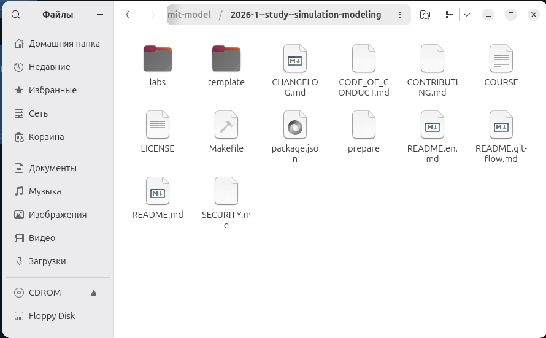
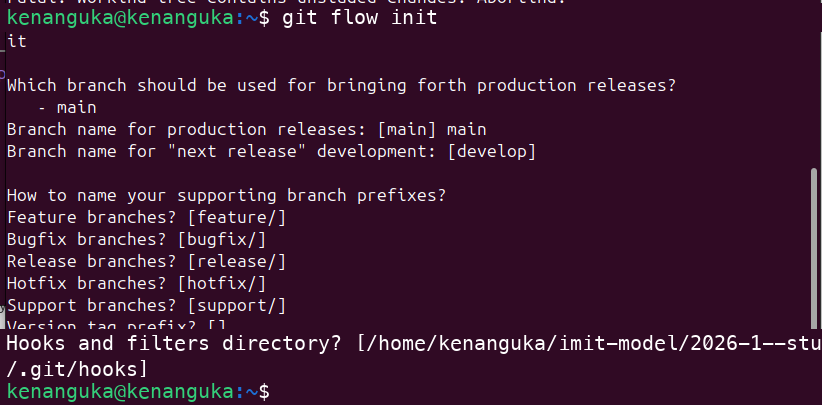
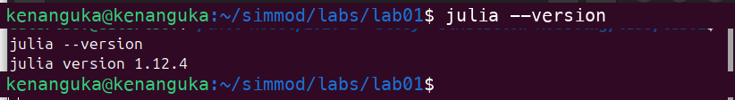
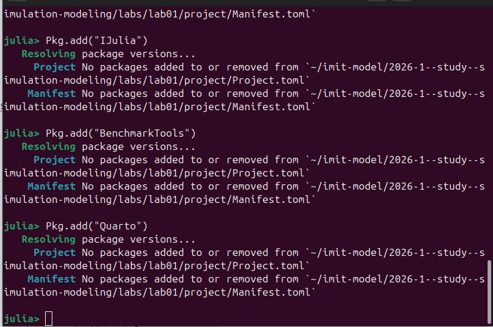
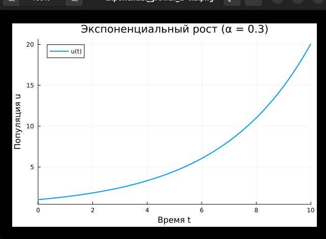
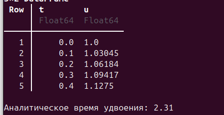
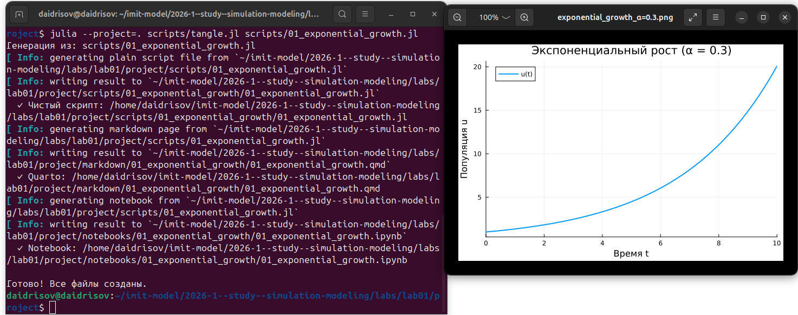
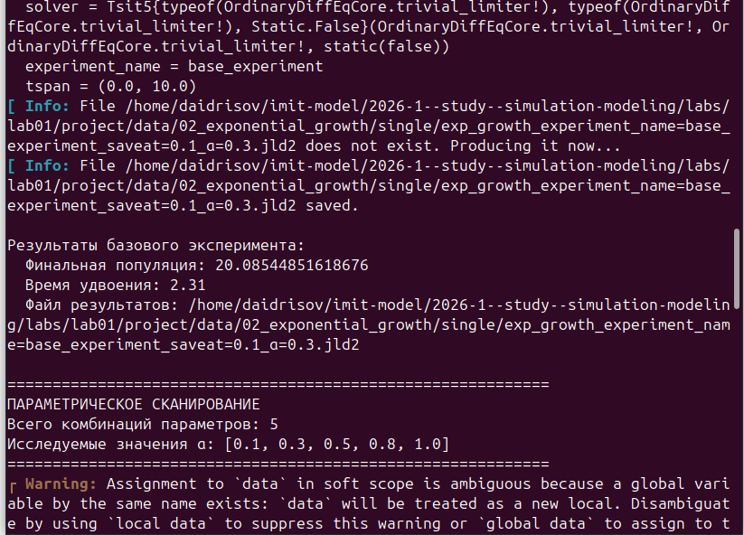
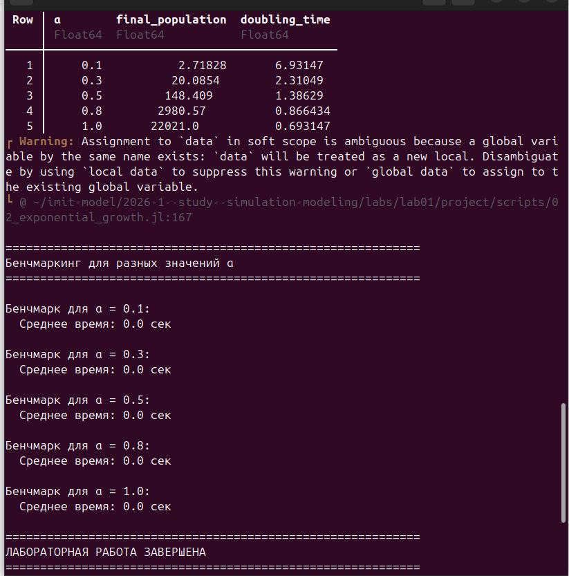
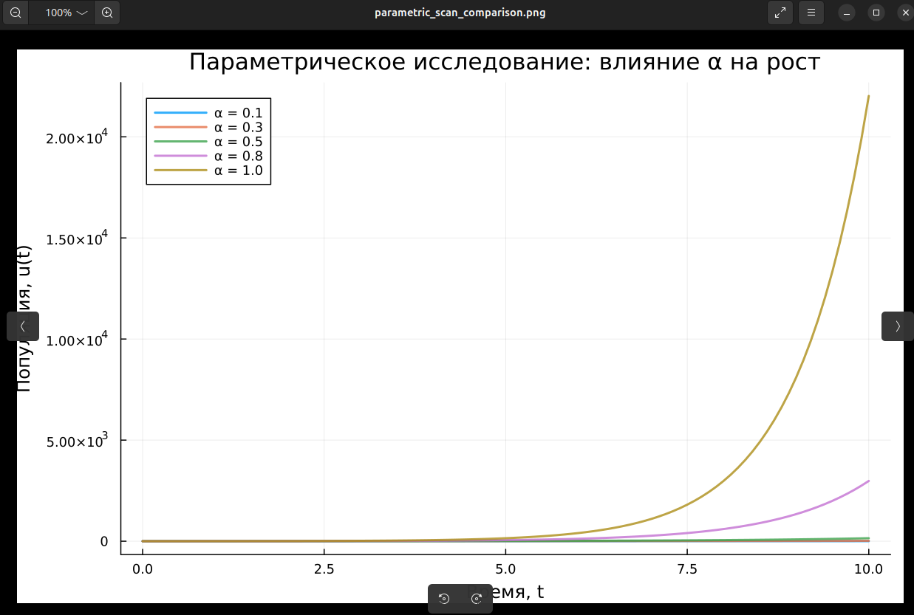

---
## Author
author:
  name: Гашимов Кенан Мухтар оглы
  affiliation:
    - name: Российский университет дружбы народов
      country: Российская Федерация
      postal-code: 117198
      city: Москва
      address: ул. Миклухо-Маклая, д. 6
## Title
title: Лабораторная работа №1
subtitle: Имитационное моделирование
license: CC BY
date: today
date-format: "2026-02-21"
---

# Информация

## Докладчик

:::::::::::::: {.columns align=center}
::: {.column width="70%"}
  * Гашимов Кенан Мухтар оглы
  * НКНбд-01-23
  * 1032235820
  * Математика и компьютерные науки
  * Российский университет дружбы народов

:::
::::::::::::::

# Вводная часть

## Цель работы

Изучить численное решение ОДУ экспоненциального роста, применяя Julia и средства воспроизводимых вычислений (DrWatson, Literate, Quarto).

## Задачи

- Подготовка рабочего окружения (git, git-flow)
- Развёртывание Julia и формирование проекта DrWatson
- Реализация простейшей модели экспоненциального роста
- Получение производных форматов из литературного кода
- Исследование модели при варьировании параметров

# Выполнение лабораторной работы

## Иерархия каталогов проекта

## Развёртывание git-flow

## Развёртывание Julia 1.12.4

## Формирование проекта DrWatson

## Добавление библиотек

## Простейшая модель экспоненциального роста

## Вычислительные итоги

## Преобразование в производные форматы

## Варьирование параметров

## Сводные результаты варьирования

## Зависимость динамики от $\alpha$

# Результаты

## Выводы

- Подготовлено рабочее окружение: git-flow, Julia 1.12.4, проект DrWatson
- Построена модель экспоненциального роста (DifferentialEquations.jl)
- Выполнен опорный расчёт ($\alpha = 0.3$, $T_2 = 2.31$)
- Код оформлен в литературном стиле с получением производных форматов
- Проведена серия экспериментов при $\alpha \in \{0.1, 0.3, 0.5, 0.8, 1.0\}$
