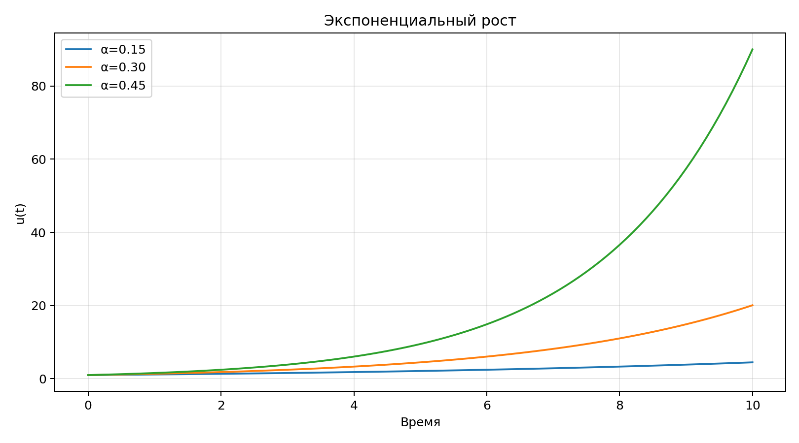

# Имитационное моделирование. Лабораторная работа 1

Гашимов Кенан Мухтар оглы

НКНбд-01-23

---

# Цель

Создать рабочее пространство курса, подготовить DrWatson-совместимую структуру проекта и воспроизвести пример модели экспоненциального роста в literate-формате.

---

# Теория

Лабораторная посвящена подготовке репозитория курса, созданию структурированного рабочего пространства и воспроизводимого проекта с примером модели экспоненциального роста.

---

# Эксперименты

- Построен курс с типовой структурой каталогов `labs/lab01` … `labs/lab08`.
- Для модели экспоненциального роста исследованы три значения параметра α.
- Собраны исходные данные, таблица метрик и визуализация динамики.

---

# Визуализация

---

# Итоги

- Каркас курса развёрнут.
- Модель экспоненциального роста исследована для нескольких α.
- Подготовлен literate-пайплайн: код, markdown, notebook, отчёт, презентация.

---

# Артефакты

- report/simulation-modeling--lab01--report.qmd
- presentation/simulation-modeling--lab01--presentation.qmd
- project/src/Lab01.jl
- project/scripts/lab01.jl
- project/test/runtests.jl
- project/notebook/lab01.ipynb
- project/markdown/lab01.qmd
- project/data/exponential-growth-alpha-*.csv
- project/plots/exponential-growth-scenarios.png
