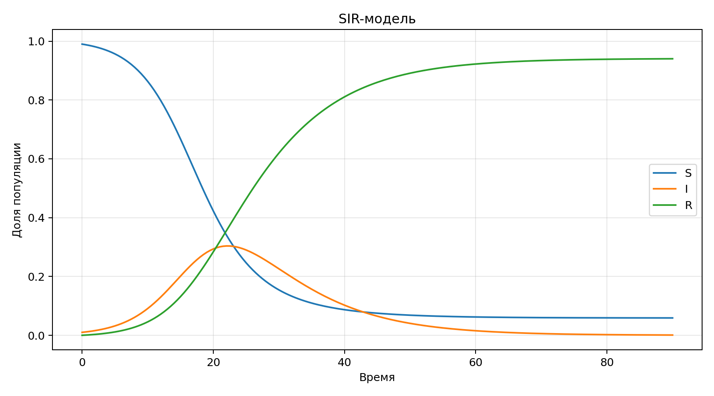

# Имитационное моделирование. Лабораторная работа 2

Гашимов Кенан Мухтар оглы

НКНбд-01-23

---

# Цель

Реализовать и исследовать базовые непрерывные модели, сравнить поведение компонент и подготовить воспроизводимые артефакты.

---

# Теория

Лабораторная рассматривает две классические системы ОДУ: эпидемиологическую SIR-модель и экосистемную модель Лотки–Вольтерры.

---

# Эксперименты

- Рассчитана SIR-модель на горизонте 90 единиц времени.
- Смоделирована система Лотки–Вольтерры на горизонте 40 единиц времени.
- Собраны таблицы ключевых метрик и графики траекторий.

---

# Визуализация

---

# Итоги

- SIR и Лотка–Вольтерра собраны в одном пайплайне.
- Для каждой модели есть код, данные, графики и выводы.
- Результаты готовы к дальнейшему развитию в агентных и событийных постановках.

---

# Артефакты

- project/data/sir.csv
- project/data/lotka-volterra.csv
- project/plots/sir.png
- project/plots/lotka-volterra.png
- project/src/Lab02.jl
- project/notebook/lab02.ipynb
- report/simulation-modeling--lab02--report.qmd
- presentation/simulation-modeling--lab02--presentation.qmd
