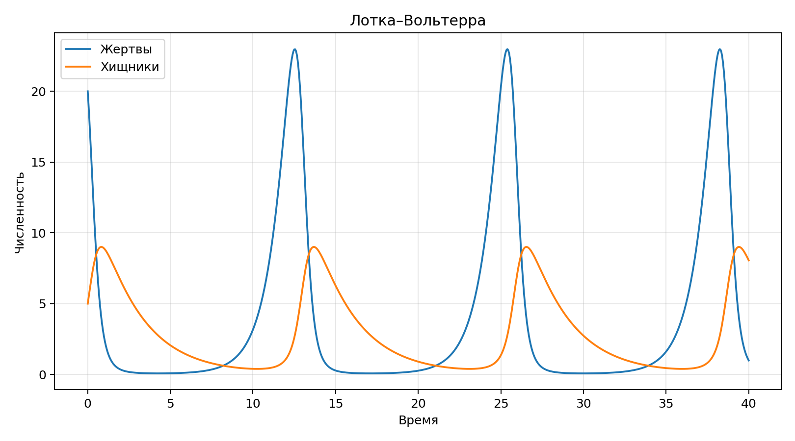

**Студент:** Гашимов Кенан Мухтар оглы  
**Группа:** НКНбд-01-23  
**Студенческий билет:** 1032235820  
**Направление:** Математика и компьютерные науки  
**Email:** kenan24gguka@gmail.com

        # Цель работы

        Реализовать и исследовать базовые непрерывные модели, сравнить поведение компонент и подготовить воспроизводимые артефакты.

        # Формулировка задания

        - Реализовать SIR-модель.
- Реализовать модель Лотки–Вольтерры.
- Сохранить графики и таблицы результатов.
- Подготовить literate-документацию, отчёт и презентацию.

        # Теоретическая часть

        Лабораторная рассматривает две классические системы ОДУ: эпидемиологическую SIR-модель и экосистемную модель Лотки–Вольтерры.

        # Ход работы

        ## SIR-модель

Для системы `S-I-R` использована схема RK4. Сохранены временные ряды и график компонент.
## Лотка–Вольтерра

Для пары хищник-жертва рассчитаны колебательные траектории. Итоговые данные сохранены в CSV и используются в отчёте.
## Параметрический анализ

Ключевые метрики сведены в компактную таблицу для удобного сравнения моделей.

        # Эксперименты

        1. Рассчитана SIR-модель на горизонте 90 единиц времени.
1. Смоделирована система Лотки–Вольтерры на горизонте 40 единиц времени.
1. Собраны таблицы ключевых метрик и графики траекторий.

        # Полученные артефакты

        - project/data/sir.csv
- project/data/lotka-volterra.csv
- project/plots/sir.png
- project/plots/lotka-volterra.png
- project/src/Lab02.jl
- project/notebook/lab02.ipynb
- report/simulation-modeling--lab02--report.qmd
- presentation/simulation-modeling--lab02--presentation.qmd

        # Основные результаты

        

        | Модель | Ключевой результат |
| --- | --- |
| SIR | Пик заражённых 0.304 на шаге 22.0 |
| Лотка–Вольтерра | Финальная точка (0.99, 8.06) |

        # Выводы

        - SIR-модель показывает ярко выраженный максимум заражённых и насыщение по R.
- Модель Лотки–Вольтерры демонстрирует квазипериодические колебания двух популяций.
- Обе модели удобно анализировать через единый расчётный и отчётный пайплайн.

        # Материалы проекта

        - CSV с траекториями SIR.
- CSV с траекториями Лотки–Вольтерры.
- PNG-графики обеих моделей.

        # Воспроизводимость

        - Исходный Julia-проект находится в `../project/`.
        - Literate-документация находится в `../project/markdown/`.
        - Notebook находится в `../project/notebook/`.
        - Для повторной сборки используйте команды `make generate`, `make render`, `make verify`.
