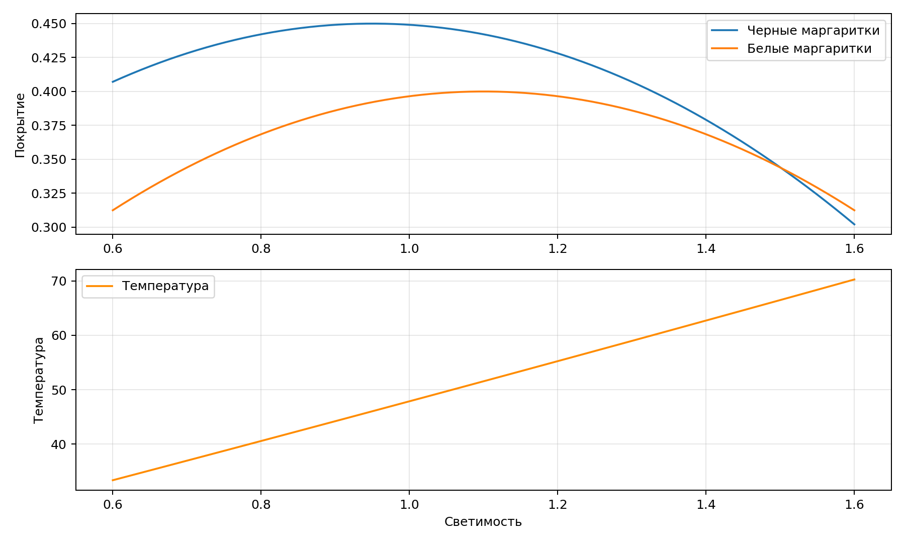

# Имитационное моделирование. Лабораторная работа 3

Гашимов Кенан Мухтар оглы

НКНбд-01-23

---

# Цель

Исследовать модель Daisyworld, построить зависимости покрытия и температуры от светимости и оформить результаты.

---

# Теория

Daisyworld показывает, как взаимодействие среды и организмов способно стабилизировать температуру за счёт обратной связи.

---

# Эксперименты

- Вычислена зависимость покрытий чёрных и белых маргариток от светимости.
- Оценена температурная стабилизация в окрестности комфортного диапазона.
- Сформированы данные и график для отчёта и презентации.

---

# Визуализация

---

# Итоги

- Показана связь светимости, альбедо и температуры.
- Выделен диапазон устойчивой саморегуляции.
- Подготовлены данные для дальнейшей агентной детализации.

---

# Артефакты

- project/data/daisyworld.csv
- project/plots/daisyworld.png
- project/src/Lab03.jl
- project/test/runtests.jl
- project/notebook/lab03.ipynb
