---
author:
  name: Идрисов Джафер Арсенович
  degrees: student
  email: 1132232876@rudn.ru
  affiliation:
    - name: Российский университет дружбы народов
      country: Российская Федерация
      postal-code: 117198
      city: Москва
      address: ул. Миклухо-Маклая, д. 6
title: "Имитационное моделирование"
subtitle: "Лабораторная работа №4. Реализация SIR-модели в агентном подходе"
license: CC BY
date: today
date-format: "YYYY-MM-DD"

---

# Информация

## Докладчик

:::::::::::::: {.columns align=center}
::: {.column width="70%"}

  * Идрисов Джафер Арсенович
  * Студент
  * Российский университет дружбы народов
  * [1132232876@rudn.ru](mailto:1132232876@rudn.ru)

:::
::: {.column width="30%"}
:::
::::::::::::::

# Цель и задачи

## Цель работы

- Реализовать агентную модель SIR средствами Agents.jl
- Организовать проект в структуре DrWatson
- Выполнить серию вычислительных экспериментов
- Подготовить literate-версии скриптов и производные форматы

## Задание

1. Создать проект и установить пакеты
2. Реализовать SIR-модель в агентном подходе
3. Выполнить базовые и параметрические эксперименты
4. Сгенерировать clean, notebook и Markdown-версии
5. Выполнить все дополнительные задания

# Теоретическое введение

## Модель SIR и агентный подход

- Классы модели: `S`, `I`, `R`
- В работе каждый человек моделируется как отдельный агент
- Между городами допускается миграция
- Можно добавлять гетерогенность и карантинные правила
- Инструменты: Agents.jl, DrWatson, Literate.jl

## Базовые параметры

- Численность городов: `[1000, 1000, 1000]`
- `beta_und = 0.5`
- `beta_det = 0.05`
- `infection_period = 14`
- `detection_time = 7`
- `death_rate = 0.02`
- Для базового запуска `R_0 = 7`

## Литературное программирование

- Исходные файлы оформлены в виде `*_literate.jl`
- Из одного файла генерируются:
  - clean `.jl`
  - `.ipynb`
  - `.md`
- Инструмент генерации: `Literate.jl`
- Такой подход обеспечивает воспроизводимость и единый источник кода и документации

# Настройка окружения

## Инициализация проекта

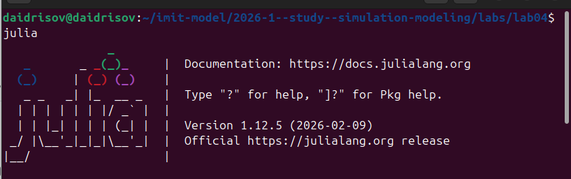{width=48%}
{width=48%}

На этом этапе запускается Julia и подключается пакет DrWatson для организации воспроизводимого проекта.

## Создание и активация проекта

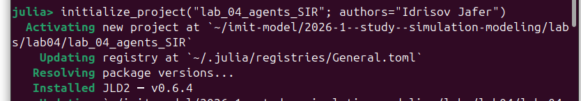{width=48%}
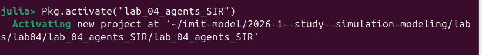{width=48%}

Проект создаётся в стандартной структуре DrWatson, после чего активируется рабочее окружение Julia.

## Установка зависимостей

{width=48%}
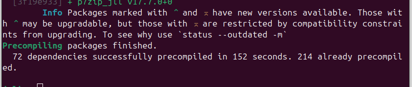{width=48%}

После установки пакетов становятся доступны Agents.jl, Literate.jl, CSV, JLD2 и инструменты оптимизации.

# Основные эксперименты

## Базовый запуск модели

{width=45%}
{width=50%}

- Базовый сценарий показывает рост, пик и спад числа инфицированных
- Общая численность уменьшается из-за смертности
- Результат согласуется с `R_0 > 1`
- Параметры задают размеры городов, заразность, длительность болезни и число шагов моделирования

## Производные форматы базового скрипта

{width=32%}
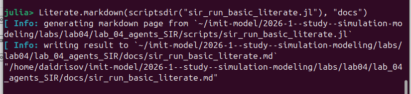{width=32%}
{width=32%}

Из literate-скрипта были получены clean-версия, Markdown-документация и notebook.

## Исследование коэффициента заразности {.smaller}

{width=36%}
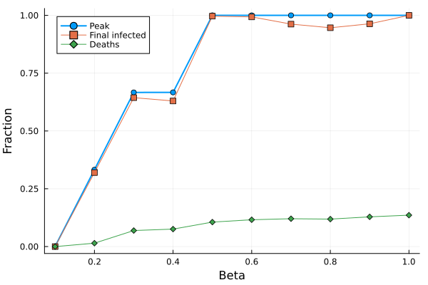{width=58%}

- При `beta = 0.1` выраженной вспышки нет
- При `beta >= 0.2` наблюдается резкий рост пика
- Это подтверждает существование порога эпидемии
- В CSV фиксируются `beta`, `peak`, `deaths`, `final_inf`

## Таблица и производные форматы для `sir_scan_beta`

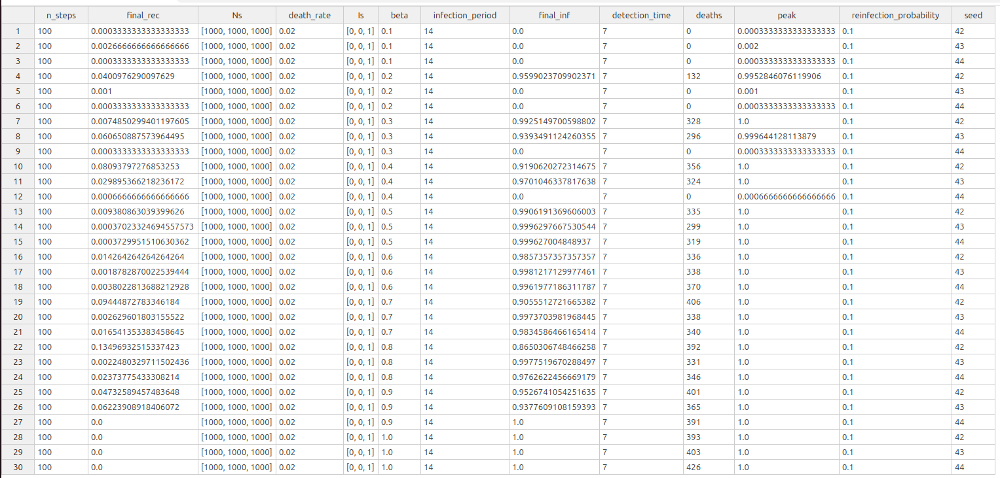{width=35%}
{width=28%}
{width=28%}

CSV-файл фиксирует все прогоны, а производные форматы обеспечивают воспроизводимость исследования.

## Исследование миграции {.smaller}

{width=34%}
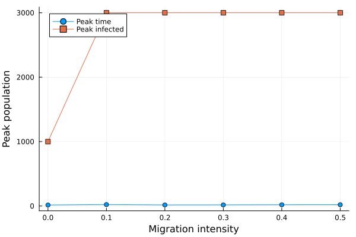{width=55%}

- Нулевая миграция даёт локальную вспышку
- Ненулевая миграция ускоряет распространение между городами
- Среди ненулевых значений минимальное среднее время до пика достигается при `0.2`
- В CSV: `migration_intensity`, `peak_time`, `peak_value`

## Оптимизация параметров

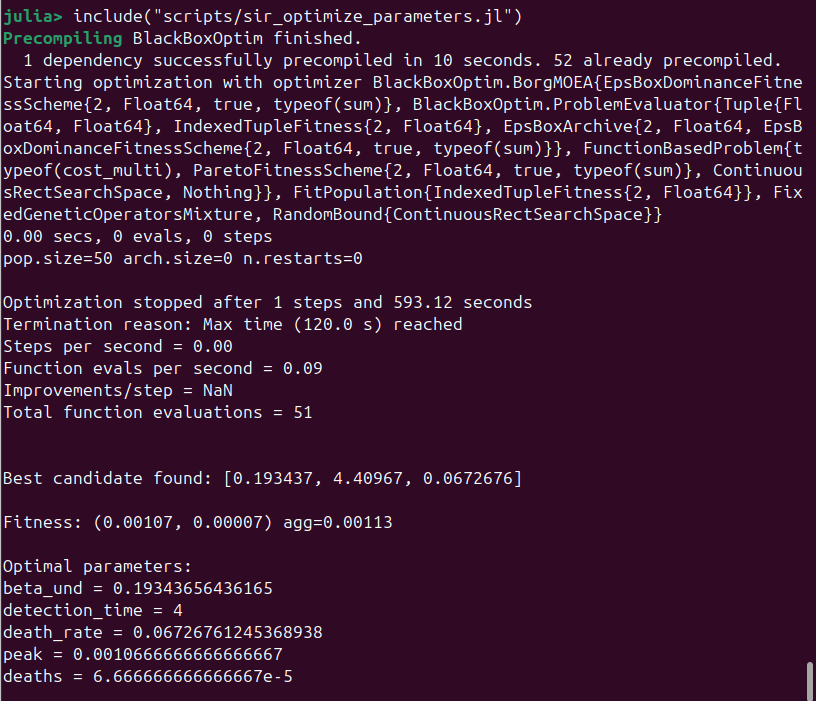{width=40%}

- Выполнен поиск параметров модели с минимизацией целевой функции
- Анализируется влияние `beta_und`, `detection_time` и `death_rate`
- Оптимизация позволяет подобрать более благоприятный сценарий распространения

## Производные форматы для `sir_optimize_parameters`

{width=30%}
{width=30%}
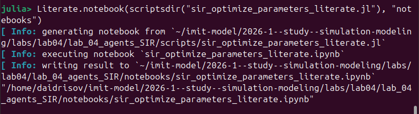{width=30%}

Для эксперимента с оптимизацией также подготовлены clean-версия, Markdown и notebook.

## Итоговая визуализация

{width=18%}
{width=36%}

Сводный график объединяет пик заражения, число умерших и долю выздоровевших в зависимости от `beta`.

## Производные форматы и документация

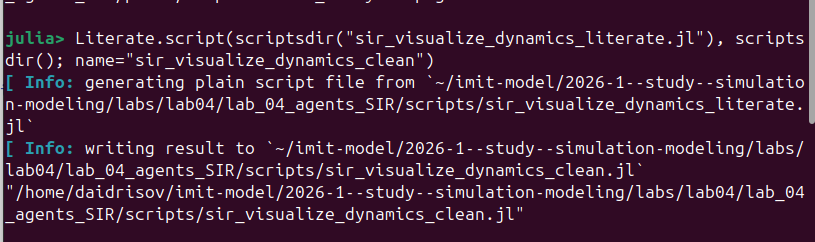{width=30%}
{width=30%}
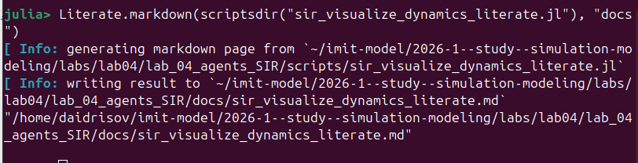{width=30%}

- Для каждого эксперимента получены clean-скрипт, notebook и Markdown-документация
- Это упрощает проверку, повторение вычислений и включение материалов в отчёт

# Дополнительные задания

## Обзор дополнительных заданий

1. Базовый анализ `R_0`
2. Порог эпидемии
3. Гетерогенность городов
4. Влияние миграции
5. Карантинные меры
6. Оптимизация с ограничением на пик

## Задания 1 и 2: `R_0` и порог эпидемии

{width=45%}
{width=45%}

- Для базового сценария `R_0 = 7`
- Практический порог возникновения эпидемии лежит между `beta = 0.1` и `beta = 0.2`
- Теоретический порог `R_0 = 1` даёт `beta ≈ 0.071`

## Задание 3: эффект гетерогенности

{width=32%}
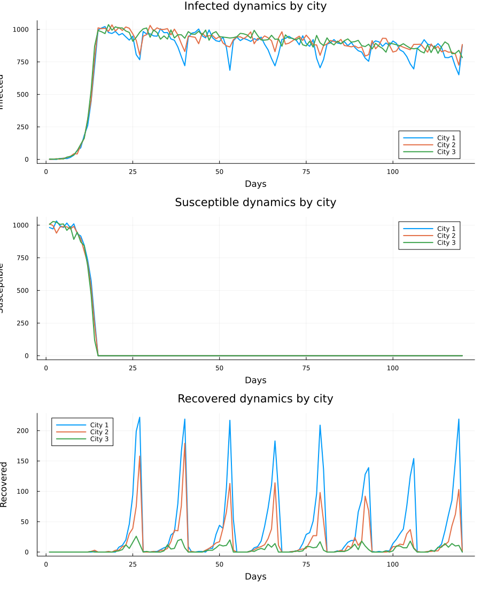{width=32%}
{width=32%}

- Для городов заданы разные `beta`: `0.3`, `0.5`, `0.8`
- Пики заражения возрастают вместе с заразностью города
- Это подтверждает влияние неоднородности параметров на общую динамику
- В сводной таблице приведены `beta_und`, `beta_det` и `peak_infected` по городам

## Задание 4: миграция

{width=48%}
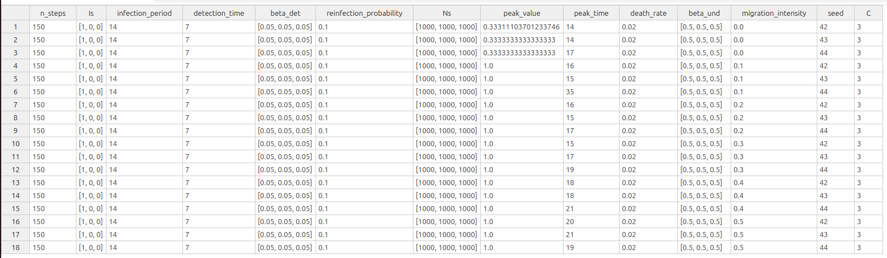{width=48%}

- Нулевая миграция не отражает межгородское распространение
- Среди ненулевых значений минимальное среднее время до пика достигается при интенсивности `0.2`
- Миграция существенно влияет на скорость охвата всей системы

## Задание 5: карантинные меры

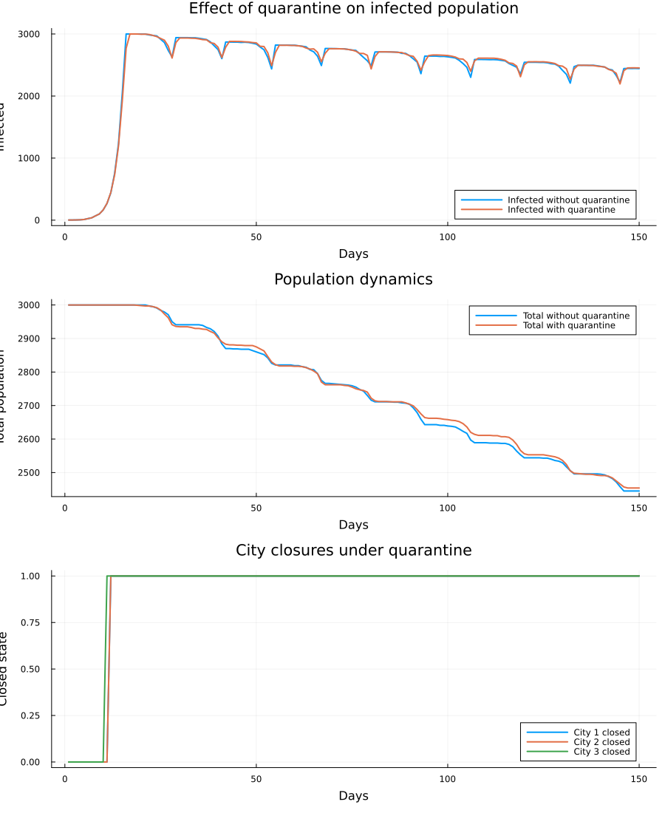{width=34%}
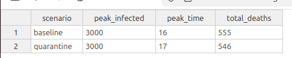{width=20%}

- Карантин блокирует выезд из города после превышения порога инфицированности
- В эксперименте пик сдвигается с 16-го на 17-й день
- Число умерших уменьшается с 555 до 546
- Сводная таблица содержит `scenario`, `peak_infected`, `peak_time`, `total_deaths`

## Задание 6: оптимизация с ограничением

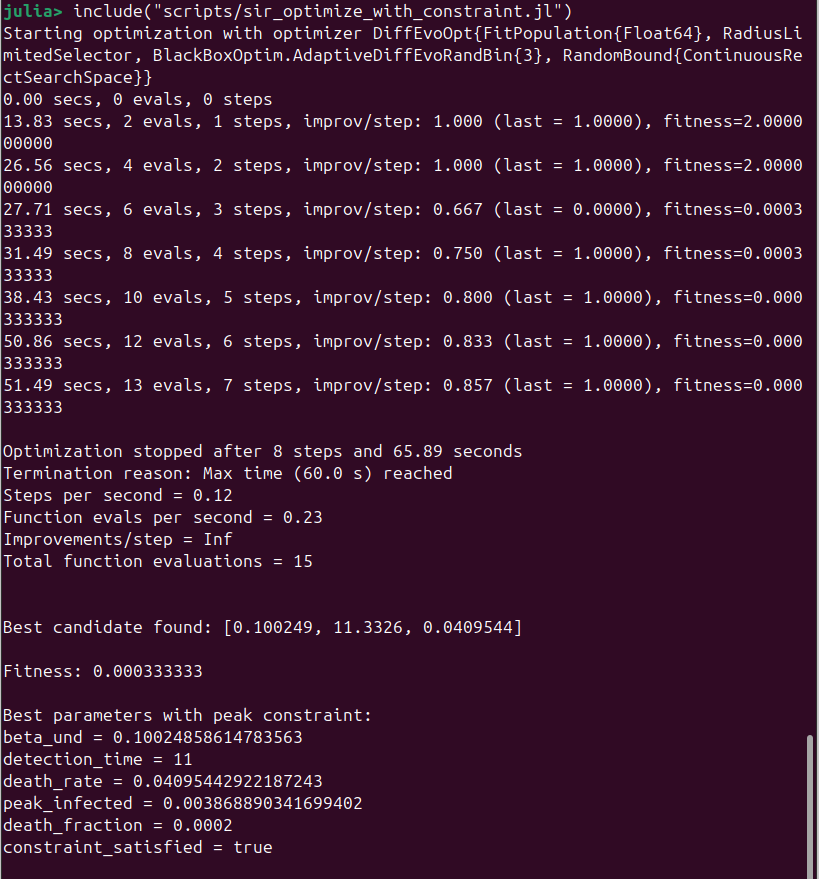{width=40%}
{width=50%}

- Цель: минимизировать смертность при `peak <= 0.3`
- Найдено решение с `peak_infected ≈ 0.2003`
- Ограничение выполнено: `satisfies_constraint = true`
- В таблице также приведены найденные `beta_und`, `detection_time` и `death_rate`

# Выводы

## Итоги работы

- Реализована агентная SIR-модель для трёх городов
- Выполнены базовые и параметрические эксперименты
- Добавлен эксперимент по оптимизации параметров модели
- Подготовлены literate-версии и производные форматы
- Все дополнительные задания описаны и проанализированы
- Наиболее содержательные эффекты: порог эпидемии, влияние миграции, гетерогенность и карантин
