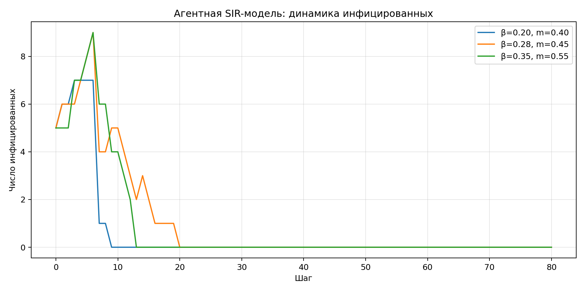

**Студент:** Гашимов Кенан Мухтар оглы  
**Группа:** НКНбд-01-23  
**Студенческий билет:** 1032235820  
**Направление:** Математика и компьютерные науки  
**Email:** kenan24gguka@gmail.com

        # Цель работы

        Построить агентную SIR-модель, исследовать влияние β и мобильности и оформить сравнительные артефакты.

        # Формулировка задания

        - Построить агентную SIR-модель.
- Провести серию параметрических экспериментов.
- Сохранить траектории, графики и summary-таблицу.
- Подготовить отчёт и презентацию.

        # Теоретическая часть

        Агентный подход позволяет исследовать SIR-модель с индивидуальными объектами, стохастикой контактов и влиянием мобильности.

        # Ход работы

        ## Постановка агентной модели

Каждый агент имеет состояние S, I или R и перемещается по дискретной сетке. Заражение происходит при совместном нахождении в клетке.
## Параметрические сценарии

Сценарии различаются вероятностью заражения и интенсивностью перемещения. Это позволяет увидеть эффект гетерогенности контактов.
## Сравнение результатов

Для всех сценариев сохранены временные ряды и извлечены значения максимума заражённых и момента достижения пика.

        # Эксперименты

        1. Смоделированы три сценария с разными значениями β и мобильности.
1. Для каждого сценария собраны временные ряды S, I, R.
1. Сравнены пики инфицированных и итоговое число переболевших.

        # Полученные артефакты

        - project/data/agent-sir-scenario-1.csv
- project/data/agent-sir-scenario-2.csv
- project/data/agent-sir-scenario-3.csv
- project/plots/agent-sir-scenarios.png
- project/src/Lab04.jl
- project/notebook/lab04.ipynb

        # Основные результаты

        

        | β | mobility | peak I | time of peak | recovered at end |
| --- | --- | ---: | ---: | ---: |
| 0.20 | 0.40 | 7 | 3 | 7 |
| 0.28 | 0.45 | 9 | 6 | 13 |
| 0.35 | 0.55 | 9 | 6 | 11 |

        # Выводы

        - Рост β и мобильности приводит к более раннему и более высокому пику инфекции.
- Стохастический агентный режим даёт естественный разброс траекторий.
- Модель готова к дальнейшему развитию в сторону городов, карантина и миграции.

        # Материалы проекта

        - Три CSV-файла по сценариям агентной SIR.
- Сводный график динамики инфицированных.
- Таблица сравнительных метрик сценариев.

        # Воспроизводимость

        - Исходный Julia-проект находится в `../project/`.
        - Literate-документация находится в `../project/markdown/`.
        - Notebook находится в `../project/notebook/`.
        - Для повторной сборки используйте команды `make generate`, `make render`, `make verify`.
