---
## Author
author:
  name: Гашимов Кенан Мухтар оглы
  affiliation:
    - name: Российский университет дружбы народов
      country: Российская Федерация
      postal-code: 117198
      city: Москва
      address: ул. Миклухо-Маклая, д. 6

## Title
title: "Имитационное моделирование"
subtitle: "Лабораторная работа №4. Реализация основных моделей в агентном подходе"
license: "CC BY"
---

# Сведения об авторе

- ФИО: Гашимов Кенан Мухтар оглы
- Группа: НКНбд-01-23
- Студенческий билет: 1032235820
- Направление: Математика и компьютерные науки

# Цель работы

Изучить реализацию эпидемиологической модели SIR в агентном подходе на языке Julia с использованием фреймворка Agents.jl, провести серию вычислительных экспериментов, подготовить literate-версии скриптов и исследовать дополнительные сценарии: порог эпидемии, гетерогенность городов, миграцию, карантин и оптимизацию с ограничением на пик заболеваемости.

# Задание

1. Создать проект `DrWatson` для лабораторной работы.
2. Установить необходимые Julia-пакеты.
3. Реализовать агентную SIR-модель в файле `src/sir_model.jl`.
4. Выполнить базовый эксперимент, параметрическое исследование коэффициента заразности, исследование миграции, оптимизацию параметров и итоговую визуализацию.
5. Подготовить literate-версии скриптов и сгенерировать производные форматы `.jl`, `.ipynb` и `.md`.
6. Выполнить дополнительные задания: базовый анализ `R_0`, поиск порога эпидемии, исследование гетерогенности, анализ влияния миграции, введение карантина и оптимизацию при ограничении на пик заболеваемости.
7. Подготовить отчёт и презентацию с описанием всех графиков, таблиц и результатов.

# Теоретическое введение

## Модель SIR

Классическая модель SIR делит популяцию на три группы: восприимчивые `S`, инфицированные `I` и выздоровевшие `R` [@kermack_1927; @hethcote_2000]. В непрерывной постановке динамика описывается системой дифференциальных уравнений, однако в данной работе используется агентный подход, в котором каждый индивид моделируется как отдельный агент.

В агентной реализации преимущества состоят в следующем:

- можно моделировать дискретных людей, а не только агрегированные доли;
- можно учитывать миграцию между городами;
- можно задавать неоднородные параметры заразности;
- можно добавлять логические правила, например карантин.

## Агентное моделирование и используемые инструменты

Фреймворк Agents.jl предоставляет средства для построения агентных моделей на графах и решётках, а также для запуска симуляций и сбора статистики [@agents_jl]. Для организации проекта используется DrWatson [@drwatson_jl], а для литературного программирования --- пакет Literate.jl [@literate_jl; @knuth_1984]. Многокритериальная и ограниченная оптимизация в работе выполняется с помощью BlackBoxOptim.jl [@blackboxoptim_jl].

## Литературное программирование

В данной лабораторной работе код оформлялся в стиле literate programming [@knuth_1984]. Это означает, что основной файл рассматривается одновременно как программный код и как текстовое описание алгоритма. Такой подход удобен в учебной работе, поскольку позволяет не дублировать вручную объяснение логики эксперимента в нескольких местах.

Пакет Literate.jl [@literate_jl] использовался для генерации трёх производных форматов:

- clean-скрипта `.jl`, пригодного для прямого запуска;
- Jupyter notebook `.ipynb`, пригодного для интерактивного выполнения;
- Markdown-документа `.md`, пригодного для включения в отчёт.

В результате каждый эксперимент существовал в двух формах: как рабочий скрипт и как literate-источник, из которого автоматически получались остальные представления.

## Параметры модели

Основные параметры SIR-модели, использованные в лабораторной работе, сведены в [табл. @tbl-sir-params].

| Параметр | Обозначение | Значение | Смысл |
|----------|-------------|----------|-------|
| Численность в городах | `Ns` | `[1000, 1000, 1000]` | Популяция трёх городов |
| Базовая заразность | `beta_und` | `0.5` | Заразность до выявления |
| Заразность после выявления | `beta_det` | `0.05` | Ослабленная передача |
| Длительность болезни | `infection_period` | `14` | Число шагов болезни |
| Время выявления | `detection_time` | `7` | Момент снижения заразности |
| Вероятность смерти | `death_rate` | `0.02` | Смерть при завершении болезни |
| Вероятность повторного заражения | `reinfection_probability` | `0.1` | Повторный переход в `I` |
| Начальное заражение | `Is` | `[1, 0, 0]` или `[0, 0, 1]` | Источник эпидемии |

: Базовые параметры агентной SIR-модели {#tbl-sir-params}

Теоретически базовое репродуктивное число оценивается как

$$
R_0 = \frac{\beta}{\gamma}, \qquad \gamma = \frac{1}{infection\_period}.
$$

Для базового значения `beta = 0.5` и `infection_period = 14` получаем `R_0 = 7`, что соответствует режиму уверенного развития эпидемии.

# Выполнение лабораторной работы

## Настройка окружения

### Запуск Julia и инициализация проекта

Сначала был запущен интерпретатор Julia ([рис. @fig-julia]) и подключён пакет DrWatson ([рис. @fig-drwatson]). Затем с помощью `initialize_project` был создан проект лабораторной работы ([рис. @fig-init-project]), после чего окружение было активировано ([рис. @fig-activate]) и дополнено необходимыми пакетами ([рис. @fig-pkg-add], [рис. @fig-pkg-finished]).

{#fig-julia width=70%}

{#fig-drwatson width=70%}

{#fig-init-project width=70%}

{#fig-activate width=70%}

{#fig-pkg-add width=70%}

{#fig-pkg-finished width=70%}

На этом этапе была подготовлена воспроизводимая структура проекта с каталогами `src`, `scripts`, `data`, `plots`, `docs` и `notebooks`.

## Реализация базовой SIR-модели

Исходный код модели был вынесен в файл `src/sir_model.jl`, где реализованы:

- тип агента `Person`;
- инициализация модели `initialize_sir`;
- шаг агента `sir_agent_step!`;
- миграция между городами;
- заражение, выздоровление и смерть;
- функции подсчёта `S`, `I`, `R` и общей численности.

В качестве пространства используется полный граф городов, что позволяет каждому агенту потенциально мигрировать в любой другой город. Такой выбор соответствует постановке задачи из методических указаний.

## Базовый эксперимент

Базовый запуск реализован в скрипте `sir_run_basic.jl` ([рис. @fig-run-basic-script]). Скрипт моделирует один эпидемический сценарий с фиксированными параметрами и сохраняет данные динамики.

{#fig-run-basic-script width=70%}

Параметры этого эксперимента имеют следующий смысл:

- `Ns` --- численности популяции в трёх городах;
- `beta_und` --- интенсивность заражения до выявления болезни;
- `beta_det` --- интенсивность заражения после выявления;
- `infection_period` --- число шагов, в течение которых агент остаётся больным;
- `detection_time` --- шаг, после которого используется ослабленная заразность;
- `death_rate` --- вероятность смерти в конце болезни;
- `reinfection_probability` --- вероятность повторного заражения для выздоровевших;
- `Is` --- начальное количество инфицированных по городам;
- `seed` --- зерно генератора случайных чисел;
- `n_steps` --- число шагов моделирования.

Результат базового эксперимента показан на [рис. @fig-run-basic-plot]. На графике видно, что число инфицированных быстро возрастает, затем достигает пика, после чего популяция постепенно переходит в класс выздоровевших. Пунктирная линия общей численности отражает влияние смертности.

{#fig-run-basic-plot width=70%}

Форма графика объясняется стандартной логикой SIR-модели. Кривая `S(t)` убывает, потому что восприимчивые агенты заражаются. Кривая `I(t)` сначала быстро растёт, так как при `R_0 > 1` каждый инфицированный заражает в среднем больше одного нового агента. После достижения пика рост прекращается из-за уменьшения числа восприимчивых. Кривая `R(t)` накапливает переболевших. Пунктир `total` убывает медленно, так как часть агентов удаляется из модели из-за смертности.

Literate-версия базового скрипта была использована для генерации производных форматов. Результаты генерации чистого скрипта, Markdown-документации и Jupyter notebook представлены на [рис. @fig-run-basic-clean], [рис. @fig-run-basic-md] и [рис. @fig-run-basic-ipynb].

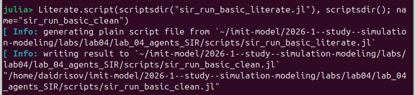{#fig-run-basic-clean width=70%}

{#fig-run-basic-md width=70%}

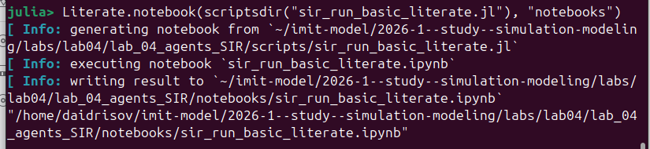{#fig-run-basic-ipynb width=70%}

## Исследование коэффициента заразности

Скрипт `sir_scan_beta.jl` ([рис. @fig-beta-script]) использовался для исследования порога эпидемии и чувствительности модели к параметру `beta`.

{#fig-beta-script width=70%}

На [рис. @fig-beta-plot] показан итоговый график зависимости характеристик эпидемии от `beta`. При `beta = 0.1` пик заражения практически отсутствует, а начиная с `beta = 0.2` наблюдается резкий рост амплитуды вспышки. Это подтверждает существование порогового эффекта.

{#fig-beta-plot width=70%}

В данном эксперименте параметр `beta` определяет заразность невыявленных больных. Параметр `beta_det` выбирается как `beta / 10`, то есть после выявления заражённый агент становится существенно менее опасным для окружающих. Благодаря этому на графике можно проследить именно влияние базовой интенсивности заражения на общую эпидемическую картину.

На графике представлены три основные зависимости:

- средний пик эпидемии;
- средняя конечная доля инфицированных;
- средняя доля умерших.

Такой вид графика объясняется пороговым характером эпидемии. При малых значениях `beta` инфекция не успевает распространиться по системе. После перехода через порог заражение начинает охватывать почти всю популяцию, из-за чего и пик, и смертность резко возрастают.

Фрагмент таблицы всех прогонов приведён на [рис. @fig-beta-csv]. Он показывает, что при `beta = 0.1` величина `peak` остаётся порядка `10^-3`, а при `beta = 0.2` уже появляются прогоны с пиком около единицы.

{#fig-beta-csv width=70%}

Столбцы таблицы `beta_scan_all.csv` означают:

- `n_steps` --- число шагов моделирования;
- `final_rec` --- итоговая доля выздоровевших;
- `Ns` --- численности населения по городам;
- `death_rate` --- вероятность смерти;
- `Is` --- число изначально инфицированных;
- `beta` --- исследуемый коэффициент заразности;
- `infection_period` --- длительность болезни;
- `final_inf` --- доля инфицированных в конце эксперимента;
- `detection_time` --- время выявления заболевания;
- `deaths` --- абсолютное число умерших;
- `peak` --- максимальная доля инфицированных за весь прогон;
- `reinfection_probability` --- вероятность повторного заражения;
- `seed` --- зерно генератора случайных чисел.

Производные форматы для этого скрипта также были сгенерированы. Иллюстрации clean-версии, notebook и Markdown-документа представлены на [рис. @fig-beta-clean], [рис. @fig-beta-ipynb] и [рис. @fig-beta-md].

{#fig-beta-clean width=70%}

{#fig-beta-ipynb width=70%}

{#fig-beta-md width=70%}

## Исследование миграции

Для анализа распространения инфекции между городами был использован скрипт `sir_migration_effect.jl` ([рис. @fig-migration-script]).

{#fig-migration-script width=70%}

График на [рис. @fig-migration-plot] показывает зависимость времени до пика и величины пика от интенсивности миграции. Нулевая миграция даёт локальную вспышку в одном городе, а при ненулевой миграции инфекция охватывает всю систему.

{#fig-migration-plot width=70%}

Параметр `migration_intensity` задаёт вероятность того, что агент покинет свой текущий город. Чем он выше, тем быстрее инфекция переносится между городами. На графике одновременно показаны:

- время достижения пика;
- величина пика.

При нулевой миграции инфекция остаётся в исходном городе, поэтому пик меньше. При положительной миграции заражение переносится в остальные города, что резко увеличивает число инфицированных. Из-за стохастичности модели зависимость времени до пика не является строго монотонной.

По данным файла [рис. @fig-migration-csv] среднее время до пика среди ненулевых значений минимально при `migration_intensity = 0.2`, где средний пик достигается примерно на 16-м дне. Это значение далее использовалось как репрезентативное для задач с межгородским распространением.

{#fig-migration-csv width=70%}

Столбцы `migration_scan_all.csv` означают:

- `n_steps` --- число шагов моделирования;
- `Is` --- начальное распределение инфицированных;
- `infection_period` --- длительность болезни;
- `detection_time` --- время выявления;
- `beta_det` --- заразность выявленных больных;
- `reinfection_probability` --- вероятность повторного заражения;
- `Ns` --- размеры городов;
- `peak_value` --- максимальная доля инфицированных;
- `peak_time` --- момент достижения пика;
- `death_rate` --- вероятность смерти;
- `beta_und` --- заразность невыявленных больных;
- `migration_intensity` --- исследуемая интенсивность миграции;
- `seed` --- зерно генератора;
- `C` --- число городов.

Генерация производных форматов для скрипта миграции показана на [рис. @fig-migration-clean], [рис. @fig-migration-md] и [рис. @fig-migration-ipynb].

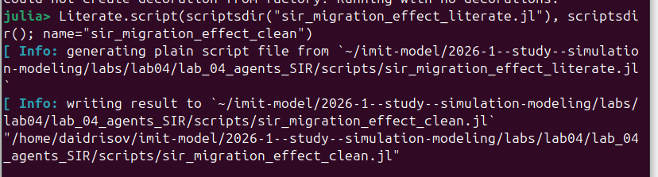{#fig-migration-clean width=70%}

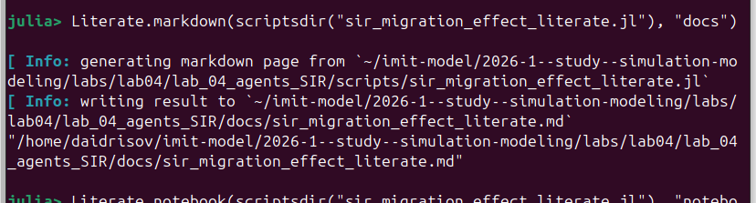{#fig-migration-md width=70%}

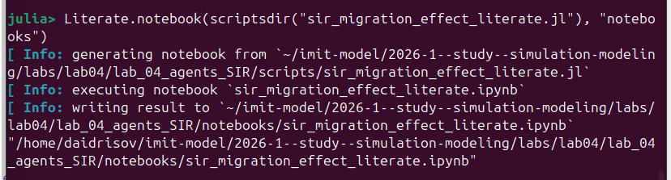{#fig-migration-ipynb width=70%}

## Базовая оптимизация и итоговая визуализация

Скрипт `sir_optimize_parameters.jl` запускал многокритериальную оптимизацию параметров ([рис. @fig-opt-script]). Поскольку эта задача вычислительно тяжёлая, её основной смысл в рамках лабораторной работы --- продемонстрировать использование эволюционного поиска для управления эпидемическими показателями.

{#fig-opt-script width=70%}

Производные форматы для скрипта оптимизации представлены на [рис. @fig-opt-clean], [рис. @fig-opt-md] и [рис. @fig-opt-ipynb].

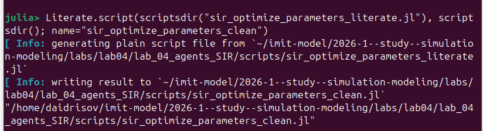{#fig-opt-clean width=70%}

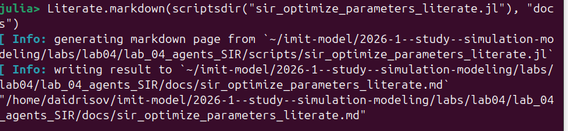{#fig-opt-md width=70%}

{#fig-opt-ipynb width=70%}

Скрипт `sir_visualize_dynamics.jl` строит сводный трёхпанельный график по результатам параметрического исследования ([рис. @fig-vis-script]). Итоговый график показан на [рис. @fig-vis-plot].

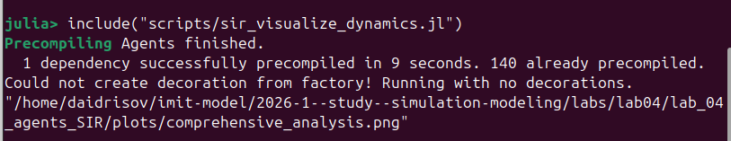{#fig-vis-script width=70%}

{#fig-vis-plot width=70%}

На верхней панели [рис. @fig-vis-plot] видно пороговое возникновение эпидемии, на средней --- рост числа умерших при увеличении заразности, а на нижней --- насыщение доли переболевших.

Верхняя панель имеет пороговый вид, потому что система переходит от затухающей вспышки к почти полному охвату популяции. Средняя панель растёт вслед за ростом заражения: чем больше агентов проходят через инфекцию, тем больше итоговая смертность. Нижняя панель выходит на насыщение, потому что при больших `beta` почти вся популяция успевает переболеть.

Генерация производных форматов итоговой визуализации показана на [рис. @fig-vis-clean], [рис. @fig-vis-ipynb] и [рис. @fig-vis-md].

{#fig-vis-clean width=70%}

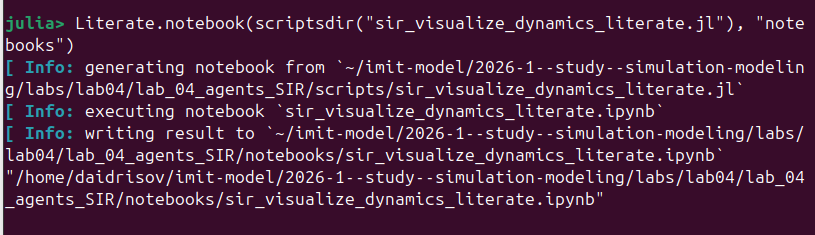{#fig-vis-ipynb width=70%}

{#fig-vis-md width=70%}

# Дополнительные задания

## Задание 1. Базовый уровень

Для базового уровня был использован уже полученный график [рис. @fig-run-basic-plot]. По формуле

$$
R_0 = \frac{\beta}{\gamma} = \frac{0.5}{1/14} = 7
$$

получаем значение `R_0 > 1`, что соответствует устойчивому развитию эпидемии. Наблюдаемая динамика на графике полностью согласуется с этим выводом: заражение быстро растёт, а затем почти вся популяция проходит через состояние `I`.

## Задание 2. Исследование порога

Порог эпидемии анализировался по результатам `beta_scan_all.csv`. В соответствии с условием задачи эпидемия считается возникшей, если пик `I` превышает `5%` популяции. По данным [рис. @fig-beta-csv] при `beta = 0.1` это условие не выполняется, а при `beta = 0.2` уже появляются траектории с выраженной вспышкой. Следовательно, практический порог в данной стохастической модели лежит между `0.1` и `0.2`.

Теоретический порог из условия `R_0 = 1` равен `beta = 1/14 ≈ 0.071`, поэтому практический порог оказался выше. Это расхождение объясняется конечным размером популяции, случайностью передачи и структурой модели.

## Задание 3. Эффект гетерогенности

Для исследования неоднородности был подготовлен отдельный скрипт `sir_heterogeneity_effect.jl` ([рис. @fig-hetero-script]). В нём использовались разные коэффициенты заразности по городам: `[0.3, 0.5, 0.8]`.

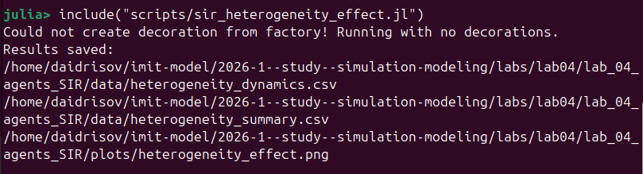{#fig-hetero-script width=70%}

Итоговый график [рис. @fig-hetero-plot] показывает отдельные траектории `S`, `I`, `R` для каждого города. Видно, что города с большей заразностью выходят на более высокий и более ранний пик.

{#fig-hetero-plot width=70%}

Таблица динамики по времени представлена на [рис. @fig-hetero-dynamics], а сводка пиков по городам --- на [рис. @fig-hetero-summary]. По итоговым данным максимальные пики составили 1022, 1035 и 1037 человек соответственно, что подтверждает усиление эпидемии в более «заразных» городах.

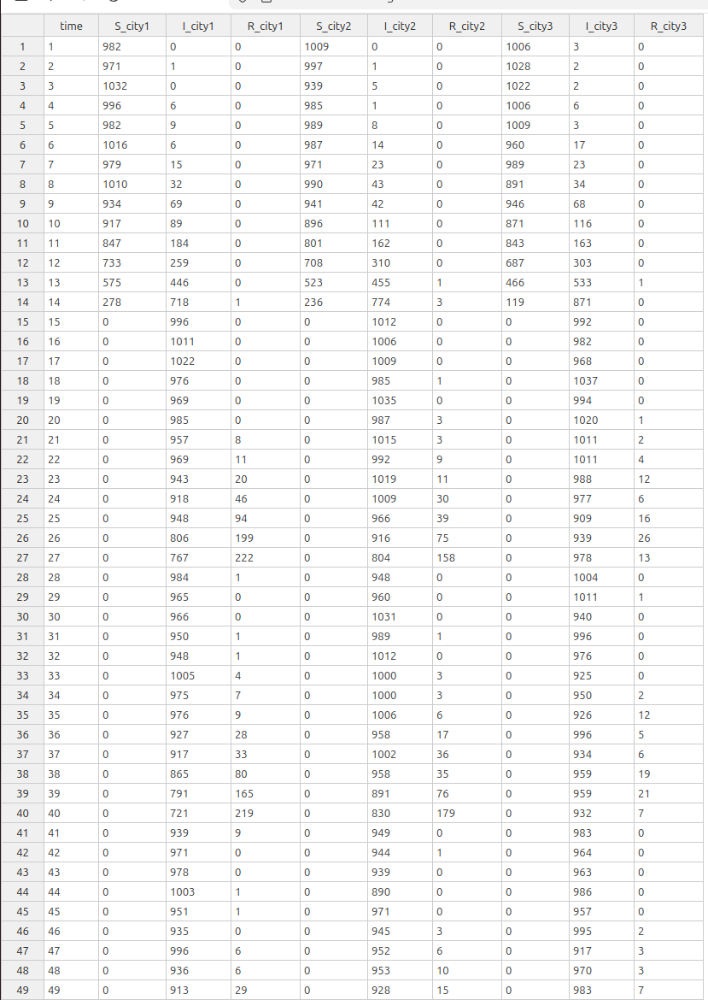{#fig-hetero-dynamics width=70%}

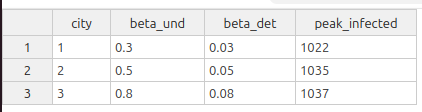{#fig-hetero-summary width=70%}

В таблице `heterogeneity_dynamics.csv` столбец `time` задаёт шаг моделирования, а столбцы `S_city*`, `I_city*`, `R_city*` показывают распределение агентов по классам в каждом из трёх городов. Таблица `heterogeneity_summary.csv` содержит номер города, значения `beta_und`, `beta_det` и максимальное число инфицированных.

График [рис. @fig-hetero-plot] выглядит именно так, потому что увеличение `beta` ускоряет распространение инфекции в конкретном городе. Поэтому у города с наибольшей заразностью пик выше и достигается быстрее.

Генерация literate-производных форматов для задания 3 иллюстрируется на [рис. @fig-hetero-clean], [рис. @fig-hetero-md] и [рис. @fig-hetero-ipynb].

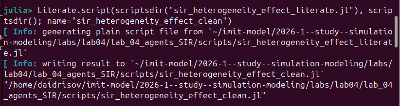{#fig-hetero-clean width=70%}

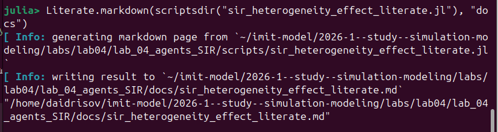{#fig-hetero-md width=70%}

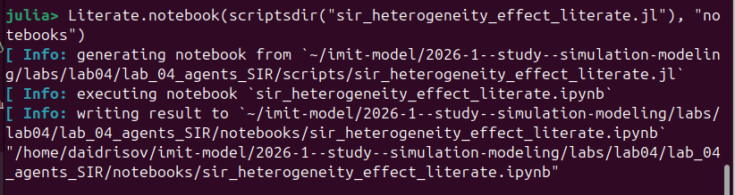{#fig-hetero-ipynb width=70%}

## Задание 4. Миграция

Пункт 4 опирается на эксперимент миграции, уже описанный в основном разделе. Его смысл заключается в нахождении интенсивности миграции, при которой эпидемия быстрее всего распространяется между городами.

По данным [рис. @fig-migration-csv] формально минимальное среднее время до пика наблюдается при нулевой миграции, однако это локальная вспышка в одном городе. Если рассматривать именно межгородское распространение, то среди ненулевых значений минимальное среднее время до пика достигается при `migration_intensity = 0.2`. Следовательно, именно это значение можно считать оптимальным с точки зрения скорости переноса инфекции между городами.

## Задание 5. Карантинные меры

Для анализа карантина была реализована отдельная модель, в которой миграция из города прекращается после превышения порога инфицированности. Скрипт запуска показан на [рис. @fig-quarantine-script].

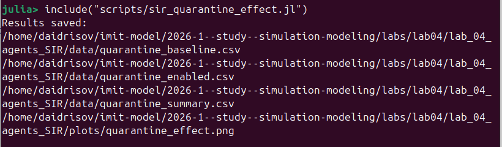{#fig-quarantine-script width=70%}

Сравнительный график [рис. @fig-quarantine-plot] содержит три панели: число инфицированных, общую численность популяции и моменты закрытия городов. Он показывает, что в выбранной настройке карантин немного сдвигает пик вправо и снижает итоговое число умерших.

{#fig-quarantine-plot width=70%}

Содержимое базового и карантинного CSV-файлов показано на [рис. @fig-quarantine-base] и [рис. @fig-quarantine-enabled], а итоговая сводка --- на [рис. @fig-quarantine-summary]. В рассматриваемом эксперименте число умерших уменьшилось с 555 до 546, а время достижения пика сдвинулось с 16 до 17 дней.

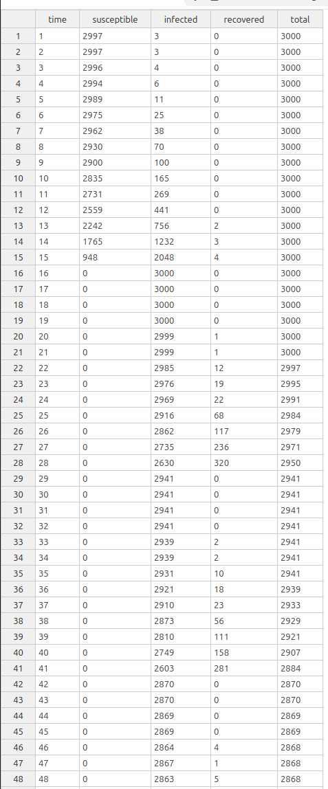{#fig-quarantine-base width=70%}

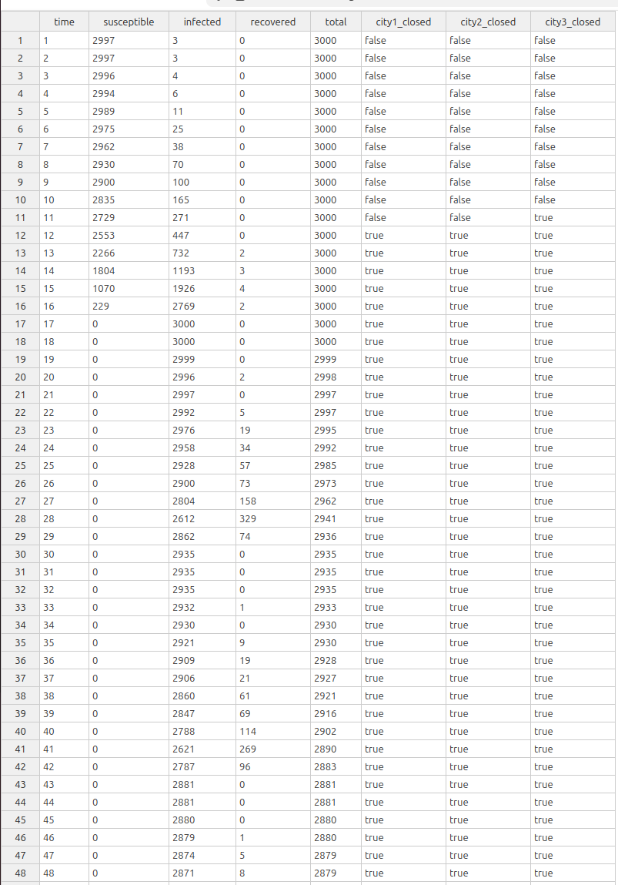{#fig-quarantine-enabled width=70%}

{#fig-quarantine-summary width=70%}

В `quarantine_baseline.csv` и `quarantine_enabled.csv` столбцы `susceptible`, `infected`, `recovered` и `total` описывают общую динамику по всей системе. Дополнительные столбцы `city1_closed`, `city2_closed`, `city3_closed` в карантинном сценарии показывают моменты закрытия городов. В `quarantine_summary.csv` собраны итоговые показатели: сценарий, пик заражения, время до пика и суммарное число умерших.

Форма графика [рис. @fig-quarantine-plot] показывает, что карантин в этой настройке не устраняет внутреннее распространение инфекции в уже заражённом городе, но замедляет межгородской перенос. Поэтому пик сдвигается по времени и смертность немного уменьшается.

Производные форматы карантинного скрипта представлены на [рис. @fig-quarantine-clean], [рис. @fig-quarantine-ipynb] и [рис. @fig-quarantine-md].

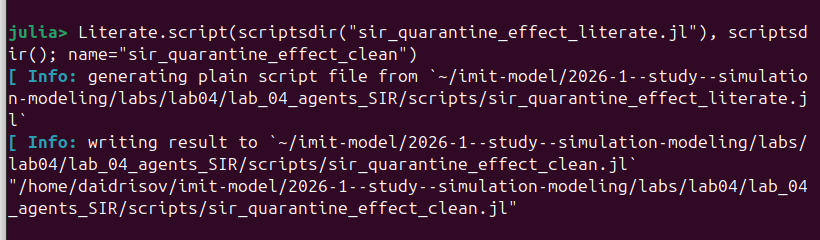{#fig-quarantine-clean width=70%}

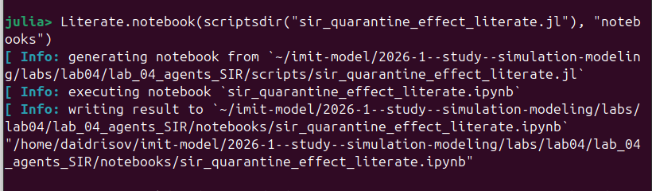{#fig-quarantine-ipynb width=70%}

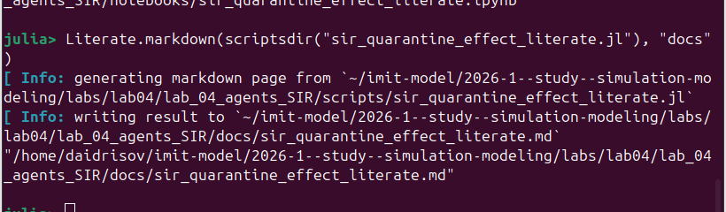{#fig-quarantine-md width=70%}

## Задание 6. Оптимизация с ограничением на пик

Для шестого задания был подготовлен отдельный скрипт `sir_optimize_with_constraint.jl`, минимизирующий смертность при условии `peak <= 0.3` ([рис. @fig-opt-constraint-script]).

{#fig-opt-constraint-script width=70%}

Результаты генерации clean-версии, Markdown-документации и notebook для ограниченной оптимизации показаны на [рис. @fig-opt-constraint-clean], [рис. @fig-opt-constraint-md] и [рис. @fig-opt-constraint-ipynb].

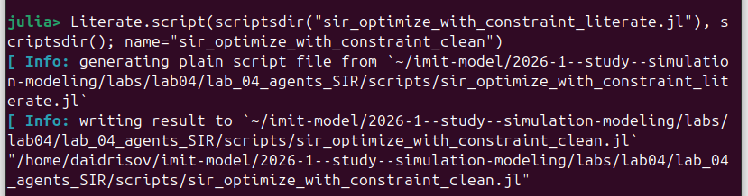{#fig-opt-constraint-clean width=70%}

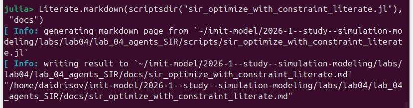{#fig-opt-constraint-md width=70%}

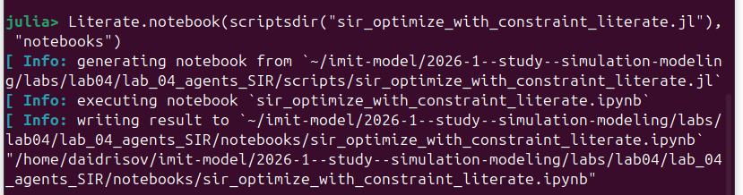{#fig-opt-constraint-ipynb width=70%}

Итоговая таблица параметров представлена на [рис. @fig-opt-constraint-csv]. Найденное решение имеет `beta_und ≈ 0.463`, `detection_time = 3`, `death_rate ≈ 0.0657`, при этом `peak_infected ≈ 0.2003`, `death_fraction = 0.0524`, а ограничение на пик удовлетворено (`true`).

{#fig-opt-constraint-csv width=70%}

Столбцы `optimization_with_constraint.csv` означают:

- `beta_und` --- найденная базовая заразность;
- `detection_time` --- найденное время выявления;
- `death_rate` --- коэффициент смертности;
- `objective` --- значение целевой функции;
- `peak_infected` --- средний пик инфицированных;
- `death_fraction` --- средняя доля умерших;
- `satisfies_constraint` --- выполнено ли ограничение `peak <= 0.3`.

Полученный результат объясняется тем, что целевая функция штрафует все решения с пиком выше 30%. Поэтому оптимизатор выбирает область параметров, где выявление происходит рано, а пик удаётся удержать ниже заданного порога.

Таким образом, задача с ограничением была решена корректно: модель нашла параметры, при которых пик остаётся ниже 30%, а смертность минимизируется в рамках выбранного алгоритма поиска.

# Выводы

В ходе лабораторной работы была реализована агентная версия эпидемиологической модели SIR на языке Julia с использованием Agents.jl и DrWatson. Были выполнены основные вычислительные эксперименты: базовый запуск, исследование коэффициента заразности, анализ миграции, оптимизация параметров и сводная визуализация.

Дополнительные задания позволили расширить исследование модели. Был вычислен и интерпретирован базовый показатель `R_0`, найден практический порог возникновения эпидемии, исследован эффект неоднородности параметров по городам, оценено влияние миграции, реализован карантинный сценарий и выполнена оптимизация с ограничением на пик заболеваемости. Все основные скрипты были представлены также в literate-формате, а из них были сгенерированы производные `.jl`, `.ipynb` и `.md`-версии.

# Список литературы{.unnumbered}

::: {#refs}
:::
