---
author:
  name: Идрисов Джафер Арсенович
  degrees: student
  email: 1132232876@rudn.ru
  affiliation:
    - name: Российский университет дружбы народов
      country: Российская Федерация
      postal-code: 117198
      city: Москва
      address: ул. Миклухо-Маклая, д. 6
title: "Имитационное моделирование"
subtitle: "Лабораторная работа №5. Аппарат сетей Петри"
license: CC BY
date: today
date-format: "YYYY-MM-DD"
---

# Информация

## Докладчик

:::::::::::::: {.columns align=center}
::: {.column width="70%"}

  * Идрисов Джафер Арсенович
  * Студент
  * Российский университет дружбы народов
  * [1132232876@rudn.ru](mailto:1132232876@rudn.ru)

:::
::: {.column width="30%"}
:::
::::::::::::::

# Цель и задачи

## Цель работы

- Изучить аппарат сетей Петри на примере задачи обедающих философов
- Реализовать модель на Julia в проекте DrWatson
- Провести базовые и параметрические эксперименты
- Подготовить literate-версии скриптов и документацию

## Задание

1. Настроить проект и зависимости
2. Реализовать сеть Петри для задачи обедающих философов
3. Выполнить базовый эксперимент и анимацию
4. Построить итоговый сравнительный график
5. Провести параметрическое исследование
6. Получить `clean`, `md`, `ipynb` и оформить отчёт

# Теоретическое введение

## Сеть Петри и задача обедающих философов

- Позиции описывают состояния системы
- Переходы описывают события
- Маркировка задаёт текущее распределение фишек
- В классической задаче возможен deadlock
- Позиция `Arbiter` устраняет тупиковую конфигурацию

## Структура файлов лабораторной работы

- `src/DiningPhilosophers.jl` --- модуль модели
- `dining_philosophers.jl` --- базовый эксперимент
- `dining_philosophers_animation.jl` --- построение анимации
- `dining_philosophers_report.jl` --- итоговый сравнительный график
- `dining_philosophers_params.jl` --- параметрическое исследование
- Для каждого скрипта подготовлена literate-версия

# Настройка окружения

## Запуск Julia и подключение DrWatson

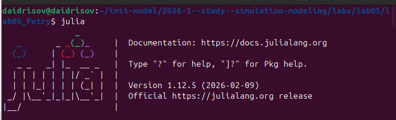{width=48%}
{width=48%}

- Слева показан запуск рабочей сессии Julia.
- Справа показано подключение `DrWatson` для организации проекта лабораторной работы.

## Установка зависимостей

{width=48%}
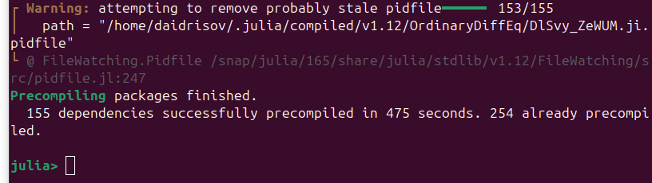{width=48%}

- Слева показан запуск менеджера пакетов Julia и установка зависимостей проекта.
- Справа показано успешное завершение установки, после которого можно запускать все скрипты лабораторной работы.

# Базовый эксперимент

## Основной скрипт и график классической сети {.smaller}

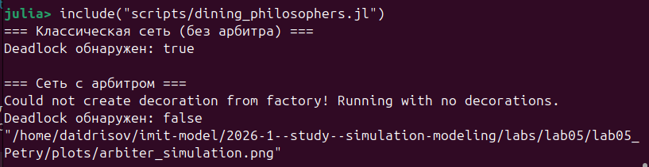{width=42%}
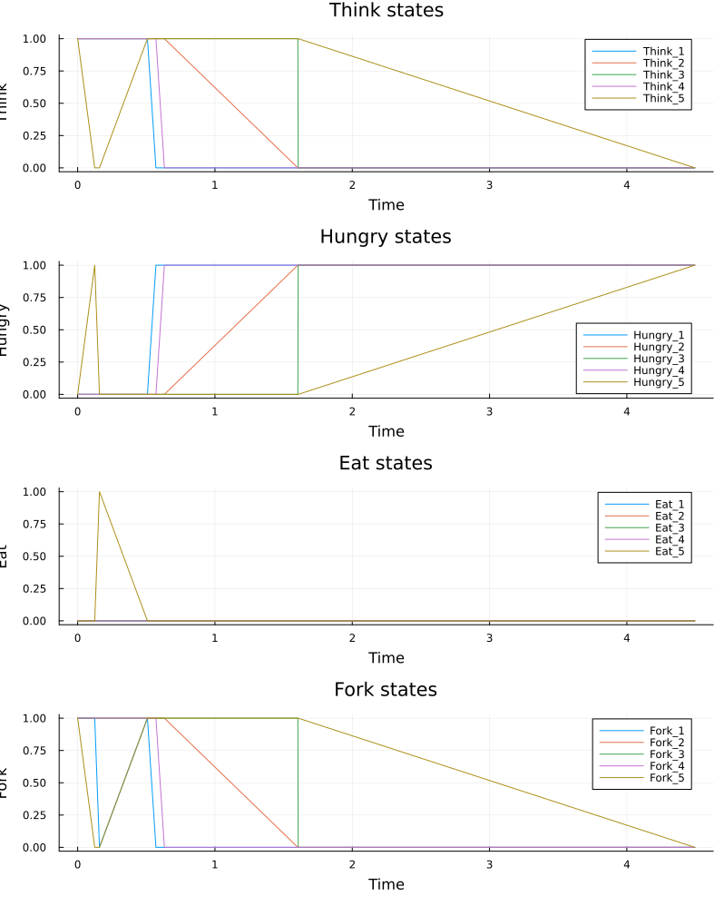{width=32%}

- Слева показан запуск основного скрипта `dining_philosophers.jl`.
- Справа приведён график классической сети: состояния `Eat_i` быстро исчезают, а система приходит к deadlock.

## Сеть с арбитром {.smaller}

{width=28%}

- На слайде показан график сети с арбитром.
- Активность системы сохраняется на всём интервале моделирования.
- В отличие от классической сети, состояния `Eat_i` продолжают появляться, а deadlock не возникает.

## CSV классической модели {.smaller}

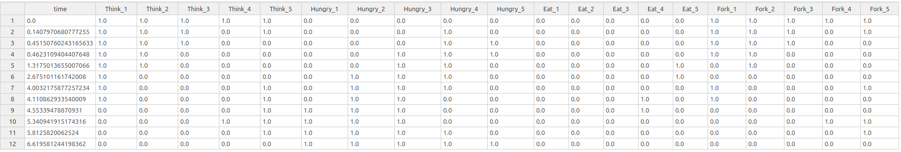{width=82%}

- Здесь показан файл `dining_classic.csv`.
- По столбцам `Think_i`, `Hungry_i`, `Eat_i`, `Fork_i` записана полная траектория классической сети.
- Последние строки таблицы отражают переход системы в состояние взаимной блокировки.

## CSV сети с арбитром и производные форматы базового скрипта {.smaller}

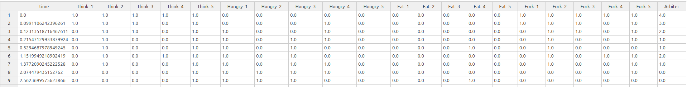{width=82%}

- Верхнее изображение показывает `dining_arbiter.csv`; его структура совпадает с классическим CSV, но дополнительно содержит столбец `Arbiter`.

## Производные форматы базового скрипта {.smaller}

{width=28%}
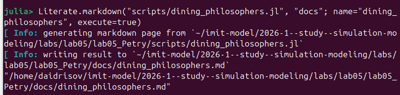{width=28%}
{width=28%}

- Слева показана `clean`-версия основного скрипта.
- По центру показан Markdown-документ, полученный из literate-версии.
- Справа показан Jupyter notebook для интерактивного воспроизведения эксперимента.

# Анимация процесса

## Скрипт анимации и его производные форматы {.smaller}

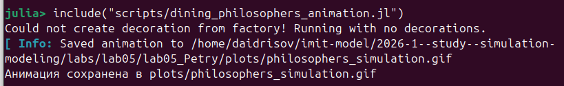{width=62%}

{width=31%}
{width=31%}
{width=31%}

- Сверху показан скрипт `dining_philosophers_animation.jl`, который строит GIF-анимацию изменения маркировки сети Петри.
- Снизу слева показана его `clean`-версия.
- Снизу по центру показан Markdown-файл с literate-описанием сценария анимации.
- Снизу справа показан notebook, в котором тот же процесс можно воспроизвести интерактивно.

# Итоговый сравнительный график

## Скрипт отчёта и итоговый график {.smaller}

{width=42%}
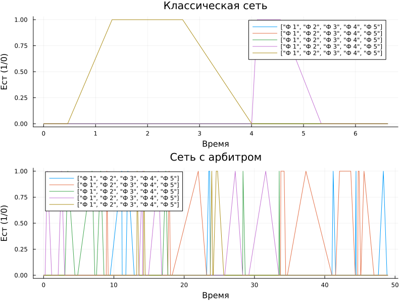{width=45%}

- Слева показан скрипт `dining_philosophers_report.jl`, который загружает ранее сохранённые CSV-файлы.
- Справа расположен итоговый график: в классической сети все `Eat_i` падают к нулю, а в сети с арбитром активность сохраняется.

## Производные форматы скрипта итогового отчёта

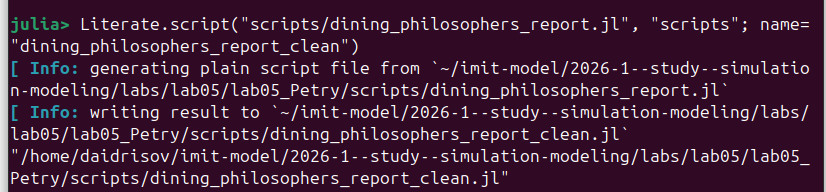{width=31%}
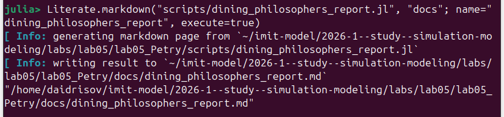{width=31%}
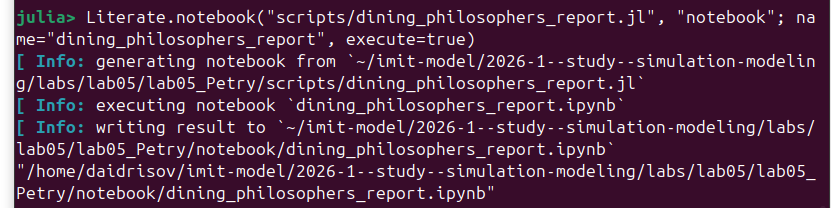{width=31%}

- Слева показана `clean`-версия итогового скрипта.
- По центру показан Markdown-документ с объяснением сравнительного графика.
- Справа показан notebook для повторного построения итогового рисунка.

# Параметрическое исследование

## Скрипт параметрического анализа и итоговый график {.smaller}

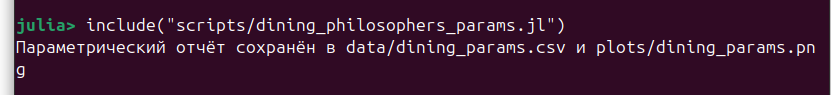{width=42%}
{width=45%}

- Слева показан скрипт `dining_philosophers_params.jl`, который перебирает `N`, `tmax` и `seed`.
- Справа приведён график `deadlock_rate`: для `classic` он равен единице, а для `arbiter` равен нулю во всех сериях экспериментов.

## CSV параметрического исследования {.smaller}

{width=62%}

- На скриншоте показан файл `dining_params.csv`.
- Столбец `network` различает `classic` и `arbiter`.
- Столбцы `N`, `tmax`, `seed` задают параметры запуска.
- Столбцы `deadlock`, `events`, `final_hungry`, `final_eat` описывают итог каждой симуляции.

## Производные форматы параметрического скрипта

{width=31%}
{width=31%}
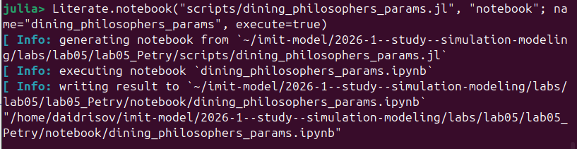{width=31%}

- Слева показана `clean`-версия параметрического скрипта.
- По центру расположен Markdown-документ с текстовым описанием серии запусков.
- Справа показан notebook для интерактивного анализа параметрического эксперимента.

# Выводы

## Итоги лабораторной работы

- Реализована сеть Петри для задачи обедающих философов
- Получены траектории классической сети и сети с арбитром
- Для классической сети deadlock возникает во всех запусках
- Для сети с арбитром deadlock не наблюдается
- Построены графики, CSV-таблицы, анимация и сравнительный итоговый отчёт
- Для каждого скрипта подготовлены `clean`, `md` и `ipynb` представления

