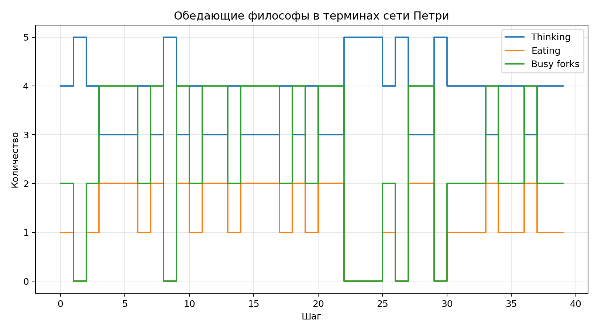

**Студент:** Гашимов Кенан Мухтар оглы  
**Группа:** НКНбд-01-23  
**Студенческий билет:** 1032235820  
**Направление:** Математика и компьютерные науки  
**Email:** kenan24gguka@gmail.com

        # Цель работы

        Описать систему через сеть Петри, воспроизвести динамику задачи обедающих философов и оформить результаты.

        # Формулировка задания

        - Подготовить модель сети Петри.
- Рассмотреть задачу обедающих философов.
- Сохранить временные ряды и график.
- Оформить отчёт и презентацию.

        # Теоретическая часть

        Сети Петри удобны для анализа конкуренции за ресурсы, синхронизации и свойств вроде блокировок и достижимости.

        # Ход работы

        ## Сеть Петри как модель ресурса

Места интерпретируются как состояния философов и доступность вилок, а переходы — как события захвата и освобождения ресурсов.
## Имитационный эксперимент

Запущена дискретная модель на 40 шагов. Сохранены данные о числе думающих, едящих и занятых вилках.
## Анализ блокировок

В выбранной схеме наблюдались шаги с активным питанием, что позволяет говорить об отсутствии полной блокировки в проведённой серии.

        # Эксперименты

        1. Смоделирована дискретная динамика пяти философов и вилок.
1. Собраны временные ряды числа едящих философов и занятых вилок.
1. Проверено отсутствие полной остановки в выбранной стратегии захвата ресурсов.

        # Полученные артефакты

        - project/data/dining-philosophers.csv
- project/plots/dining-philosophers.png
- project/src/Lab05.jl
- project/notebook/lab05.ipynb
- RELEASE.md

        # Основные результаты

        

        | Показатель | Значение |
| --- | ---: |
| Максимум едящих философов | 2 |
| Максимум занятых вилок | 4 |
| Наблюдалось питание | 1 |

        # Выводы

        - Сети Петри хорошо подходят для анализа распределения ресурсов.
- Даже простая стратегия захвата/освобождения вилок даёт содержательную динамику состояний.
- Отчётный пайплайн одинаково применим и к дискретным моделям управления ресурсами.

        # Материалы проекта

        - CSV-файл со временными рядами для философов.
- PNG-график числа едящих философов и занятых вилок.
- Локальный release-документ по лабораторной.

        # Воспроизводимость

        - Исходный Julia-проект находится в `../project/`.
        - Literate-документация находится в `../project/markdown/`.
        - Notebook находится в `../project/notebook/`.
        - Для повторной сборки используйте команды `make generate`, `make render`, `make verify`.
