---
## Author
author:
  name: Идрисов Джафер Арсенович
  degrees: student
  email: 1132232876@rudn.ru
  affiliation:
    - name: Российский университет дружбы народов
      country: Российская Федерация
      postal-code: 117198
      city: Москва
      address: ул. Миклухо-Маклая, д. 6

## Title
title: "Имитационное моделирование"
subtitle: "Лабораторная работа №5. Аппарат сетей Петри"
license: "CC BY"
---

# Цель работы

Изучить аппарат сетей Петри на примере задачи обедающих философов, реализовать классическую и модифицированную модель на языке Julia, выполнить вычислительные эксперименты, получить графики и таблицы результатов, подготовить literate-версии скриптов и собрать итоговую документацию по лабораторной работе.

# Задание

1. Создать рабочий каталог и проект Julia в структуре DrWatson.
2. Установить необходимые пакеты для моделирования, визуализации и документирования.
3. Реализовать модель сети Петри для задачи обедающих философов.
4. Выполнить базовый эксперимент для классической сети и сети с арбитром.
5. Построить анимацию изменения маркировки.
6. Сформировать итоговый сравнительный график по состояниям `Eat_i`.
7. Выполнить параметрическое исследование по `N`, `tmax` и `seed`.
8. Подготовить literate-версии скриптов и производные форматы `clean`, `md`, `ipynb`.
9. Описать все полученные графики, CSV-таблицы и листинги кода.

# Теоретическое введение

## Сети Петри

Сеть Петри представляет собой двудольный ориентированный граф, в котором используются четыре базовых сущности:

- позиции;
- переходы;
- дуги;
- маркировка.

Позиции отражают состояния системы, переходы описывают события, дуги задают причинно-следственные связи, а маркировка определяет текущее распределение фишек по позициям. Формально сеть Петри можно задать четвёркой

$$
N = (P, T, F, M_0),
$$

где `P` --- множество позиций, `T` --- множество переходов, `F` --- множество дуг, `M_0` --- начальная маркировка.

Для данной лабораторной работы сеть Петри используется как модель конкурентного доступа к общим ресурсам [@peterson1981].

## Задача обедающих философов

В классической постановке `N` философов сидят за круглым столом. Между соседними философами лежит по одной вилке. Чтобы перейти к приёму пищи, философ должен получить две вилки --- левую и правую. Если каждый философ одновременно захватывает только одну вилку, система может перейти в состояние взаимной блокировки: все вилки разобраны частично, но никто не может продолжить выполнение.

В терминах сети Петри используются следующие группы позиций:

- `Think_i` --- философ `i` размышляет;
- `Hungry_i` --- философ `i` голоден и ожидает вторую вилку;
- `Eat_i` --- философ `i` ест;
- `Fork_i` --- вилка `i` свободна.

В модификации с арбитром вводится дополнительная позиция `Arbiter` с `N - 1` фишками. Она запрещает ситуацию, когда все философы одновременно берут по одной вилке, и тем самым устраняет deadlock.

## Используемые инструменты

В работе использовались:

- `Julia` как язык реализации;
- `DrWatson` для организации структуры проекта;
- `OrdinaryDiffEq` для детерминированной формы модели;
- `Plots` для графиков и анимации;
- `CSV` и `DataFrames` для сохранения и анализа результатов;
- `Literate.jl` для генерации `clean`, `md` и `ipynb` представлений.

Язык Julia используется как современная среда для научных вычислений [@bezanson2017]. Для организации воспроизводимого проекта применён `DrWatson` [@drwatson_jl], а для преобразования literate-скриптов в разные представления --- пакет `Literate.jl` [@literate_jl].

## Литературное программирование

Литературное программирование рассматривает программу не только как последовательность инструкций для выполнения, но и как связный текст, объясняющий логику решения. Такой подход был сформулирован Дональдом Кнутом [@knuth1984] и далее получил развитие в инструментах воспроизводимых вычислений [@schulte2012].

В данной лабораторной работе этот подход использовался следующим образом:

- основной код каждого эксперимента оформлялся в отдельном `*_literate.jl`-файле;
- из literate-файла генерировались три производных представления:
  - чистый исполняемый `.jl`-скрипт;
  - Markdown-документ `.md`;
  - Jupyter notebook `.ipynb`;
- один и тот же источник одновременно использовался и для вычислений, и для документирования результатов.

Такой способ организации материалов удобен для учебной лабораторной работы, поскольку позволяет избежать расхождения между кодом, текстовым описанием и интерактивной версией эксперимента.

# Выполнение лабораторной работы

## Подготовка окружения

Сначала был запущен интерпретатор Julia и подготовлен проект лабораторной работы. Далее был подключён пакет `DrWatson`, активировано окружение проекта и установлены зависимости, используемые в лабораторной работе.

{width=70%}

На скриншоте показан старт рабочей сессии Julia, с которой начинается настройка окружения и выполнение всех последующих скриптов лабораторной работы.

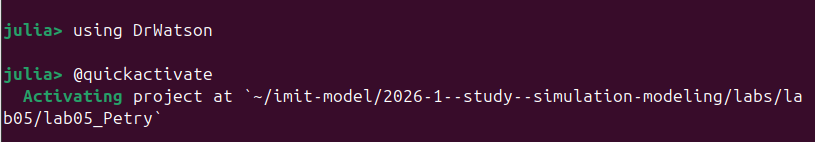{width=70%}

Здесь видно подключение `DrWatson`, который обеспечивает стандартную структуру проекта и удобные функции для работы с каталогами `src`, `scripts`, `data` и `plots`.

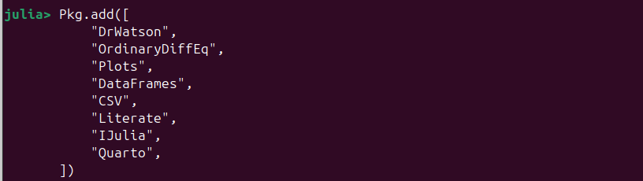{width=70%}

На этом шаге были подготовлены и добавлены пакеты `CSV`, `DataFrames`, `DrWatson`, `IJulia`, `Literate`, `OrdinaryDiffEq`, `Plots` и `Quarto`.

{width=70%}

Скриншот фиксирует успешное завершение подготовки окружения. После этого проект был готов к созданию исходных файлов и запуску экспериментов.

## Структура файлов лабораторной работы

В результате выполнения работы были подготовлены следующие основные файлы:

- `src/DiningPhilosophers.jl` --- модуль с описанием структуры сети Петри, моделирования и анализа результатов;
- `scripts/dining_philosophers.jl` --- базовый эксперимент для классической сети и сети с арбитром;
- `scripts/dining_philosophers_literate.jl` --- literate-версия базового эксперимента;
- `scripts/dining_philosophers_animation.jl` --- построение анимации изменения маркировки;
- `scripts/dining_philosophers_animation_literate.jl` --- literate-версия скрипта анимации;
- `scripts/dining_philosophers_report.jl` --- построение итогового сравнительного графика по состояниям `Eat_i`;
- `scripts/dining_philosophers_report_literate.jl` --- literate-версия итогового отчёта;
- `scripts/dining_philosophers_params.jl` --- параметрическое исследование;
- `scripts/dining_philosophers_params_literate.jl` --- literate-версия параметрического исследования.

## Описание модели и модуля `DiningPhilosophers.jl`

Модуль `src/DiningPhilosophers.jl` содержит:

- структуру `PetriNet`;
- функции построения классической сети и сети с арбитром;
- детерминированную модель через систему ОДУ;
- стохастическую симуляцию по схеме Гиллеспи;
- функцию обнаружения deadlock;
- функцию построения графиков эволюции маркировки.

Ключевая идея реализации состоит в том, что матрица инцидентности хранит изменения маркировки для каждой пары "позиция-переход". При стохастическом моделировании из текущей маркировки вычисляются интенсивности допустимых переходов, после чего выбирается очередной переход и обновляется состояние системы. По сути в скрипте используется событийная схема, близкая к алгоритму Гиллеспи для стохастических систем [@gillespie1977].

### Ключевые функции модуля

Ниже приведены основные фрагменты кода модуля `DiningPhilosophers.jl`.

```julia
struct PetriNet
    n_places::Int
    n_transitions::Int
    incidence::Matrix{Int}
    place_names::Vector{Symbol}
    transition_names::Vector{Symbol}
end

function add_arc!(net::PetriNet, place::Int,
                  transition::Int, sign::Int)
    net.incidence[place, transition] += sign
end
```

```julia
function build_classical_network(N::Int)
    n_places = 4N
    n_transitions = 3N
    net = PetriNet(n_places, n_transitions)

    for i = 1:N
        net.place_names[i] = Symbol("Think_$i")
        net.place_names[N + i] = Symbol("Hungry_$i")
        net.place_names[2N + i] = Symbol("Eat_$i")
        net.place_names[3N + i] = Symbol("Fork_$i")
    end
    # ...
    return net, u0, net.place_names
end
```

```julia
function detect_deadlock(df::DataFrame, net::PetriNet;
                         tol = 1e-6)
    u_last = [df[end, String(net.place_names[i])]
              for i = 1:net.n_places]
    for j = 1:net.n_transitions
        can_fire = true
        for i = 1:net.n_places
            if net.incidence[i, j] < 0 &&
               u_last[i] < -net.incidence[i, j] - tol
                can_fire = false
                break
            end
        end
        if can_fire
            return false
        end
    end
    return true
end
```

Эти функции определяют структуру сети, построение маркировки и критерий взаимной блокировки.

## Базовый эксперимент: `scripts/dining_philosophers.jl`

Основной скрипт лабораторной работы запускает две модели:

- классическую сеть без арбитра;
- сеть с арбитром.

Скрипт создаёт сети, запускает стохастическую симуляцию, сохраняет траектории в CSV, проверяет наличие deadlock и строит графики эволюции маркировки.

### Ключевой фрагмент кода

```julia
function main()
    N = 5
    tmax = 50.0

    net_classic, u0_classic, _ =
        DiningPhilosophers.build_classical_network(N)
    df_classic =
        DiningPhilosophers.simulate_stochastic(
            net_classic, u0_classic, tmax
        )
    CSV.write(datadir("dining_classic.csv"), df_classic)

    dead =
        DiningPhilosophers.detect_deadlock(
            df_classic, net_classic
        )
    plot_classic =
        DiningPhilosophers.plot_marking_evolution(
            df_classic, N
        )
    savefig(plot_classic,
            plotsdir("classic_simulation.png"))
end
```

Этот фрагмент показывает общий шаблон базового эксперимента: построение сети, моделирование, проверку deadlock и сохранение результатов.

{width=70%}

Этот скриншот подтверждает выполнение базового сценария. На его основе формируются два ключевых файла данных: `dining_classic.csv` и `dining_arbiter.csv`.

### Результаты для классической сети

{width=52%}

На графике показана динамика четырёх групп состояний:

- `Think_i` --- фишка покидает позицию после начала захвата вилок;
- `Hungry_i` --- число голодных философов постепенно растёт;
- `Eat_i` --- состояние приёма пищи оказывается кратковременным;
- `Fork_i` --- свободные вилки исчезают по мере захвата ресурсов.

Финальная часть графика соответствует взаимной блокировке: философы перестают переходить в состояние `Eat`, а вилки становятся недоступны. По содержимому последней строки `dining_classic.csv` видно, что в момент `t ≈ 6.62` все пять философов находятся в состоянии `Hungry`, все `Eat_i = 0`, а все `Fork_i = 0`. Это и есть deadlock.

### Результаты для сети с арбитром

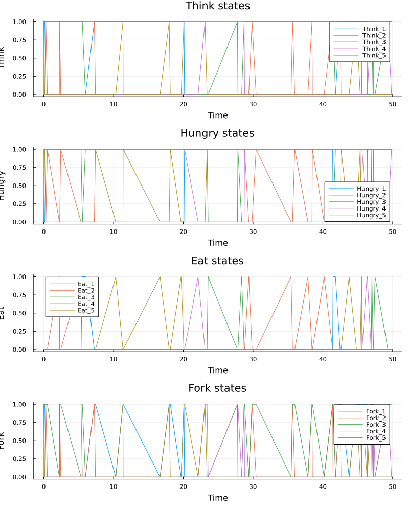{width=52%}

На этом графике система ведёт себя иначе. Несмотря на постоянную конкуренцию за ресурсы, переходы продолжают срабатывать до конца моделирования. На интервале до `t ≈ 49` наблюдается чередование состояний `Think`, `Hungry` и `Eat`, а позиция `Arbiter` ограничивает число одновременно пытающихся поесть философов. Deadlock не возникает.

### CSV-таблица `dining_classic.csv`

{width=90%}

Файл `dining_classic.csv` содержит полную временную траекторию классической сети. Столбцы интерпретируются так:

- `time` --- модельное время;
- `Think_1` ... `Think_5` --- наличие философа в состоянии размышления;
- `Hungry_1` ... `Hungry_5` --- наличие философа в состоянии ожидания;
- `Eat_1` ... `Eat_5` --- наличие философа в состоянии приёма пищи;
- `Fork_1` ... `Fork_5` --- наличие свободных вилок.

Каждый из этих столбцов фактически содержит число фишек в соответствующей позиции. В данной постановке значения обычно равны `0` или `1`, поскольку философ не может одновременно находиться в нескольких состояниях.

### CSV-таблица `dining_arbiter.csv`

{width=90%}

Структура файла `dining_arbiter.csv` совпадает с `dining_classic.csv`, но дополнительно содержит столбец:

- `Arbiter` --- число фишек в позиции арбитра.

Если `Arbiter > 0`, система допускает новый вход философа в критическую секцию захвата ресурсов. Когда фишка арбитра временно отсутствует, очередной философ не может начать цикл захвата вилок. Именно этот дополнительный ресурс устраняет тупиковую конфигурацию.

### Производные форматы для основного скрипта

После подготовки literate-версии были сгенерированы производные представления.

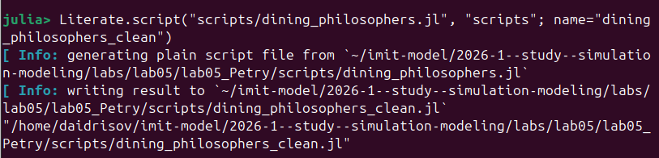{width=70%}

Скриншот показывает автоматически сформированный `clean`-скрипт, пригодный для прямого запуска без literate-разметки.

{width=70%}

Файл `.md` использовался как текстовая документация и как источник для дальнейшего включения материала в отчёт.

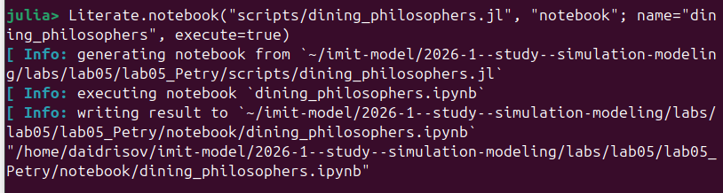{width=70%}

Notebook-версия позволила выполнить тот же эксперимент в интерактивной форме и визуально проверить воспроизводимость результата.

## Анимация процесса: `scripts/dining_philosophers_animation.jl`

Следующий скрипт строит анимацию изменения маркировки классической сети для малого числа философов `N = 3`.

{width=70%}

Логика скрипта состоит в следующем:

- создаётся классическая сеть Петри;
- выполняется стохастическая симуляция;
- для каждой строки таблицы создаётся кадр столбчатой диаграммы;
- кадры сохраняются в GIF-файл `philosophers_simulation.gif`.

Эта анимация особенно полезна тем, что позволяет увидеть не только итоговое состояние, но и весь процесс постепенного перехода сети к блокировке.

### Ключевой фрагмент кода

```julia
function main()
    N = 3
    tmax = 30.0
    net, u0, names =
        DiningPhilosophers.build_classical_network(N)

    Random.seed!(123)
    df =
        DiningPhilosophers.simulate_stochastic(
            net, u0, tmax
        )

    anim = @animate for row in eachrow(df)
        u = [row[col] for col in propertynames(row)
             if col != :time]
        bar(1:length(u), u, legend = false)
        xticks!(1:length(u), string.(names),
                rotation = 45)
    end

    gif(anim, plotsdir("philosophers_simulation.gif"),
        fps = 2)
end
```

Код анимации строит последовательность кадров по строкам таблицы состояний и сохраняет GIF-файл.

### Производные форматы для скрипта анимации

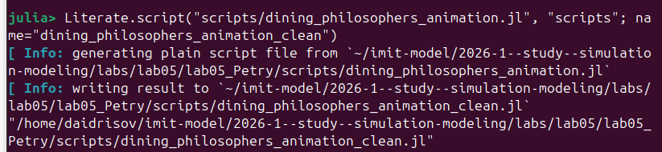{width=70%}

`Clean`-представление содержит только исполняемый код и используется как конечный вариант сценария генерации GIF.

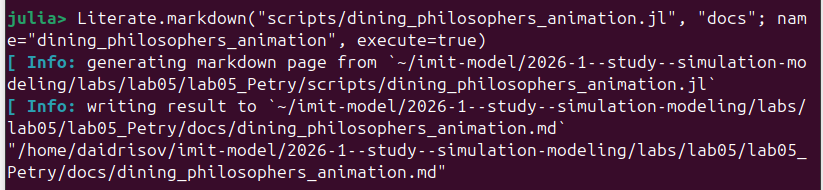{width=70%}

Markdown-файл фиксирует словесное описание анимационного сценария и последовательность построения кадров.

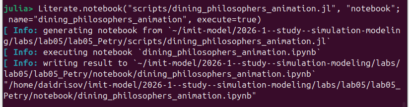{width=70%}

Notebook-версия удобна для визуального просмотра построения анимации и проверки каждого шага отдельно.

## Итоговый сравнительный отчёт: `scripts/dining_philosophers_report.jl`

Скрипт `dining_philosophers_report.jl` загружает данные базового эксперимента и строит сводный график по состояниям `Eat_i`.

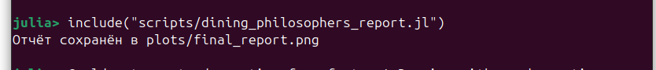{width=70%}

Основная задача этого файла --- не моделирование, а повторная обработка уже полученных CSV-таблиц.

### Ключевой фрагмент кода

```julia
function main()
    df_classic =
        CSV.read(datadir("dining_classic.csv"),
                 DataFrame)
    df_arbiter =
        CSV.read(datadir("dining_arbiter.csv"),
                 DataFrame)
    N = 5

    eat_cols = [Symbol("Eat_$i") for i = 1:N]

    p1 = plot(df_classic.time,
              Matrix(df_classic[:, eat_cols]),
              title = "Классическая сеть")
    p2 = plot(df_arbiter.time,
              Matrix(df_arbiter[:, eat_cols]),
              title = "Сеть с арбитром")

    p_final = plot(p1, p2, layout = (2, 1),
                   size = (800, 600))
    savefig(p_final, plotsdir("final_report.png"))
end
```

В этом фрагменте показана повторная загрузка экспериментальных данных и построение сводного графика для двух сценариев.

### График `final_report.png`

{width=70%}

На верхней панели графика показана классическая сеть. Все кривые `Eat_i` довольно быстро опускаются к нулю и дальше остаются на нуле. Это означает, что философы перестали получать возможность есть.

На нижней панели показана сеть с арбитром. Здесь линии колеблются на всём интервале времени, а значит система не теряет живость и хотя бы часть философов продолжает получать доступ к ресурсам.

Именно этот график наиболее наглядно демонстрирует различие между двумя постановками задачи:

- в классической сети deadlock возникает неизбежно;
- в сети с арбитром приём пищи продолжается на протяжении моделирования.

### Производные форматы для итогового отчёта

{width=70%}

Clean-версия фиксирует исполняемый код для построения итогового графика без literate-комментариев.

{width=70%}

В Markdown-представлении содержится пояснение к идее сравнения состояний `Eat_i` и интерпретация графика.

{width=70%}

Notebook-версия обеспечивает интерактивный просмотр итогового анализа и повторное построение графика.

## Параметрическое исследование: `scripts/dining_philosophers_params.jl`

Параметрический скрипт выполняет серию запусков для наборов параметров:

- `N = [3, 5, 7]`;
- `tmax = [30.0, 50.0, 80.0]`;
- `seed = [123, 124, 125]`.

При каждом запуске рассматриваются две сети --- `classic` и `arbiter`. Для них сохраняются признаки наличия deadlock, число событий и значения `final_hungry`, `final_eat`.

{width=70%}

Этот файл агрегирует результаты сразу по 54 прогонам: 27 комбинаций параметров для классической сети и 27 --- для сети с арбитром.

### Ключевой фрагмент кода

```julia
function main()
    N_VALUES = [3, 5, 7]
    TMAX_VALUES = [30.0, 50.0, 80.0]
    SEEDS = [123, 124, 125]

    results = DataFrame(
        network = String[],
        N = Int[],
        tmax = Float64[],
        seed = Int[],
        deadlock = Bool[],
        events = Int[],
        final_hungry = Float64[],
        final_eat = Float64[],
    )

    for N in N_VALUES, tmax in TMAX_VALUES, seed in SEEDS
        # запуск classical и arbiter
        # заполнение таблицы results
    end

    CSV.write(datadir("dining_params.csv"), results)
end
```

В параметрическом скрипте центральным элементом является тройной цикл по `N`, `tmax` и `seed`, после которого агрегированные результаты сохраняются в CSV и визуализируются на отдельном графике.

### График `dining_params.png`

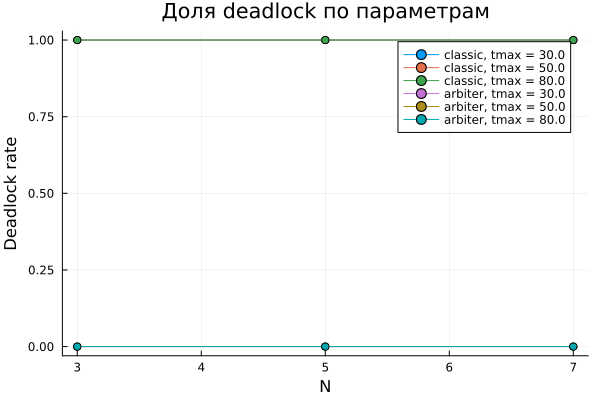{width=70%}

На графике по оси `N` отложено число философов, а по оси `Deadlock rate` --- доля прогонов, завершившихся взаимной блокировкой.

Фактический результат оказался очень устойчивым:

- для сети `classic` `deadlock_rate = 1` при всех значениях `N` и `tmax`;
- для сети `arbiter` `deadlock_rate = 0` при всех значениях `N` и `tmax`.

Дополнительно по `dining_params.csv` можно сделать ещё два вывода:

- среднее число событий в классической сети равно примерно `17.67`, то есть система быстро приходит к блокировке;
- среднее число событий в сети с арбитром равно примерно `93.33`, что отражает существенно более длительную активную работу системы.

### CSV-таблица `dining_params.csv`

{width=70%}

Файл `dining_params.csv` содержит агрегированную информацию о каждом прогоне. Столбцы имеют следующий смысл:

- `network` --- тип сети: `classic` или `arbiter`;
- `N` --- число философов;
- `tmax` --- предельное время моделирования;
- `seed` --- зерно генератора случайных чисел;
- `deadlock` --- булев признак наличия deadlock в конце прогона;
- `events` --- число зафиксированных состояний в траектории;
- `final_hungry` --- суммарное число философов в состоянии `Hungry` в последней строке;
- `final_eat` --- суммарное число философов в состоянии `Eat` в последней строке.

Из этой таблицы видно, что:

- в строках сети `classic` признак `deadlock` всегда равен `true`;
- в строках сети `arbiter` признак `deadlock` всегда равен `false`;
- для классической сети `final_eat` во всех прогонах равен нулю;
- для сети с арбитром в конце моделирования нередко сохраняется хотя бы один философ в состоянии приёма пищи.

### Производные форматы для параметрического исследования

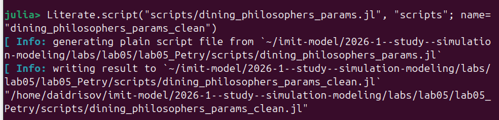{width=70%}

Clean-версия содержит исполняемый сценарий многократного прогона без разметки literate programming.

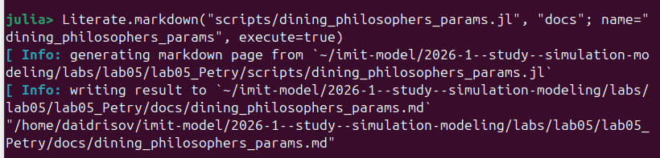{width=70%}

Markdown-файл удобен как краткая текстовая документация для параметрического анализа.

{width=70%}

Notebook-версия позволяет выполнить серию запусков в интерактивной форме и пересчитать график при изменении параметров.

## Общий вывод по результатам моделирования

Полученные файлы данных и графики согласуются между собой:

- `dining_classic.csv` показывает быстрое вырождение траектории в deadlock;
- `dining_arbiter.csv` показывает, что система остаётся активной до конца интервала моделирования;
- `final_report.png` количественно подтверждает исчезновение состояний `Eat_i` в классической сети;
- `dining_params.csv` и `dining_params.png` показывают, что результат не зависит от выбранных `N`, `tmax` и `seed`: классическая сеть всегда тупиковая, сеть с арбитром --- нет.

# Выводы

В ходе лабораторной работы был реализован и исследован аппарат сетей Петри на примере задачи обедающих философов. Построены две модели: классическая и модифицированная с арбитром. Базовый эксперимент показал, что классическая постановка быстро приводит к deadlock, тогда как введение арбитра сохраняет активность системы на всём интервале моделирования.

Были получены:

- графики эволюции маркировки для обеих сетей;
- CSV-файлы с полными траекториями состояний;
- анимация изменения маркировки;
- итоговый сравнительный график по состояниям `Eat_i`;
- таблица и график параметрического исследования;
- literate-версии скриптов и производные форматы `clean`, `md`, `ipynb`.

Параметрический анализ подтвердил устойчивость результата: для всех 27 комбинаций параметров классическая сеть завершалась deadlock, а сеть с арбитром не блокировалась ни в одном запуске. Следовательно, введение дополнительного механизма синхронизации в виде арбитра является эффективным способом устранения взаимной блокировки в задаче обедающих философов.

# Список литературы{.unnumbered}

::: {#refs}
:::

