---
author:
  name: Идрисов Джафер Арсенович
  degrees: student
  email: 1132232876@rudn.ru
  affiliation:
    - name: Российский университет дружбы народов
      country: Российская Федерация
      postal-code: 117198
      city: Москва
      address: ул. Миклухо-Маклая, д. 6
title: "Имитационное моделирование"
subtitle: "Лабораторная работа №6. Реализация модели SIR в подходе сетей Петри"
license: CC BY
date: today
date-format: "YYYY-MM-DD"
---

# Информация

## Докладчик

:::::::::::::: {.columns align=center}
::: {.column width="70%"}

  * Идрисов Джафер Арсенович
  * Студент
  * Российский университет дружбы народов
  * [1132232876@rudn.ru](mailto:1132232876@rudn.ru)

:::
::: {.column width="30%"}
:::
::::::::::::::

# Цель и задачи

## Цель работы

- Реализовать модель SIR в аппарате сетей Петри
- Выполнить детерминированный и стохастический эксперименты
- Построить графики, таблицы и анимацию
- Подготовить literate-скрипты и производные форматы

## Задание

1. Настроить проект `DrWatson`
2. Реализовать модуль `SIRPetri.jl`
3. Выполнить базовый прогон, скан параметров, анимацию и итоговый отчёт
4. Получить `clean`, `md`, `ipynb`
5. Подготовить отчёт и презентацию

# Теоретическое введение

## Модель SIR и сети Петри

- Позиции сети: `S`, `I`, `R`
- Переходы:
  - `infection: S + I -> I + I`
  - `recovery: I -> R`
- Детерминированная форма задаётся системой ОДУ
- Стохастическая форма реализуется алгоритмом Гиллеспи

## Используемые инструменты

- `Julia`
- `DrWatson`
- `AlgebraicPetri` и `Catlab`
- `OrdinaryDiffEq`
- `Plots`
- `CSV`, `DataFrames`
- `Literate.jl`

# Подготовка окружения

## Запуск Julia и DrWatson

{width=46%}
{width=46%}

- Слева показан запуск Julia REPL.
- Справа показано подключение `DrWatson`.

## Инициализация и активация проекта

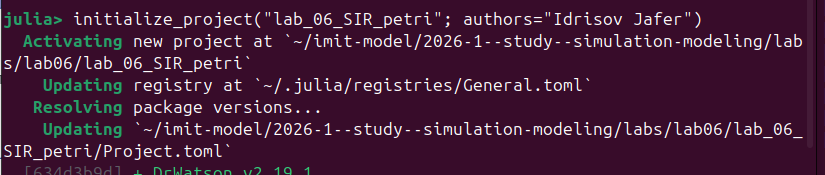{width=46%}
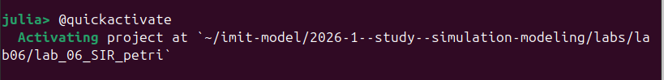{width=46%}

- Слева проект создаётся как `lab_06_SIR_petri`.
- Справа показана активация окружения через `@quickactivate`.

## Установка зависимостей

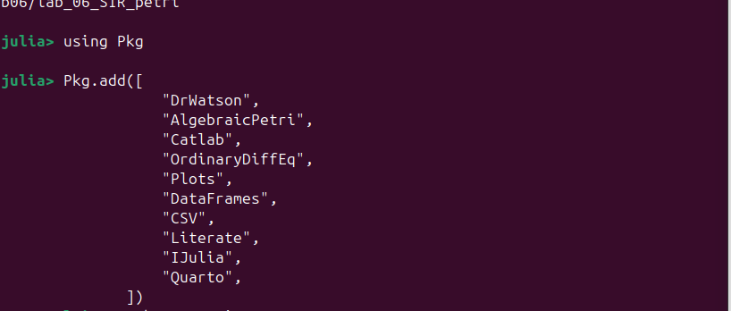{width=46%}
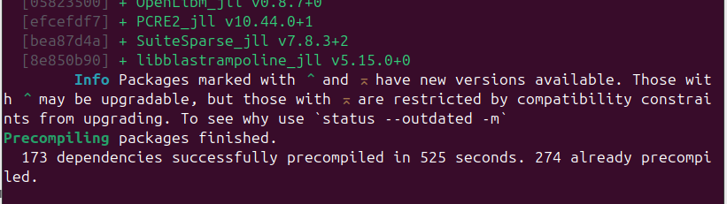{width=46%}

- Слева показана установка пакетов.
- Справа показано завершение precompile и готовность среды.

# Базовый прогон

## Скрипт базового прогона и его смысл

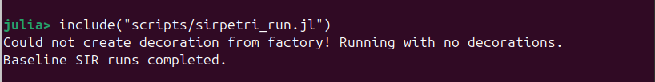{width=52%}

- Скрипт `sirpetri_run.jl` выполняет детерминированную и стохастическую симуляции.
- Результаты сохраняются в `sir_det.csv`, `sir_stoch.csv`, `sir_det_dynamics.png`, `sir_stoch_dynamics.png`.

## Детерминированная и стохастическая динамика

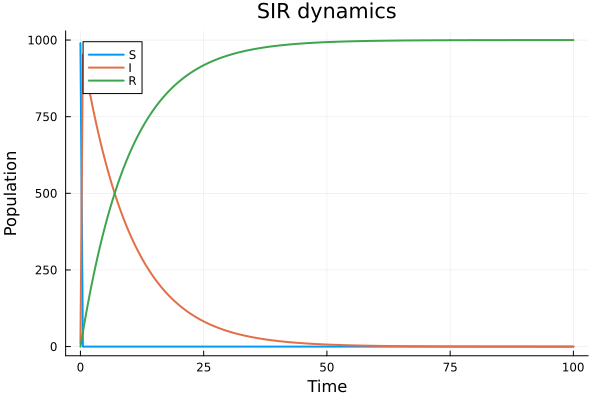{width=46%}
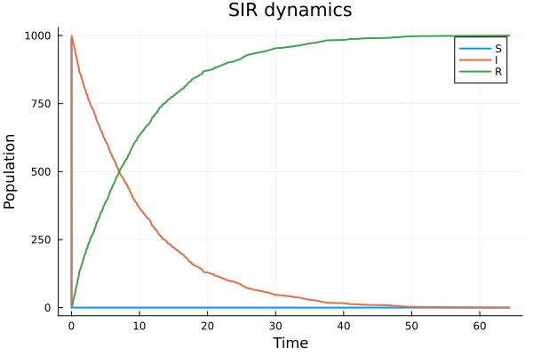{width=46%}

- Слева детерминированная кривая: быстрый пик `I`, затем спад.
- Справа стохастическая траектория: дискретные скачки и быстрое достижение максимума.

## CSV-таблицы базового прогона

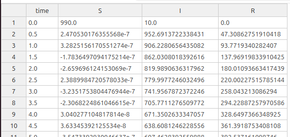{width=46%}
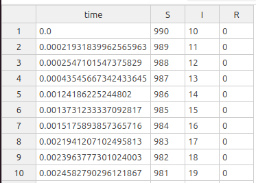{width=46%}

- `sir_det.csv` содержит гладкую траекторию ОДУ.
- `sir_stoch.csv` содержит событийную дискретную траекторию.

## Literate и производные форматы базового прогона

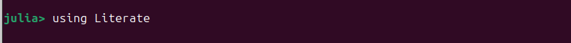{width=32%}
{width=32%}
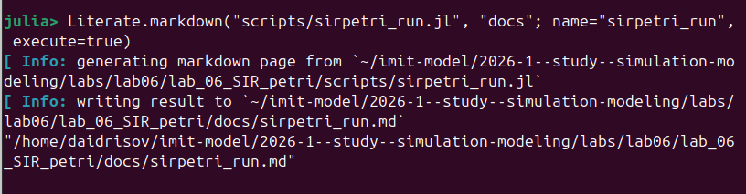{width=32%}

- Слева показано подключение `Literate.jl`.
- По центру показан `clean`-файл.
- Справа показан Markdown-документ.

## Notebook базового прогона

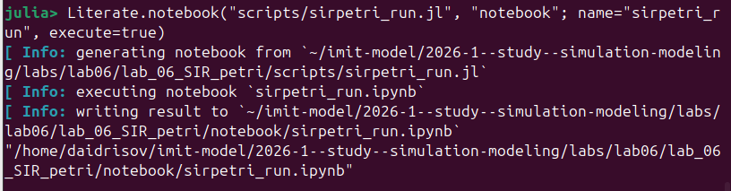{width=72%}

- Notebook-версия воспроизводит базовый эксперимент в интерактивной форме.

# Параметрическое исследование

## Скрипт исследования по `β`

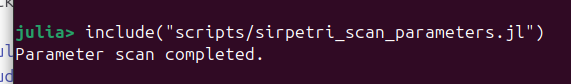{width=56%}

- `sirpetri_scan_parameters.jl` перебирает значения `β` от `0.1` до `0.8`.
- Для каждого значения вычисляются `peak_I` и `final_R`.

## График `sir_scan.png`

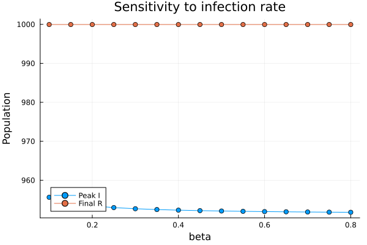{width=50%}

- Зависимость от `beta` оказалась слабой.
- `peak_I` меняется в узком диапазоне, `final_R` почти постоянно близко к `1000`.

## CSV-таблица `sir_scan.csv`

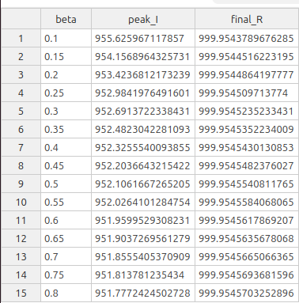{width=40%}

- Таблица содержит 15 строк для значений `β`.
- В столбцах записаны `beta`, `peak_I`, `final_R`.

## Производные форматы параметрического скрипта

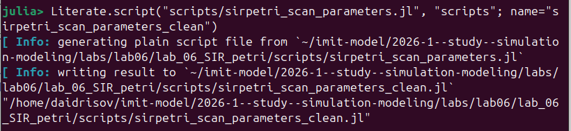{width=31%}
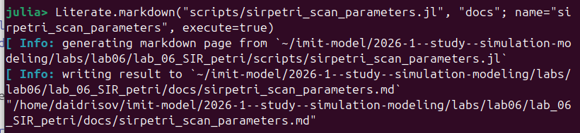{width=31%}
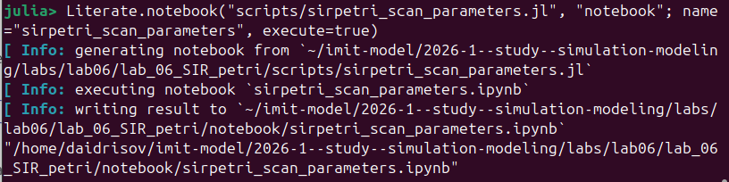{width=31%}

- Слева `clean`-версия.
- По центру Markdown-представление.
- Справа Jupyter notebook.

# Анимация

## Скрипт анимации

{width=60%}

- `sirpetri_animate.jl` строит GIF по детерминированной траектории.
- На каждом кадре отображаются значения `S`, `I`, `R`.

## Производные форматы скрипта анимации

{width=31%}
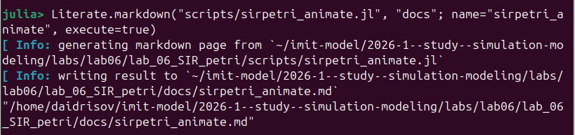{width=31%}
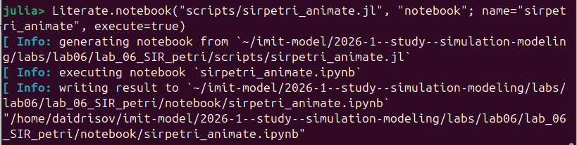{width=31%}

- Слева исполняемая `clean`-версия.
- По центру Markdown-документ.
- Справа notebook для интерактивного воспроизведения.

# Итоговый отчётный сценарий

## Скрипт `sirpetri_report.jl`

{width=56%}

- Итоговый сценарий читает готовые CSV-файлы.
- Он строит `comparison.png` и `sensitivity.png`.

## Сравнительный график `comparison.png`

{width=50%}

- На графике сравниваются траектории `I(t)` для детерминированного и стохастического режимов.
- Обе кривые показывают очень быстрое распространение инфекции в текущей постановке модели.

## График `sensitivity.png`

{width=50%}

- Этот рисунок повторно визуализирует зависимость `peak_I` от `β`.
- Он включён в проект как отдельный итоговый график.

## Производные форматы итогового сценария

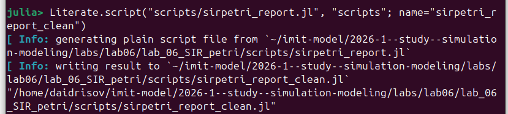{width=31%}
{width=31%}
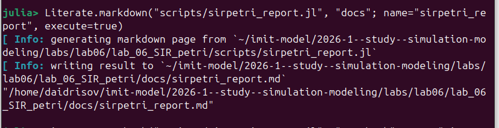{width=31%}

- Слева `clean`-версия итогового скрипта.
- По центру notebook.
- Справа Markdown-документ.

# Выводы

## Итоги лабораторной работы

- Реализована модель SIR в аппарате сетей Петри
- Получены детерминированная и стохастическая траектории
- Построены таблицы `sir_det.csv`, `sir_stoch.csv`, `sir_scan.csv`
- Выполнены параметрический анализ и анимация
- Для каждого сценария получены `clean`, `md`, `ipynb`
- Результаты интегрированы в отчёт и презентацию
