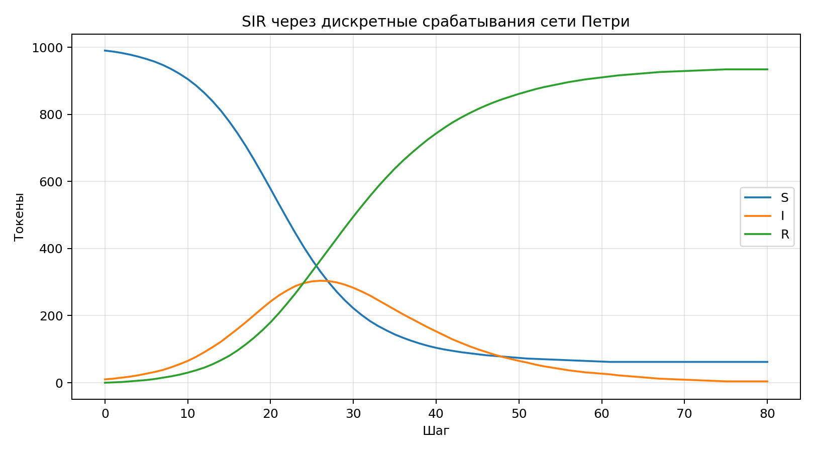

**Студент:** Гашимов Кенан Мухтар оглы  
**Группа:** НКНбд-01-23  
**Студенческий билет:** 1032235820  
**Направление:** Математика и компьютерные науки  
**Email:** kenan24gguka@gmail.com

        # Цель работы

        Реализовать SIR как сеть Петри, провести дискретный эксперимент и сравнить динамику компонент.

        # Формулировка задания

        - Представить SIR в форме сети Петри.
- Провести дискретный расчёт и сохранить траекторию.
- Оформить выводы в отчёте и презентации.

        # Теоретическая часть

        SIR можно представить как сеть Петри, где токены соответствуют числу восприимчивых, инфицированных и выздоровевших, а переходы — заражению и выздоровлению.

        # Ход работы

        ## Постановка сети Петри

Компоненты S, I и R представлены местами, а заражение и выздоровление — переходами, меняющими разметку сети.
## Расчёт траектории

На каждом шаге вычисляется число новых заражений и выздоровлений, после чего обновляются токены сети.
## Содержательный анализ

Из траектории выделены пик инфекции, время пика и финальное число выздоровевших.

        # Эксперименты

        1. Запущена токенная SIR-модель на 81 шаге.
1. Собраны временные ряды S, I и R.
1. Рассчитан пик инфекции и финальное число выздоровевших.

        # Полученные артефакты

        - project/data/sir-petri.csv
- project/plots/sir-petri.png
- project/src/Lab06.jl
- project/notebook/lab06.ipynb
- report/simulation-modeling--lab06--report.qmd

        # Основные результаты

        

        | Показатель | Значение |
| --- | ---: |
| Пик I | 304 |
| Время пика | 26 |
| Финальное R | 934 |

        # Выводы

        - Петри-представление удобно интерпретирует эпидемию через срабатывания переходов.
- Даже дискретная схема воспроизводит ожидаемую форму эпидемической кривой.
- Подход связывает классические SIR-модели с аппаратом дискретных событий.

        # Материалы проекта

        - CSV с токенами SIR.
- PNG-график динамики SIR через сеть Петри.
- Таблица пика и финального значения R.

        # Воспроизводимость

        - Исходный Julia-проект находится в `../project/`.
        - Literate-документация находится в `../project/markdown/`.
        - Notebook находится в `../project/notebook/`.
        - Для повторной сборки используйте команды `make generate`, `make render`, `make verify`.
