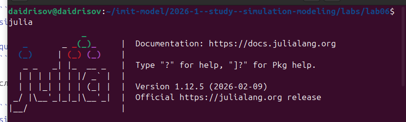
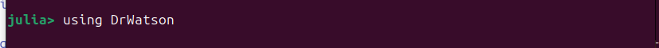
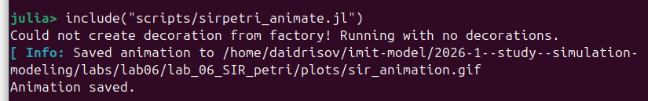
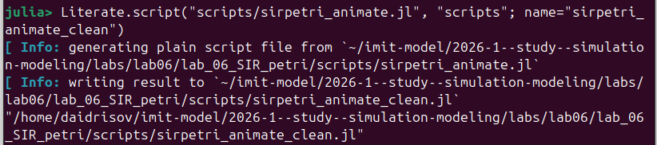
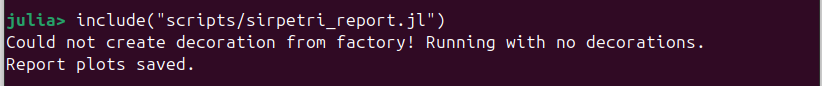
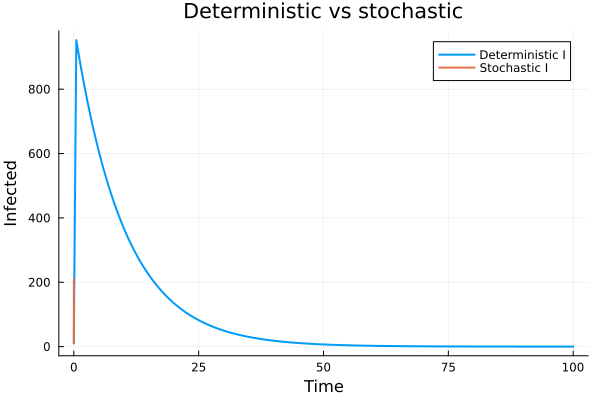
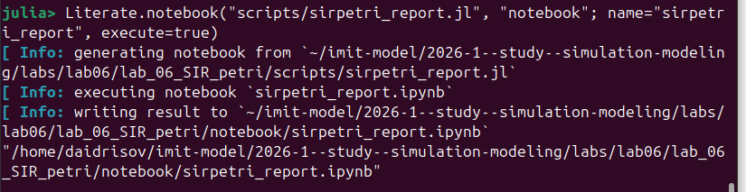

---
## Author
author:
  name: Гашимов Кенан Мухтар оглы
  affiliation:
    - name: Российский университет дружбы народов
      country: Российская Федерация
      postal-code: 117198
      city: Москва
      address: ул. Миклухо-Маклая, д. 6

## Title
title: "Имитационное моделирование"
subtitle: "Лабораторная работа №6. Реализация модели SIR в подходе сетей Петри"
license: "CC BY"
---

# Сведения об авторе

- ФИО: Гашимов Кенан Мухтар оглы
- Группа: НКНбд-01-23
- Студенческий билет: 1032235820
- Направление: Математика и компьютерные науки

# Цель работы

Изучить реализацию модели SIR в аппарате сетей Петри, построить модуль модели и набор вычислительных сценариев на Julia, выполнить детерминированные и стохастические эксперименты, подготовить графики и CSV-таблицы результатов, а также сформировать literate-версии скриптов и производные форматы `clean`, `md`, `ipynb`.

# Задание

1. Создать рабочий каталог проекта в структуре `DrWatson`.
2. Установить зависимости для моделирования, визуализации и документирования.
3. Реализовать модуль `SIRPetri.jl` с описанием сети Петри и функциями симуляции.
4. Выполнить базовый прогон модели и сохранить результаты в `CSV` и `PNG`.
5. Провести параметрическое исследование по коэффициенту заражения `β`.
6. Построить GIF-анимацию детерминированной динамики.
7. Подготовить итоговый сравнительный отчёт по ранее сохранённым данным.
8. Для каждого сценария получить `clean`, `md` и `ipynb` представления при помощи `Literate.jl`.
9. Интегрировать полученные материалы в итоговый отчёт и презентацию.

# Теоретическое введение

## Сети Петри и модель SIR

Сеть Петри представляет собой ориентированный двудольный граф, в котором позиции задают состояния системы, переходы описывают события, дуги определяют разрешённые связи, а маркировка показывает текущее распределение фишек по позициям [@peterson1981]. Такой аппарат удобен для моделирования дискретных событий и конкурирующих процессов.

В данной лабораторной работе рассматривается эпидемическая модель SIR с тремя состояниями:

- `S` --- восприимчивые;
- `I` --- инфицированные;
- `R` --- выздоровевшие.

Используются два перехода:

- `infection: S + I -> I + I`;
- `recovery: I -> R`.

Тем самым заражение интерпретируется как совместное наличие восприимчивого и инфицированного, а выздоровление --- как уход токена из состояния `I` в состояние `R`.

## Детерминированная и стохастическая формы модели

Для непрерывной аппроксимации динамики используется система обыкновенных дифференциальных уравнений:

$$
\frac{dS}{dt} = -\beta S I, \qquad
\frac{dI}{dt} = \beta S I - \gamma I, \qquad
\frac{dR}{dt} = \gamma I.
$$

Эта форма даёт усреднённую гладкую траекторию по закону действующих масс. Стохастическая форма строится по алгоритму Гиллеспи [@gillespie1977], где на каждом шаге вычисляются интенсивности событий `infection` и `recovery`, после чего случайно выбираются время следующего события и тип перехода.

В текущей реализации интенсивность заражения задаётся как `β * S * I` без нормировки на размер популяции. Именно это объясняет очень быстрый рост `I` и почти мгновенное истощение `S` в полученных экспериментах.

## Инструменты работы

В работе использовались:

- `Julia` как язык реализации [@bezanson2017];
- `DrWatson` для организации воспроизводимой структуры проекта [@drwatson_jl];
- `OrdinaryDiffEq` для численного решения системы ОДУ;
- `Plots` для построения графиков и анимации;
- `CSV` и `DataFrames` для сохранения и анализа таблиц результатов;
- `Literate.jl` для генерации `clean`, `md` и `ipynb` представлений [@literate_jl].

## Литературное программирование

Литературное программирование рассматривает программу как связный документ, в котором код и объяснение образуют единое целое [@knuth1984]. Такой подход особенно удобен в учебной лабораторной работе, поскольку позволяет из одного исходного скрипта получить:

- исполняемую `clean`-версию;
- Markdown-документацию;
- Jupyter notebook.

Воспроизводимые вычислительные документы такого типа естественно вписываются в практику исследовательской работы [@schulte2012].

# Выполнение лабораторной работы

## Подготовка окружения

Сначала была запущена рабочая сессия Julia, после чего для проекта была использована стандартная схема `DrWatson`: создание каталога проекта, подключение пакета и активация окружения.

{width=70%}

На скриншоте показан старт рабочей сессии Julia, с которой начиналась вся настройка проекта и последующее выполнение экспериментов.

{width=70%}

После запуска интерпретатора был подключён пакет `DrWatson`, который обеспечивает типовую структуру проекта и удобные функции `srcdir`, `datadir`, `plotsdir`.

{width=70%}

Здесь показано создание проекта `lab_06_SIR_petri` через `initialize_project`. На этом шаге были сформированы каталоги `src`, `scripts`, `data`, `plots`, `test` и служебные файлы `Project.toml` и `Manifest.toml`.

{width=70%}

После инициализации проекта было выполнено `@quickactivate`, что связало текущую REPL-сессию именно с каталогом лабораторной работы.

{width=70%}

На этом шаге были установлены основные зависимости: `AlgebraicPetri`, `Catlab`, `OrdinaryDiffEq`, `Plots`, `CSV`, `DataFrames`, `Literate`, `IJulia`, `Quarto`.

{width=70%}

Скриншот фиксирует окончание precompile и готовность окружения к выполнению кода лабораторной работы.

## Структура файлов лабораторной работы

По итогам выполнения работы были подготовлены следующие основные файлы:

- `src/SIRPetri.jl` --- модуль модели;
- `scripts/sirpetri_run.jl` --- базовый прогон;
- `scripts/sirpetri_scan_parameters.jl` --- параметрическое исследование по `β`;
- `scripts/sirpetri_animate.jl` --- построение GIF-анимации;
- `scripts/sirpetri_report.jl` --- итоговые сравнительные графики;
- `docs/*.md` --- Markdown-представления сценариев;
- `notebook/*.ipynb` --- notebook-представления;
- `data/*.csv` и `plots/*.png`/`*.gif` --- результаты вычислений.

## Модуль `src/SIRPetri.jl`

Модуль `SIRPetri.jl` содержит:

- построение размеченной сети Петри;
- функцию правой части ОДУ;
- детерминированную симуляцию;
- стохастическую симуляцию по алгоритму Гиллеспи;
- построение графиков;
- вывод объекта Graphviz для визуализации сети.

### Ключевые фрагменты кода модуля

```julia
function build_sir_network(beta::Real = 0.3, gamma::Real = 0.1)
    states = [:S, :I, :R]
    net = LabelledPetriNet(
        states,
        :infection => ([:S, :I] => [:I, :I]),
        :recovery => ([:I] => [:R]),
    )

    u0 = [990.0, 10.0, 0.0]
    return net, u0, states
end
```

Этот фрагмент задаёт структуру сети Петри с тремя состояниями и двумя переходами. Начальная маркировка фиксирует популяцию `990 + 10 + 0 = 1000`.

```julia
function sir_ode(net, rates::AbstractVector{<:Real} = [0.3, 0.1])
    function f!(du, u, p, t)
        s, i, r = u
        beta, gamma = rates

        infection_rate = beta * s * i
        recovery_rate = gamma * i

        du[1] = -infection_rate
        du[2] = infection_rate - recovery_rate
        du[3] = recovery_rate
        return nothing
    end

    return f!
end
```

Здесь реализована детерминированная форма модели. Из-за множителя `S * I` без нормировки скорость заражения при начальных `S = 990`, `I = 10` оказывается очень большой уже с первых шагов интегрирования.

```julia
function simulate_stochastic(net, u0, tspan; rates = [0.3, 0.1], rng = Random.GLOBAL_RNG)
    u = Int.(round.(u0))
    t = Float64(tspan[1])
    tmax = Float64(tspan[2])
    beta, gamma = rates

    while t < tmax
        s, i, r = u
        a_inf = beta * s * i
        a_rec = gamma * i
        a0 = a_inf + a_rec
        if a0 <= 0
            break
        end
        dt = -log(rand(rng)) / a0
        event_draw = rand(rng) * a0
        if event_draw < a_inf
            u[1] -= 1
            u[2] += 1
        else
            u[2] -= 1
            u[3] += 1
        end
        t += dt
    end
end
```

В стохастической части модели на каждом шаге рассчитываются пропускные способности заражения и выздоровления. Это даёт ступенчатую траекторию с дискретными событиями.

## Базовый прогон: `scripts/sirpetri_run.jl`

Скрипт `sirpetri_run.jl` запускает два сценария:

- детерминированную симуляцию;
- стохастическую симуляцию с фиксированным зерном генератора случайных чисел.

Он сохраняет результаты в `sir_det.csv` и `sir_stoch.csv`, а также строит графики `sir_det_dynamics.png` и `sir_stoch_dynamics.png`.

### Ключевой фрагмент кода

```julia
function main()
    beta = 0.3
    gamma = 0.1
    tmax = 100.0

    net, u0, _ = SIRPetri.build_sir_network(beta, gamma)

    df_det = SIRPetri.simulate_deterministic(
        net, u0, (0.0, tmax); saveat = 0.5, rates = [beta, gamma]
    )
    CSV.write(datadir("sir_det.csv"), df_det)

    Random.seed!(123)
    df_stoch = SIRPetri.simulate_stochastic(
        net, u0, (0.0, tmax); rates = [beta, gamma]
    )
    CSV.write(datadir("sir_stoch.csv"), df_stoch)
end
```

Этот фрагмент показывает общую схему базового эксперимента: построение сети, запуск двух видов симуляции и сохранение результатов.

{width=70%}

Скриншот подтверждает успешное выполнение скрипта `sirpetri_run.jl` и завершение базовых экспериментов.

### График `sir_det_dynamics.png`

{width=62%}

На детерминированном графике видно, что число восприимчивых практически мгновенно падает к нулю, а число инфицированных достигает максимума уже при `t = 0.5`. Максимум составляет примерно `I_max = 952.69`, после чего `I(t)` монотонно убывает, а `R(t)` растёт до значения `999.95` к `t = 100`.

Таким образом, в текущей реализации модель даёт очень жёсткую вспышку: почти вся популяция за короткое время переходит в состояние заражения, а затем плавно выздоравливает.

### График `sir_stoch_dynamics.png`

{width=62%}

Стохастическая траектория имеет ступенчатый характер. В начале моделирования наблюдается серия быстрых актов заражения, поэтому `I(t)` почти мгновенно возрастает до `999` уже при `t ≈ 0.037`. Затем начинается медленный каскад выздоровлений, и к `t ≈ 64.35` система приходит в состояние `S = 0`, `I = 0`, `R = 1000`.

Этот график хорошо показывает отличие событийной стохастической модели от гладкой детерминированной аппроксимации.

### CSV-таблица `sir_det.csv`

{width=90%}

Файл `sir_det.csv` содержит 201 строку данных и 4 столбца:

- `time` --- время;
- `S` --- число восприимчивых;
- `I` --- число инфицированных;
- `R` --- число выздоровевших.

По первым строкам таблицы видно, что уже к `t = 0.5` компонент `S` практически зануляется, а `I` становится порядка `952.69`. В последних строках `I` убывает до `0.045`, а `R` выходит на плато около `999.95`.

### CSV-таблица `sir_stoch.csv`

{width=90%}

Файл `sir_stoch.csv` содержит 1991 строку данных и те же столбцы `time`, `S`, `I`, `R`, но все состояния меняются дискретно. В первых строках хорошо видны последовательные события заражения: `S` уменьшается на единицу, а `I` увеличивается на единицу. В последних строках происходит убывание `I` до нуля и рост `R` до `1000`.

Эта таблица даёт полную событийную траекторию стохастической модели.

## Подготовка literate-представлений базового сценария

После успешного прогона был подключён пакет `Literate.jl` и выполнена генерация производных форматов.

{width=70%}

Скриншот показывает подключение `Literate.jl`, который использовался для построения `clean`, `md` и `ipynb` представлений каждого сценария.

{width=70%}

`Clean`-представление содержит только исполняемый код без текстовой literate-разметки.

{width=70%}

Markdown-файл выступает в роли промежуточной документации по базовому прогону.

{width=70%}

Notebook-версия позволяет воспроизводить тот же эксперимент интерактивно по ячейкам.

## Параметрическое исследование: `scripts/sirpetri_scan_parameters.jl`

Скрипт `sirpetri_scan_parameters.jl` выполняет серию детерминированных прогонов для `β` в диапазоне `0.1:0.05:0.8` при фиксированном `γ = 0.1`, после чего сохраняет таблицу `sir_scan.csv` и график `sir_scan.png`.

### Ключевой фрагмент кода

```julia
function main()
    beta_range = 0.1:0.05:0.8
    gamma_fixed = 0.1
    tmax = 100.0

    results = DataFrame(beta = Float64[], peak_I = Float64[], final_R = Float64[])

    for beta in beta_range
        net, u0, _ = SIRPetri.build_sir_network(beta, gamma_fixed)
        df = SIRPetri.simulate_deterministic(
            net, u0, (0.0, tmax); saveat = 0.5, rates = [beta, gamma_fixed]
        )
        push!(results, (beta = Float64(beta), peak_I = maximum(df.I), final_R = df.R[end]))
    end

    CSV.write(datadir("sir_scan.csv"), results)
end
```

Здесь центральным элементом является цикл по значениям `β`, который для каждого прогона вычисляет максимум `I` и итоговое значение `R`.

{width=70%}

Скриншот подтверждает выполнение `sirpetri_scan_parameters.jl` и формирование итоговой таблицы и графика.

### График `sir_scan.png`

{width=70%}

График содержит две кривые:

- `Peak I(β)` --- максимальное число инфицированных;
- `Final R(β)` --- итоговое число выздоровевших.

В полученных данных обе зависимости оказываются очень слабо изменяющимися: `peak_I` лежит в диапазоне от `951.78` до `955.63`, а `final_R` --- около `999.9545`. При этом максимум `I` даже слегка уменьшается с ростом `β`. Такое поведение связано не с типичной эпидемиологической динамикой, а с тем, что заражение в текущей реализации и без того происходит почти мгновенно для всех рассмотренных значений параметра.

### CSV-таблица `sir_scan.csv`

{width=90%}

Таблица `sir_scan.csv` содержит 15 строк данных со столбцами:

- `beta` --- коэффициент заражения;
- `peak_I` --- максимальное число инфицированных;
- `final_R` --- итоговое число выздоровевших.

Минимум `peak_I` достигается при `β = 0.8` и равен `951.7772`, максимум --- при `β = 0.1` и равен `955.6260`. Значения `final_R` отличаются только в четвёртом знаке после запятой, что подтверждает слабую чувствительность текущей реализации к изменению `β`.

### Производные форматы параметрического сценария

{width=70%}

Этот файл содержит исполняемый вариант параметрического скрипта без поясняющего текста.

{width=70%}

Markdown-файл фиксирует ход параметрического эксперимента и служит текстовым артефактом literate-подхода.

{width=70%}

Notebook-версия удобна для повторного запуска серии экспериментов в интерактивной среде.

## Анимация: `scripts/sirpetri_animate.jl`

Скрипт `sirpetri_animate.jl` строит GIF-анимацию по детерминированной траектории, в которой на каждом кадре отображается текущее число токенов в состояниях `S`, `I`, `R`.

### Ключевой фрагмент кода

```julia
function main()
    beta = 0.3
    gamma = 0.1
    tmax = 100.0

    net, u0, _ = SIRPetri.build_sir_network(beta, gamma)
    df = SIRPetri.simulate_deterministic(
        net, u0, (0.0, tmax); saveat = 0.2, rates = [beta, gamma]
    )

    anim = @animate for i in 1:nrow(df)
        bar(["S", "I", "R"], [df.S[i], df.I[i], df.R[i]];
            ylim = (0, 1000), legend = false)
    end

    gif(anim, plotsdir("sir_animation.gif"), fps = 10)
end
```

Этот фрагмент показывает, что анимация строится напрямую по строкам таблицы состояния.

{width=70%}

Скриншот фиксирует запуск `sirpetri_animate.jl` и сохранение файла `sir_animation.gif`.

Логика анимации заключается в том, что на первых кадрах быстро уменьшается `S`, затем почти весь столбик переходит в `I`, а далее начинается медленный рост `R` и спад `I`.

### Производные форматы скрипта анимации

{width=70%}

`Clean`-представление анимации содержит конечный исполняемый код построения GIF.

{width=70%}

Markdown-версия фиксирует пояснения к построению кадров и сохранению анимации.

{width=70%}

Notebook-версия позволяет последовательно воспроизводить процесс создания анимации в интерактивной форме.

## Итоговый отчётный сценарий: `scripts/sirpetri_report.jl`

Скрипт `sirpetri_report.jl` не моделирует систему заново, а загружает ранее сохранённые данные и строит итоговые графики `comparison.png` и `sensitivity.png`.

### Ключевой фрагмент кода

```julia
function main()
    df_det = CSV.read(datadir("sir_det.csv"), DataFrame)
    df_stoch = CSV.read(datadir("sir_stoch.csv"), DataFrame)
    df_scan = CSV.read(datadir("sir_scan.csv"), DataFrame)

    n = min(nrow(df_det), nrow(df_stoch))

    p1 = plot(df_det.time[1:n], df_det.I[1:n], label = "Deterministic I")
    plot!(p1, df_stoch.time[1:n], df_stoch.I[1:n], label = "Stochastic I")
    savefig(p1, plotsdir("comparison.png"))

    p2 = plot(df_scan.beta, df_scan.peak_I, marker = :circle, label = "Peak I")
    savefig(p2, plotsdir("sensitivity.png"))
end
```

Итоговый сценарий объединяет результаты базового прогона и параметрического анализа в отдельные отчётные рисунки.

{width=70%}

Скриншот подтверждает выполнение `sirpetri_report.jl` и сохранение итоговых графиков.

### График `comparison.png`

{width=70%}

На этом графике совместно показаны кривые `I(t)` для двух режимов моделирования. Стохастическая траектория стартует резче и быстрее достигает пика, тогда как детерминированная аппроксимация остаётся гладкой. Обе кривые отражают одну и ту же общую картину: резкий всплеск числа инфицированных и последующее затухание.

### График `sensitivity.png`

{width=70%}

Этот график строится по данным `sir_scan.csv` и показывает зависимость `peak_I` от параметра `β`. Он дублирует по смыслу уже рассмотренную зависимость из `sir_scan.png`, но в итоговом сценарии сохраняется отдельно как отчётный рисунок `sensitivity.png`.

### Производные форматы итогового сценария

{width=70%}

`Clean`-файл содержит исполняемый вариант итогового сценария без literate-комментариев.

{width=70%}

Notebook-версия удобна для повторного чтения CSV-файлов и построения итоговых графиков в интерактивном режиме.

{width=70%}

Markdown-файл завершает цепочку производных артефактов и документирует назначение итогового отчётного сценария.

# Выводы

В ходе выполнения лабораторной работы была реализована модель SIR в аппарате сетей Петри, подготовлен модуль `SIRPetri.jl` и набор сценариев для базового прогона, параметрического исследования, анимации и итогового анализа. Для базового эксперимента были получены две траектории: гладкая детерминированная и событийная стохастическая.

Все три CSV-файла и все графики были проанализированы. Детерминированная модель дала пик `I ≈ 952.69` уже при `t = 0.5`, стохастическая модель достигла `I = 999` при `t ≈ 0.037`, а параметрическое исследование показало слабую зависимость `peak_I` и `final_R` от `β` в текущей постановке. Для каждого сценария были успешно подготовлены `clean`, `md` и `ipynb` представления, а затем материалы интегрированы в отчёт и презентацию.

# Список литературы{.unnumbered}

::: {#refs}
:::
