---
author:
  name: Идрисов Джафер Арсенович
  degrees: student
  email: 1132232876@rudn.ru
  affiliation:
    - name: Российский университет дружбы народов
      country: Российская Федерация
      postal-code: 117198
      city: Москва
      address: ул. Миклухо-Маклая, д. 6
title: "Имитационное моделирование"
subtitle: "Лабораторная работа №7. Дискретно-событийное моделирование"
license: CC BY
date: today
date-format: "YYYY-MM-DD"
---

# Информация

## Докладчик

:::::::::::::: {.columns align=center}
::: {.column width="70%"}

- Идрисов Джафер Арсенович
- Студент
- Российский университет дружбы народов
- [1132232876@rudn.ru](mailto:1132232876@rudn.ru)

:::
::: {.column width="30%"}
:::
::::::::::::::

# Цель и задачи

## Цель работы

- Реализовать дискретно-событийные модели `M/M/c` и Росса
- Выполнить базовые и параметрические эксперименты
- Сохранить результаты в `CSV` и `PNG`
- Получить производные форматы `md`, `ipynb`, `clean`
- Сравнить имитацию с аналитическими оценками

## Задание

1. Создать проект `DrWatson`
2. Реализовать модуль `QueueingModels.jl`
3. Запустить обычные скрипты моделей
4. Выполнить параметрические исследования
5. Сгенерировать производные форматы через `Literate.jl`

# Подготовка проекта

## Julia и DrWatson

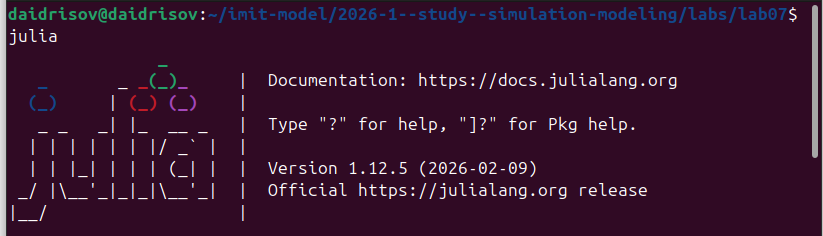{width=46%}
{width=46%}

- Запущен Julia REPL
- Подключён `DrWatson`

## Создание проекта

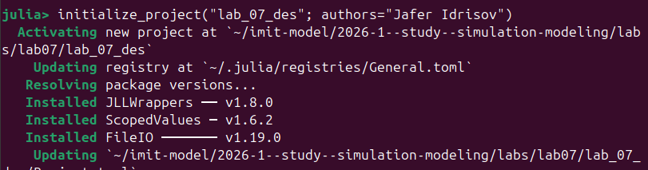{width=55%}

- Проект создан как `lab_07_des`
- Использована стандартная структура `src`, `scripts`, `data`, `plots`, `notebooks`, `docs`

## Установка зависимостей

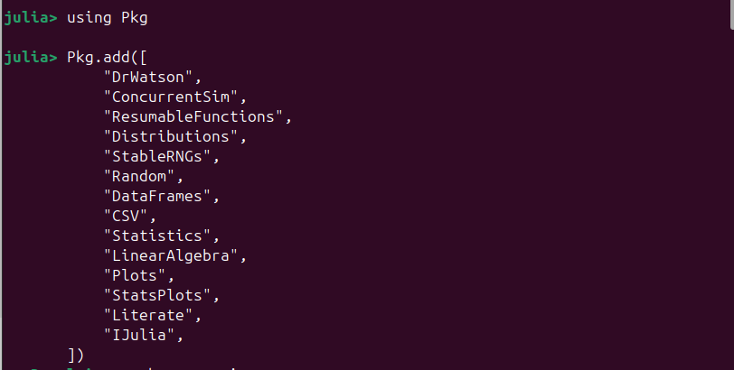{width=46%}
{width=46%}

- Установлены `ConcurrentSim`, `Distributions`, `DataFrames`, `CSV`, `Plots`, `Literate`
- Окружение готово к запуску сценариев

# Структура решения

## Файлы проекта

- `src/QueueingModels.jl` --- функции моделей, метрик, таблиц и графиков
- `scripts/mmc.jl` --- базовый сценарий `M/M/c`
- `scripts/mmc_parameters.jl` --- параметрическое исследование `M/M/c`
- `scripts/ross.jl` --- базовый сценарий Росса
- `scripts/ross_parameters.jl` --- параметрическое исследование Росса
- `scripts/*_literate.jl` --- источники для `Literate.jl`

# Модель M/M/c

## Запуск базового сценария

{width=55%}

- Выполнен `scripts/mmc.jl`
- Получены `mmc_customers.csv`, `mmc_events.csv`, `mmc_summary.csv`
- Построены графики очереди, каналов, ожидания и сравнения с аналитикой

## Сравнение аналитики и имитации

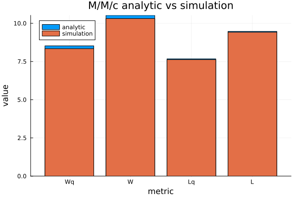{width=50%}

- `analytic_wq = 8.5263`
- `sim_wq = 8.3449`
- `analytic_w = 10.5263`
- `sim_w = 10.3125`

## Занятые каналы

{width=55%}

- При `rho = 0.9` два канала часто заняты одновременно
- График показывает ступенчатую событийную динамику занятости

## Длина очереди

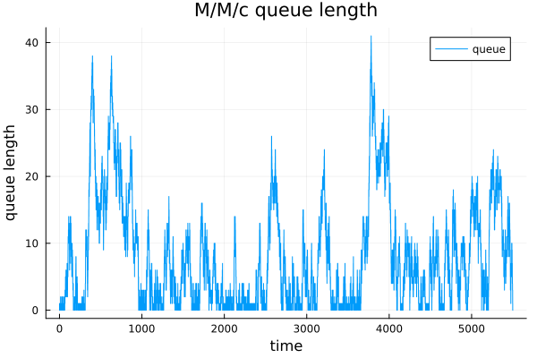{width=55%}

- Очередь периодически растёт из-за высокой загрузки
- Система остаётся устойчивой, но работает около предельного режима

## Время ожидания

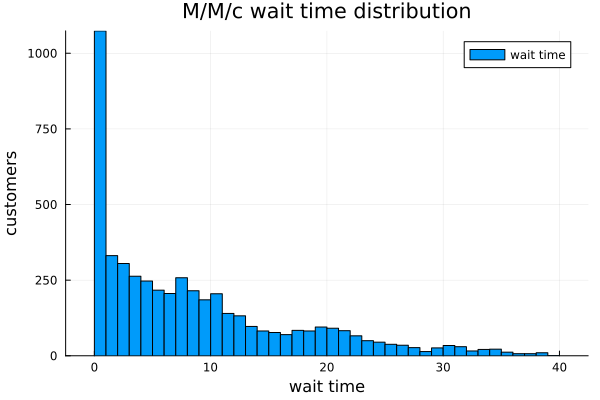{width=55%}

- Большая часть заявок ждёт недолго
- Распределение имеет длинный правый хвост

## Производные форматы M/M/c

{width=35%}

- Получены `docs/mmc.md`
- Получен `scripts/mmc_clean.jl`
- Получен выполненный `notebooks/mmc.ipynb`

# Параметрическое исследование M/M/c

## Запуск исследования

{width=55%}

- Исследованы разные `lambda`
- Исследовано число каналов `c = 1:6`
- Результаты сохранены в `mmc_parameter_scan.csv`

## Загрузка системы

{width=55%}

- Загрузка растёт при увеличении `lambda`
- Загрузка падает при добавлении каналов

## Ожидание от числа каналов

{width=55%}

- Увеличение `c` снижает среднее ожидание
- Эффект особенно заметен при высокой интенсивности входящего потока

## Ожидание от входного потока

{width=55%}

- При росте `lambda` очередь и ожидание увеличиваются
- Для большего числа каналов рост более сглажен

## Производные форматы исследования

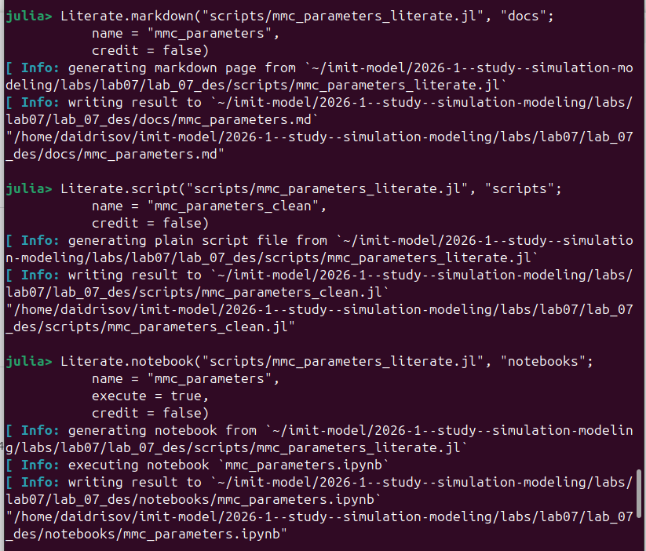{width=35%}

- Получены `docs/mmc_parameters.md`
- Получен `scripts/mmc_parameters_clean.jl`
- Получен выполненный `notebooks/mmc_parameters.ipynb`

# Модель Росса

## Запуск базового сценария

{width=55%}

- Выполнен `scripts/ross.jl`
- Параметры: `N = 10`, `S = 3`, `repairers = 1`
- Выполнено `300` прогонов

## Время до падения

{width=55%}

- Распределение времени до падения имеет большой разброс
- Среднее значение: `11996.19`
- Стандартное отклонение: `12450.17`

## Исправные машины

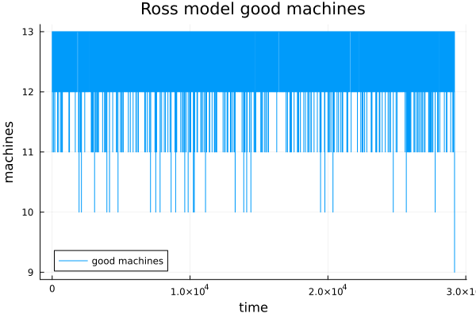{width=55%}

- График показывает число исправных машин во времени
- Отказы уменьшают число исправных машин, ремонты восстанавливают резерв

## Загрузка ремонтника

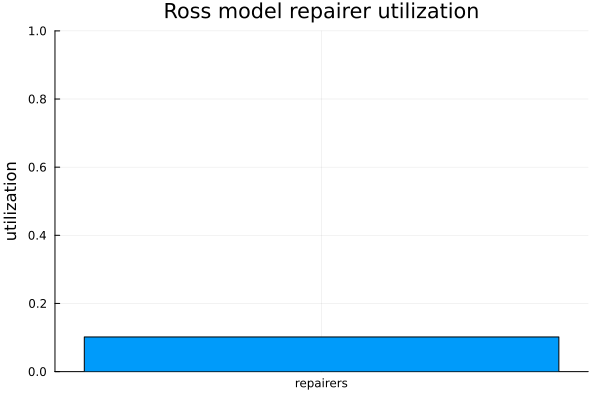{width=55%}

- Средняя загрузка ремонтника: `0.1017`
- Очередь на ремонт при базовых параметрах мала

## Очередь на ремонт

{width=55%}

- Средняя длина очереди: `0.01238`
- Очередь возникает редко и быстро рассасывается

## Имитация и аналитика

{width=55%}

- Имитация: `11996.19`
- Аналитическая оценка: `12340.00`
- Значения близки с учётом стохастического разброса

## Резервные машины

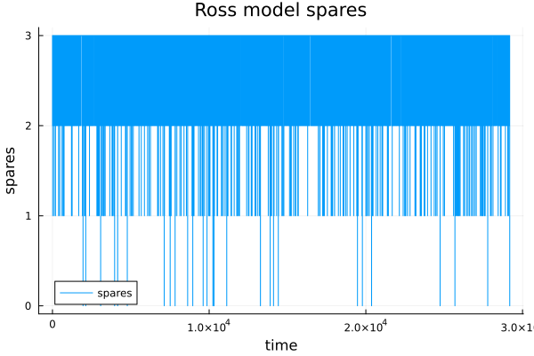{width=55%}

- Резерв уменьшается после отказа
- После ремонта машина возвращается в резерв

## Производные форматы Росса

{width=35%}

- Получены `docs/ross.md`
- Получен `scripts/ross_clean.jl`
- Получен выполненный `notebooks/ross.ipynb`

# Параметрическое исследование Росса

## Запуск исследования

{width=55%}

- Исследованы разные `N`, `S`, `repairers`
- Использовано `20` прогонов на сценарий
- Результаты сохранены в `ross_parameter_scan.csv`

## Влияние числа рабочих машин

{width=55%}

- При росте `N` суммарная интенсивность отказов увеличивается
- Среднее время до падения уменьшается

## Влияние резерва

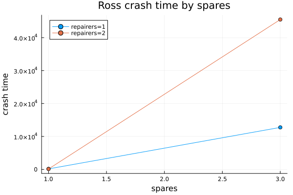{width=55%}

- Увеличение `S` резко повышает время до падения
- Резервирование существенно повышает устойчивость

## Влияние ремонтников

{width=55%}

- Увеличение числа ремонтников повышает устойчивость
- Эффект заметнее при большем числе резервных машин

## Загрузка ремонтников

{width=55%}

- Загрузка зависит от сценария
- При добавлении ремонтника средняя индивидуальная загрузка снижается

## Производные форматы исследования Росса

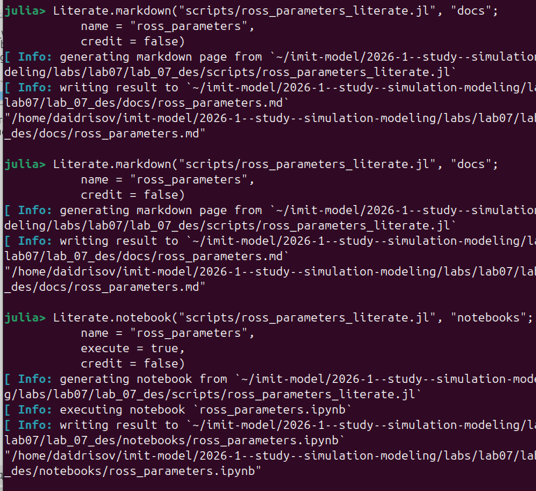{width=35%}

- Получены `docs/ross_parameters.md`
- Получен `scripts/ross_parameters_clean.jl`
- Получен выполненный `notebooks/ross_parameters.ipynb`

# Таблицы результатов

## Таблицы M/M/c

- `mmc_customers.csv`: заявка, прибытие, начало обслуживания, выход, ожидание, обслуживание, время в системе, канал
- `mmc_events.csv`: время события, тип события, заявка, очередь, занятые каналы, размер системы
- `mmc_summary.csv`: параметры, аналитические и имитационные метрики
- `mmc_parameter_scan.csv`: параметры сценариев и результаты параметрического исследования

## Таблицы Росса

- `ross_events_sample.csv`: журнал событий одного прогона
- `ross_runs.csv`: результаты отдельных прогонов
- `ross_summary.csv`: сводка базового сценария
- `ross_parameter_scan.csv`: результаты по разным `N`, `S`, `repairers`

# Выводы

## Итоги

- Реализованы модели `M/M/c` и Росса
- Выполнены базовые и параметрические сценарии
- Построены все требуемые графики
- Сохранены CSV-таблицы результатов
- Для каждого сценария получены `md`, `clean`, `ipynb`
- Имитационные результаты сопоставлены с аналитическими оценками

## Основные наблюдения

- В `M/M/c` рост `lambda` увеличивает ожидание и загрузку
- Увеличение числа каналов резко снижает очередь
- В модели Росса резервирование существенно увеличивает время до падения
- Добавление ремонтников снижает нагрузку ремонтной подсистемы

