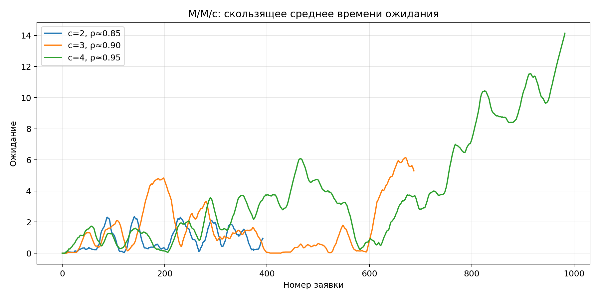
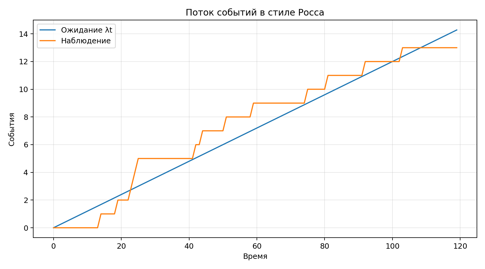

**Студент:** Гашимов Кенан Мухтар оглы  
**Группа:** НКНбд-01-23  
**Студенческий билет:** 1032235820  
**Направление:** Математика и компьютерные науки  
**Email:** kenan24gguka@gmail.com

        # Цель работы

        Собрать DES-эксперименты для `M/M/c` и событийного потока, оценить метрики ожидания и оформить артефакты.

        # Формулировка задания

        - Построить DES-модель очереди `M/M/c`.
- Провести эксперимент с потоком событий по Россу.
- Сохранить метрики, графики и summary-таблицы.
- Оформить отчёт и презентацию.

        # Теоретическая часть

        DES-подход моделирует систему через упорядоченный календарь событий. На этой основе естественно реализуются очереди и пуассоновские потоки.

        # Ход работы

        ## M/M/c-очередь

Для нескольких конфигураций каналов обслуживания рассчитаны времена ожидания и длины очереди на потоке заявок.
## Поток событий

В отдельном эксперименте сопоставлены теоретическое ожидание `λt` и наблюдаемая реализация числа событий.
## Сводка результатов

Сценарии `M/M/c` сведены в таблицу средней и максимальной задержки, а для потока сохранён самостоятельный график.

        # Эксперименты

        1. Смоделированы очереди `M/M/c` для трёх конфигураций числа каналов.
1. Построен эксперимент с пуассоновским потоком в духе задач Росса.
1. Собраны метрики ожидания, длины очереди и накопления событий.

        # Полученные артефакты

        - project/data/mmc-2-servers.csv
- project/data/mmc-3-servers.csv
- project/data/mmc-4-servers.csv
- project/data/ross-poisson.csv
- project/plots/mmc.png
- project/plots/ross-poisson.png

        # Основные результаты

        

        | c | ρ | avg wait | max wait | avg queue |
| --- | --- | ---: | ---: | ---: |
| 2 | 0.85 | 0.936 | 5.247 | 1.527 |
| 3 | 0.90 | 1.732 | 7.216 | 2.600 |
| 4 | 0.95 | 4.058 | 15.174 | 3.927 |

        # Выводы

        - Увеличение числа каналов уменьшает среднее ожидание и длину очереди.
- Пуассоновский поток хорошо иллюстрирует разницу между ожиданием и отдельной реализацией.
- DES-представление удобно для перехода к событийной SIR-модели следующей лабораторной.

        # Материалы проекта

        - Три CSV для конфигураций `M/M/c`.
- CSV для потока событий по Россу.
- PNG-графики очереди и потока.

        # Воспроизводимость

        - Исходный Julia-проект находится в `../project/`.
        - Literate-документация находится в `../project/markdown/`.
        - Notebook находится в `../project/notebook/`.
        - Для повторной сборки используйте команды `make generate`, `make render`, `make verify`.
