---
## Author
author:
  name: Идрисов Джафер Арсенович
  degrees: student
  email: 1132232876@rudn.ru
  affiliation:
    - name: Российский университет дружбы народов
      country: Российская Федерация
      postal-code: 117198
      city: Москва
      address: ул. Миклухо-Маклая, д. 6

## Title
title: "Имитационное моделирование"
subtitle: "Лабораторная работа №7. Дискретно-событийное моделирование"
license: "CC BY"
code-overflow: wrap
code-line-numbers: false
lot: true
---

# Цель работы

Изучить дискретно-событийное моделирование на Julia, реализовать модели `M/M/c` и Росса, выполнить базовые и параметрические эксперименты, сохранить результаты в таблицы и графики, а также получить производные форматы из literate-кода: `md`, `ipynb`, `clean`.

# Задание

1. Создать рабочий каталог проекта в структуре `DrWatson`.
2. Установить зависимости для дискретно-событийного моделирования, обработки таблиц, визуализации и литературного программирования.
3. Реализовать модель `M/M/c`.
4. Реализовать модель Росса с несколькими ремонтниками.
5. Выполнить базовые прогоны обеих моделей.
6. Выполнить параметрические исследования.
7. Построить графики динамики, загрузки и сравнений с аналитическими оценками.
8. Сохранить результаты в `CSV`.
9. Для каждого literate-скрипта получить `md`, `ipynb` и `clean`-представления.
10. Интегрировать результаты в отчёт и презентацию.

# Теоретическое введение

## Дискретно-событийное моделирование

Дискретно-событийное моделирование применяется для систем, состояние которых изменяется не непрерывно в каждый момент времени, а только в моменты наступления отдельных событий. Такими событиями в системах массового обслуживания являются поступление заявки, начало обслуживания и завершение обслуживания. В надёжностных моделях событиями являются отказ оборудования, начало ремонта, окончание ремонта и падение системы. Такой подход позволяет не пересчитывать состояние системы на равномерной временной сетке, а переходить от одного события к следующему [@law2014simulation].

В лабораторной работе использовались две дискретно-событийные постановки: очередь `M/M/c` и модель Росса. В обоих случаях результат работы модели фиксировался в журналах событий, после чего по этим журналам вычислялись метрики и строились графики. Для воспроизводимости были заданы фиксированные начальные значения генераторов случайных чисел.

## Модель `M/M/c`

Модель `M/M/c` относится к классическим моделям массового обслуживания. Первая буква `M` означает марковский, то есть пуассоновский входной поток с экспоненциальными интервалами между поступлениями. Вторая буква `M` означает экспоненциальное время обслуживания. Параметр `c` задаёт число параллельных одинаковых каналов обслуживания [@harchol2013performance].

В работе использовались параметры:

| Параметр | Смысл |
|---|---|
| `lambda` | интенсивность входящего потока |
| `mu` | интенсивность обслуживания одного канала |
| `c` | число каналов обслуживания |
| `rho` | загрузка одного канала |

: Параметры модели `M/M/c` {#tbl-mmc-params}

Для базового сценария использованы значения `lambda = 0.9`, `mu = 0.5`, `c = 2`. При этих параметрах загрузка равна `rho = 0.9`, поэтому система остаётся устойчивой, но работает в режиме высокой нагрузки. Это хорошо подходит для демонстрации роста очереди и сравнения аналитических и имитационных оценок.

В качестве основных метрик использовались:

| Метрика | Смысл |
|---|---|
| `Wq` | среднее время ожидания в очереди |
| `W` | среднее время пребывания заявки в системе |
| `Lq` | среднее число заявок в очереди |
| `L` | среднее число заявок в системе |
| `Pwait` | вероятность того, что заявка будет ждать |
| `utilization` | загрузка каналов обслуживания |

: Основные метрики модели `M/M/c` {#tbl-mmc-metrics}

Имитационная модель генерирует заявки, назначает каждой заявке первый освободившийся канал и сохраняет для каждой заявки время прибытия, начала обслуживания и выхода из системы. На основе этих данных строится журнал событий и рассчитываются средние значения по заявкам и по времени.

## Модель Росса

Модель Росса описывает систему с резервированием и ремонтом [@ross2013simulation]. В системе постоянно должны работать `N` машин. Дополнительно есть `S` резервных машин. Если работающая машина выходит из строя, её заменяет резервная машина, а неисправная отправляется в ремонт. Если отказ произошёл в момент, когда резерва нет, система считается упавшей.

В работе использовались параметры:

| Параметр | Смысл |
|---|---|
| `N` | число постоянно работающих машин |
| `S` | число резервных машин |
| `repairers` | число ремонтников |
| `mean_time_to_failure` | средняя наработка машины до отказа |
| `mean_repair_time` | среднее время ремонта |
| `runs` | число независимых прогонов |

: Параметры модели Росса {#tbl-ross-params}

Для модели Росса важны не только среднее время до падения, но и состояние ремонтной подсистемы. Поэтому дополнительно вычислялись средняя длина очереди на ремонт и загрузка ремонтников. Эти величины считались как средние по времени, а не как обычные средние по строкам журнала событий. Такой способ корректен для ступенчатых траекторий дискретно-событийной модели.

Аналитическое сравнение выполнялось через марковскую модель по числу доступных резервных машин. Для каждого состояния записывалось уравнение для среднего времени до поглощения, после чего система линейных уравнений решалась численно.

## Инструменты реализации

Расчёты выполнены на языке Julia [@bezanson2017julia]. Структура проекта организована с помощью `DrWatson`, который предназначен для воспроизводимых вычислительных проектов и единообразного управления путями к данным, графикам и исходным файлам [@datseris2020drwatson]. Таблицы сохранялись через `CSV.jl` и `DataFrames.jl`, графики строились с помощью `Plots.jl`.

## Литературное программирование

Литературное программирование рассматривает программу как документ, в котором код и поясняющий текст образуют единый воспроизводимый материал. Такой подход удобен в лабораторной работе, потому что один исходный literate-скрипт может быть преобразован сразу в несколько форматов: исполняемый чистый скрипт, Markdown-документацию и Jupyter notebook [@knuth1984literate].

В данной работе literate-версии использовались только для генерации производных форматов. Сами вычисления запускались обычными скриптами:

| Обычный скрипт | Literate-версия | Производные форматы |
|---|---|---|
| `mmc.jl` | `mmc_literate.jl` | `mmc.md`, `mmc_clean.jl`, `mmc.ipynb` |
| `mmc_parameters.jl` | `mmc_parameters_literate.jl` | `mmc_parameters.md`, `mmc_parameters_clean.jl`, `mmc_parameters.ipynb` |
| `ross.jl` | `ross_literate.jl` | `ross.md`, `ross_clean.jl`, `ross.ipynb` |
| `ross_parameters.jl` | `ross_parameters_literate.jl` | `ross_parameters.md`, `ross_parameters_clean.jl`, `ross_parameters.ipynb` |

: Соответствие обычных и literate-скриптов {#tbl-literate-files}

Для генерации использовался пакет `Literate.jl` [@literate_jl]. Метод `Literate.markdown` создавал Markdown-документ, `Literate.script` создавал чистую Julia-версию, а `Literate.notebook` создавал выполненный Jupyter notebook.

# Выполнение лабораторной работы

## Подготовка окружения

Работа началась с запуска Julia REPL.

{#fig-julia width=70%}

Далее был подключён пакет `DrWatson`.

{#fig-drwatson width=70%}

Проект был создан в каталоге `lab_07_des`.

{#fig-init width=70%}

После создания проекта были установлены зависимости.

{#fig-pkg width=70%}

На следующем скриншоте показано завершение установки и предварительной компиляции пакетов.

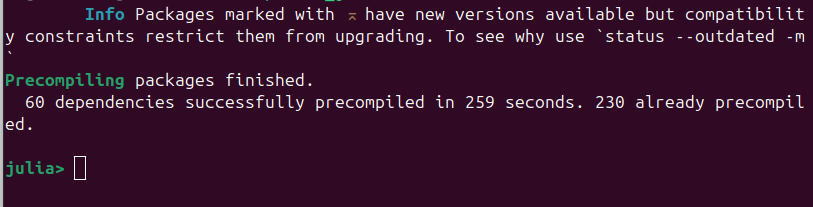{#fig-pkg-finished width=70%}

## Структура проекта

В проекте были подготовлены основные файлы:

- `src/QueueingModels.jl` --- модуль с функциями моделей, расчёта метрик, сохранения таблиц и построения графиков;
- `scripts/mmc.jl` --- базовый прогон `M/M/c`;
- `scripts/mmc_parameters.jl` --- параметрическое исследование `M/M/c`;
- `scripts/ross.jl` --- базовый прогон модели Росса;
- `scripts/ross_parameters.jl` --- параметрическое исследование модели Росса;
- `scripts/*_literate.jl` --- literate-версии сценариев;
- `scripts/*_clean.jl`, `docs/*.md`, `notebooks/*.ipynb` --- производные форматы;
- `data/*.csv` --- таблицы результатов;
- `plots/*.png` --- графики.

## Ключевые листинги кода

### Модуль `QueueingModels.jl`

В модуле экспортированы функции для расчёта аналитики, запуска имитации и проведения параметрических исследований.

```julia
export mmc_analytic,
    simulate_mmc,
    run_mmc_experiment,
    run_mmc_parameter_scan,
    ross_analytic_crash_time,
    simulate_ross_once,
    run_ross_experiment,
    run_ross_parameter_scan
```

### Аналитические метрики `M/M/c`

Функция `mmc_analytic` рассчитывает загрузку, вероятность ожидания и основные характеристики очереди.

```julia
function mmc_analytic(lambda::Real, mu::Real, c::Integer)
    rho = lambda / (c * mu)
    if rho >= 1
        return (
            rho = Float64(rho),
            p0 = NaN,
            pwait = NaN,
            lq = Inf,
            wq = Inf,
            w = Inf,
            l = Inf,
        )
    end

    a = c * rho
    finite_sum = sum(a^n / factorial(n) for n in 0:(c - 1))
    tail = a^c / (factorial(c) * (1 - rho))
    p0 = 1 / (finite_sum + tail)
    pwait = tail * p0
    lq = rho / (1 - rho) * pwait
    wq = lq / lambda
    w = wq + 1 / mu
    l = lambda * w
end
```

### Имитация `M/M/c`

В имитации генерируются моменты прибытия, выбирается первый освободившийся канал, после чего фиксируются ожидание, обслуживание и время выхода.

```julia
for id in 1:num_customers
    arrival_time += rand(rng, interarrival_dist)
    server_id = findmin(server_available)[2]
    service_start = max(arrival_time, server_available[server_id])
    service_time = rand(rng, service_dist)
    departure_time = service_start + service_time
    server_available[server_id] = departure_time

    push!(rows, (
        id = id,
        arrival_time = arrival_time,
        service_start = service_start,
        departure_time = departure_time,
        wait_time = service_start - arrival_time,
        service_time = service_time,
        system_time = departure_time - arrival_time,
        server_id = server_id,
    ))
end
```

### Запуск базового сценария `M/M/c`

```julia
using DrWatson
@quickactivate "lab_07_des"

include(srcdir("QueueingModels.jl"))

QueueingModels.run_mmc_experiment(;
    lambda = 0.9,
    mu = 0.5,
    c = 2,
    num_customers = 5000,
    seed = 123,
)
```

### Параметрическое исследование `M/M/c`

```julia
QueueingModels.run_mmc_parameter_scan(;
    lambdas = [0.3, 0.6, 0.9],
    channels = 1:6,
    mu = 0.5,
    num_customers = 3000,
    seed = 321,
)
```

### Аналитика модели Росса

Для модели Росса среднее время до падения находится через систему линейных уравнений.

```julia
function ross_analytic_crash_time(;
    N,
    S,
    repairers,
    mean_time_to_failure,
    mean_repair_time,
)
    a = N / mean_time_to_failure
    mu = 1 / mean_repair_time
    m = S + 1
    A = zeros(Float64, m, m)
    b = ones(Float64, m)

    for s in 0:S
        idx = s + 1
        repair_rate = min(S - s, repairers) * mu
        if s == 0
            A[idx, idx] = a + repair_rate
            A[idx, idx + 1] = -repair_rate
        elseif s == S
            A[idx, idx] = a
            A[idx, idx - 1] = -a
        else
            A[idx, idx] = a + repair_rate
            A[idx, idx - 1] = -a
            A[idx, idx + 1] = -repair_rate
        end
    end

    times = A \ b
    return times[S + 1]
end
```

### Имитация модели Росса

В одном прогоне сравнивается время следующего отказа и время ближайшего окончания ремонта. При отказе без резерва фиксируется событие `crash`.

```julia
while true
    next_repair = isempty(completion_times) ? Inf : minimum(completion_times)

    if next_failure <= next_repair
        now = next_failure
        if spares == 0
            push_ross_event!(
                rows,
                now,
                "crash",
                N,
                spares,
                repair_queue,
                busy_repairers;
                crashed = true,
            )
            break
        end

        spares -= 1
        push_ross_event!(
            rows,
            now,
            "failure",
            N,
            spares,
            repair_queue,
            busy_repairers,
        )
    else
        now = next_repair
        busy_repairers -= 1
        spares += 1
        push_ross_event!(
            rows,
            now,
            "repair_finish",
            N,
            spares,
            repair_queue,
            busy_repairers,
        )
    end
end
```

### Запуск модели Росса

```julia
QueueingModels.run_ross_experiment(;
    N = 10,
    S = 3,
    repairers = 1,
    mean_time_to_failure = 100.0,
    mean_repair_time = 1.0,
    runs = 300,
    seed = 150,
)
```

### Параметрическое исследование модели Росса

```julia
QueueingModels.run_ross_parameter_scan(;
    N_values = [5, 10, 15],
    S_values = [1, 3],
    repairer_values = [1, 2],
    mean_time_to_failure = 100.0,
    mean_repair_time = 1.0,
    runs = 20,
    seed = 500,
)
```

# Модель `M/M/c`

## Базовый прогон

Базовый сценарий был выполнен скриптом `scripts/mmc.jl`.

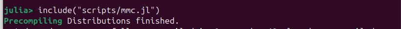{#fig-mmc-run width=75%}

В результате были сохранены таблицы `mmc_customers.csv`, `mmc_events.csv`, `mmc_summary.csv` и графики очереди, занятых каналов, распределения времени ожидания и сравнения аналитики с имитацией.

## Таблица `mmc_customers.csv`

Столбцы таблицы:

| Столбец | Описание |
|---|---|
| `id` | номер заявки |
| `arrival_time` | момент прибытия заявки |
| `service_start` | момент начала обслуживания |
| `departure_time` | момент выхода из системы |
| `wait_time` | время ожидания в очереди |
| `service_time` | длительность обслуживания |
| `system_time` | полное время пребывания в системе |
| `server_id` | номер обслуживающего канала |

: Описание столбцов таблицы `mmc_customers.csv` {#tbl-mmc-customers-columns}

Первые строки таблицы:

| `id` | `arrival_time` | `service_start` | `departure_time` | `wait_time` | `service_time` | `system_time` | `server_id` |
|---:|---:|---:|---:|---:|---:|---:|---:|
| 1 | 0.145 | 0.145 | 0.953 | 0.000 | 0.808 | 0.808 | 1 |
| 2 | 1.100 | 1.100 | 1.235 | 0.000 | 0.135 | 0.135 | 2 |
| 3 | 1.167 | 1.167 | 2.261 | 0.000 | 1.094 | 1.094 | 1 |
| 4 | 3.246 | 3.246 | 4.663 | 0.000 | 1.417 | 1.417 | 2 |
| 5 | 5.091 | 5.091 | 6.565 | 0.000 | 1.474 | 1.474 | 1 |

: Первые строки `mmc_customers.csv` {#tbl-mmc-customers-sample}

## Таблица `mmc_events.csv`

Столбцы таблицы:

| Столбец | Описание |
|---|---|
| `time` | момент события |
| `event` | тип события: `arrival`, `service_start`, `departure` |
| `customer_id` | номер заявки, к которой относится событие |
| `queue_length` | длина очереди после обработки события |
| `busy_servers` | число занятых каналов после события |
| `system_size` | число заявок в системе после события |

: Описание столбцов таблицы `mmc_events.csv` {#tbl-mmc-events-columns}

Первые строки таблицы:

| `time` | `event` | `customer_id` | `queue_length` | `busy_servers` | `system_size` |
|---:|---|---:|---:|---:|---:|
| 0.145 | `arrival` | 1 | 1 | 0 | 1 |
| 0.145 | `service_start` | 1 | 0 | 1 | 1 |
| 0.953 | `departure` | 1 | 0 | 0 | 0 |
| 1.100 | `arrival` | 2 | 1 | 0 | 1 |
| 1.100 | `service_start` | 2 | 0 | 1 | 1 |

: Первые строки `mmc_events.csv` {#tbl-mmc-events-sample}

## Таблица `mmc_summary.csv`

Столбцы таблицы:

| Столбец | Описание |
|---|---|
| `lambda` | интенсивность входящего потока |
| `mu` | интенсивность обслуживания одного канала |
| `c` | число каналов |
| `num_customers` | число смоделированных заявок |
| `seed` | зерно генератора случайных чисел |
| `rho` | загрузка системы на один канал |
| `analytic_wq`, `sim_wq` | аналитическое и имитационное среднее ожидание |
| `analytic_w`, `sim_w` | аналитическое и имитационное время в системе |
| `analytic_lq`, `sim_lq` | аналитическое и имитационное число заявок в очереди |
| `analytic_l`, `sim_l` | аналитическое и имитационное число заявок в системе |
| `analytic_pwait`, `sim_pwait` | вероятность ожидания |
| `sim_utilization` | имитационная загрузка каналов |

: Описание столбцов таблицы `mmc_summary.csv` {#tbl-mmc-summary-columns}

Строка таблицы, часть 1:

| `lambda` | `mu` | `c` | `num_customers` | `seed` | `rho` | `analytic_wq` | `sim_wq` | `analytic_w` | `sim_w` |
|---:|---:|---:|---:|---:|---:|---:|---:|---:|---:|
| 0.9 | 0.5 | 2 | 5000 | 123 | 0.9 | 8.526 | 8.345 | 10.526 | 10.313 |

: Строка `mmc_summary.csv`: параметры и временные метрики {#tbl-mmc-summary-sample-a}

Строка таблицы, часть 2:

| `analytic_lq` | `sim_lq` | `analytic_l` | `sim_l` | `analytic_pwait` | `sim_pwait` | `sim_utilization` |
|---:|---:|---:|---:|---:|---:|---:|
| 7.674 | 7.622 | 9.474 | 9.420 | 0.853 | 0.856 | 0.899 |

: Строка `mmc_summary.csv`: метрики длины очереди и загрузки {#tbl-mmc-summary-sample-b}

## Графики базового прогона `M/M/c`

На графике сравнения показаны аналитические и имитационные значения `Wq`, `W`, `Lq`, `L`. Расхождения небольшие: например, `analytic_wq = 8.5263`, а `sim_wq = 8.3449`.

{#fig-mmc-analytic width=75%}

График занятых каналов показывает, что при `rho = 0.9` два сервера часто работают одновременно.

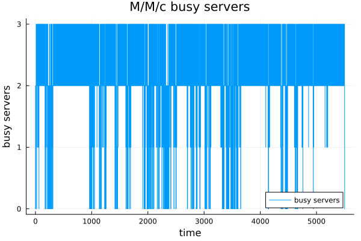{#fig-mmc-busy width=75%}

График длины очереди демонстрирует сильные колебания: система устойчива, но из-за высокой загрузки очередь периодически заметно растёт.

{#fig-mmc-queue width=75%}

Гистограмма времени ожидания показывает асимметричное распределение: много заявок ждут мало, но есть длинный правый хвост.

{#fig-mmc-wait-hist width=75%}

После выполнения literate-скрипта были получены производные форматы `docs/mmc.md`, `scripts/mmc_clean.jl`, `notebooks/mmc.ipynb`.

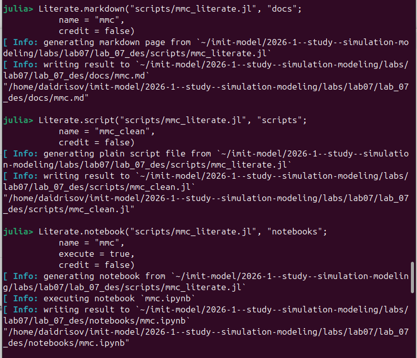{#fig-mmc-derivative width=75%}

## Параметрическое исследование `M/M/c`

Параметрическое исследование было выполнено скриптом `scripts/mmc_parameters.jl`.

{#fig-mmc-param-run width=75%}

## Таблица `mmc_parameter_scan.csv`

Столбцы таблицы:

| Столбец | Описание |
|---|---|
| `lambda` | интенсивность входящего потока |
| `mu` | интенсивность обслуживания |
| `c` | число каналов обслуживания |
| `rho` | загрузка одного канала |
| `analytic_wq` | аналитическое среднее ожидание в очереди |
| `sim_wq` | имитационное среднее ожидание |
| `analytic_w` | аналитическое время в системе |
| `sim_w` | имитационное время в системе |
| `sim_utilization` | имитационная загрузка каналов |

: Описание столбцов таблицы `mmc_parameter_scan.csv` {#tbl-mmc-scan-columns}

Первые строки таблицы:

| `lambda` | `mu` | `c` | `rho` | `analytic_wq` | `sim_wq` | `analytic_w` | `sim_w` | `sim_utilization` |
|---:|---:|---:|---:|---:|---:|---:|---:|---:|
| 0.3 | 0.5 | 1 | 0.60 | 3.000 | 2.819 | 5.000 | 4.825 | 0.597 |
| 0.3 | 0.5 | 2 | 0.30 | 0.198 | 0.224 | 2.198 | 2.240 | 0.301 |
| 0.3 | 0.5 | 3 | 0.20 | 0.021 | 0.028 | 2.021 | 2.042 | 0.204 |
| 0.3 | 0.5 | 4 | 0.15 | 0.002 | 0.005 | 2.002 | 1.936 | 0.149 |
| 0.3 | 0.5 | 5 | 0.12 | 0.000 | 0.000 | 2.000 | 1.998 | 0.121 |

: Первые строки `mmc_parameter_scan.csv` {#tbl-mmc-scan-sample}

Тепловая карта загрузки показывает, что загрузка растёт при увеличении `lambda` и уменьшается при увеличении числа каналов.

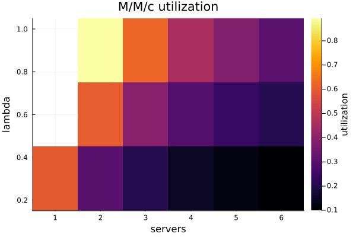{#fig-mmc-heatmap width=75%}

График зависимости ожидания от числа каналов показывает, что добавление серверов резко снижает `Wq`, особенно при больших значениях `lambda`.

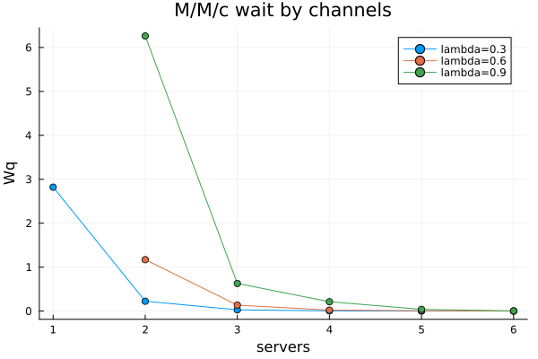{#fig-mmc-wait-channels width=75%}

График зависимости ожидания от интенсивности входящего потока показывает рост очереди при увеличении `lambda`.

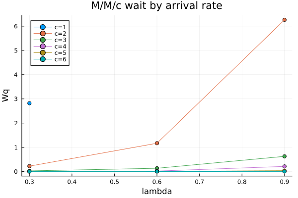{#fig-mmc-wait-lambda width=75%}

После выполнения literate-версии параметрического сценария были получены `docs/mmc_parameters.md`, `scripts/mmc_parameters_clean.jl`, `notebooks/mmc_parameters.ipynb`.

{#fig-mmc-param-derivative width=75%}

# Модель Росса

## Базовый прогон

Базовый сценарий модели Росса был выполнен скриптом `scripts/ross.jl`.

{#fig-ross-run width=75%}

## Таблица `ross_events_sample.csv`

Столбцы таблицы:

| Столбец | Описание |
|---|---|
| `time` | момент события |
| `event` | тип события: `start`, `failure`, `repair_start`, `repair_finish`, `crash` |
| `working` | число работающих машин |
| `spares` | число резервных машин |
| `broken` | число сломанных машин |
| `repair_queue` | число машин в очереди на ремонт |
| `busy_repairers` | число занятых ремонтников |
| `good_machines` | число исправных машин |

: Описание столбцов таблицы `ross_events_sample.csv` {#tbl-ross-events-columns}

Первые строки таблицы:

| `time` | `event` | `working` | `spares` | `broken` | `repair_queue` | `busy_repairers` | `good_machines` |
|---:|---|---:|---:|---:|---:|---:|---:|
| 0.000 | `start` | 10 | 3 | 0 | 0 | 0 | 13 |
| 1.947 | `failure` | 10 | 2 | 0 | 0 | 0 | 12 |
| 1.947 | `repair_start` | 10 | 2 | 1 | 0 | 1 | 12 |
| 4.396 | `repair_finish` | 10 | 3 | 0 | 0 | 0 | 13 |
| 12.247 | `failure` | 10 | 2 | 0 | 0 | 0 | 12 |

: Первые строки `ross_events_sample.csv` {#tbl-ross-events-sample}

## Таблица `ross_runs.csv`

Столбцы таблицы:

| Столбец | Описание |
|---|---|
| `run_id` | номер прогона |
| `crash_time` | время до падения системы |
| `mean_repair_queue` | средняя длина очереди на ремонт |
| `repairer_utilization` | загрузка ремонтника |

: Описание столбцов таблицы `ross_runs.csv` {#tbl-ross-runs-columns}

Первые строки таблицы:

| `run_id` | `crash_time` | `mean_repair_queue` | `repairer_utilization` |
|---:|---:|---:|---:|
| 1 | 1669.888 | 0.0123 | 0.1063 |
| 2 | 42675.710 | 0.0101 | 0.1011 |
| 3 | 18234.460 | 0.0112 | 0.1047 |
| 4 | 2719.418 | 0.0136 | 0.1004 |
| 5 | 3409.050 | 0.0084 | 0.1056 |

: Первые строки `ross_runs.csv` {#tbl-ross-runs-sample}

## Таблица `ross_summary.csv`

Столбцы таблицы:

| Столбец | Описание |
|---|---|
| `N` | число рабочих машин |
| `S` | число резервных машин |
| `repairers` | число ремонтников |
| `runs` | число прогонов |
| `mean_crash_time` | среднее время до падения |
| `std_crash_time` | стандартное отклонение времени до падения |
| `analytic_crash_time` | аналитическая оценка времени до падения |
| `mean_repair_queue` | средняя очередь на ремонт |
| `repairer_utilization` | средняя загрузка ремонтников |

: Описание столбцов таблицы `ross_summary.csv` {#tbl-ross-summary-columns}

Строка таблицы:

| `N` | `S` | `repairers` | `runs` | `mean_crash_time` | `std_crash_time` | `analytic_crash_time` | `mean_repair_queue` | `repairer_utilization` |
|---:|---:|---:|---:|---:|---:|---:|---:|---:|
| 10 | 3 | 1 | 300 | 11996.189 | 12450.172 | 12340.000 | 0.0124 | 0.1017 |

: Строка `ross_summary.csv` {#tbl-ross-summary-sample}

## Графики базового прогона модели Росса

Гистограмма времени до падения показывает высокую вариативность случайного времени отказа системы.

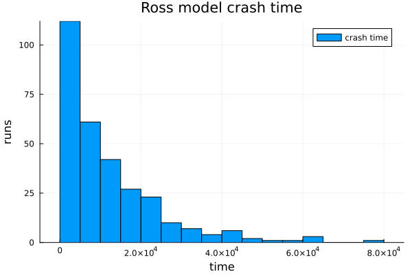{#fig-ross-hist width=75%}

График числа исправных машин показывает ступенчатую событийную динамику отказов и ремонтов.

{#fig-ross-good width=75%}

График загрузки ремонтника показывает, что при базовых параметрах ремонтник занят примерно на `0.1017` доли времени.

{#fig-ross-util width=75%}

График очереди на ремонт показывает, что очередь почти всегда мала; среднее значение по `ross_summary.csv` равно `0.01238`.

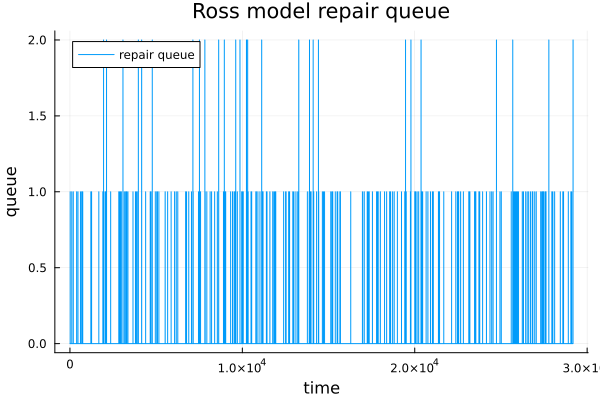{#fig-ross-queue width=75%}

Сравнение имитации и аналитики показывает близкие значения: среднее по имитации `11996.19`, аналитическая оценка `12340.00`.

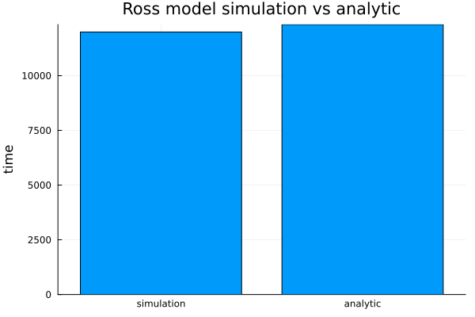{#fig-ross-compare width=75%}

График числа резервных машин показывает, как запас уменьшается при отказах и восстанавливается после ремонта.

{#fig-ross-spares width=75%}

После выполнения literate-версии базового сценария были получены `docs/ross.md`, `scripts/ross_clean.jl`, `notebooks/ross.ipynb`.

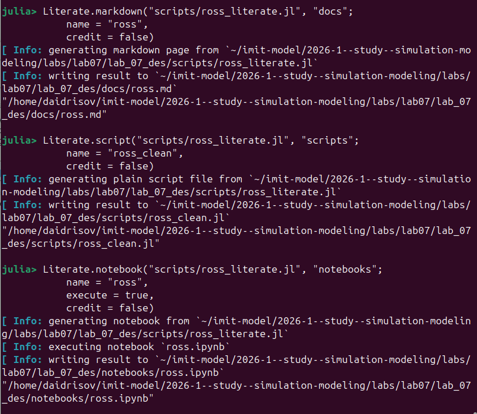{#fig-ross-derivative width=75%}

## Параметрическое исследование модели Росса

Параметрический сценарий был выполнен скриптом `scripts/ross_parameters.jl`.

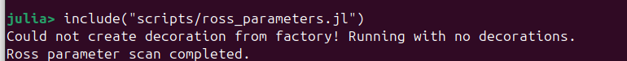{#fig-ross-param-run width=75%}

## Таблица `ross_parameter_scan.csv`

Столбцы таблицы:

| Столбец | Описание |
|---|---|
| `N` | число рабочих машин |
| `S` | число резервных машин |
| `repairers` | число ремонтников |
| `runs` | число прогонов для сценария |
| `mean_crash_time` | среднее время до падения |
| `std_crash_time` | стандартное отклонение |
| `analytic_crash_time` | аналитическая оценка |
| `mean_repair_queue` | средняя очередь на ремонт |
| `repairer_utilization` | загрузка ремонтников |

: Описание столбцов таблицы `ross_parameter_scan.csv` {#tbl-ross-scan-columns}

Первые строки таблицы:

| `N` | `S` | `repairers` | `runs` | `mean_crash_time` | `std_crash_time` | `analytic_crash_time` | `mean_repair_queue` | `repairer_utilization` |
|---:|---:|---:|---:|---:|---:|---:|---:|---:|
| 5 | 1 | 1 | 20 | 432.737 | 396.997 | 440.000 | 0.0000 | 0.0501 |
| 5 | 1 | 2 | 20 | 294.977 | 225.544 | 440.000 | 0.0000 | 0.0249 |
| 5 | 3 | 1 | 20 | 224341.051 | 181764.863 | 177280.000 | 0.0028 | 0.0503 |
| 5 | 3 | 2 | 20 | 687686.634 | 791879.395 | 690080.000 | 0.0000 | 0.0251 |
| 10 | 1 | 1 | 20 | 147.400 | 152.540 | 120.000 | 0.0000 | 0.0909 |

: Первые строки `ross_parameter_scan.csv` {#tbl-ross-scan-sample}

График зависимости времени до падения от `N` показывает, что при росте числа рабочих машин суммарная интенсивность отказов увеличивается, поэтому время до падения уменьшается.

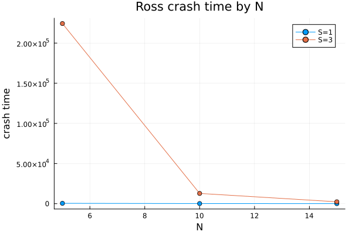{#fig-ross-by-n width=75%}

График зависимости времени до падения от числа резервных машин показывает сильный положительный эффект резервирования.

{#fig-ross-by-spares width=75%}

График сравнения числа ремонтников показывает, что увеличение числа ремонтников повышает устойчивость системы, особенно при большем запасе резервных машин.

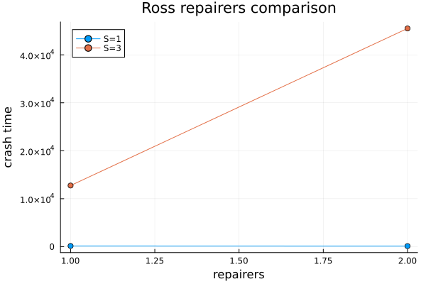{#fig-ross-repairers width=75%}

График загрузки ремонтников по сценариям показывает, что загрузка снижается при добавлении ремонтника и зависит от числа рабочих и резервных машин.

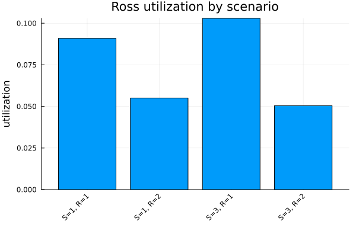{#fig-ross-util-scenarios width=75%}

После выполнения literate-версии параметрического сценария были получены `docs/ross_parameters.md`, `scripts/ross_parameters_clean.jl`, `notebooks/ross_parameters.ipynb`.

{#fig-ross-param-derivative width=75%}

# Производные форматы

Для каждого из четырёх сценариев были подготовлены literate-скрипты:

- `mmc_literate.jl`;
- `mmc_parameters_literate.jl`;
- `ross_literate.jl`;
- `ross_parameters_literate.jl`.

Для каждого сценария через `Literate.jl` были получены три формата:

- Markdown-документ в `docs/`;
- чистый Julia-скрипт в `scripts/`;
- выполненный notebook в `notebooks/`.

Отдельный запуск `clean`-версий не выполнялся: результаты моделей были получены обычными скриптами, а `clean`-версии использовались как производный формат.

# Выводы

В ходе работы был создан проект `lab_07_des` в структуре `DrWatson`, реализован модуль `QueueingModels.jl`, выполнены базовые и параметрические сценарии для `M/M/c` и модели Росса.

Для `M/M/c` получено, что при высокой загрузке `rho = 0.9` очередь заметно растёт, но имитационные оценки близки к аналитическим: `sim_wq = 8.3449` против `analytic_wq = 8.5263`. Параметрическое исследование показало, что увеличение числа каналов снижает ожидание, а рост `lambda` увеличивает загрузку и очередь.

Для модели Росса получено среднее время до падения `11996.19` при аналитической оценке `12340.00`. Параметрическое исследование показало, что увеличение числа резервных машин существенно повышает время до падения, а увеличение числа ремонтников снижает загрузку ремонтной подсистемы и повышает устойчивость системы.

Все результаты сохранены в CSV-таблицы, построены графики, подготовлены literate-представления и производные форматы `md`, `ipynb`, `clean`.

# Список литературы{.unnumbered}

::: {#refs}
:::

