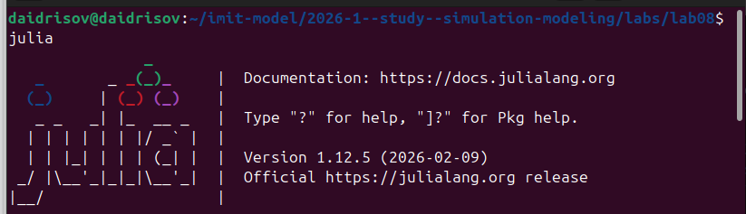
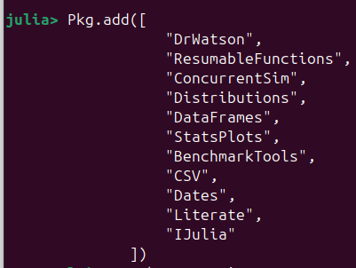
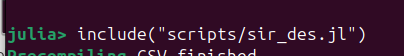
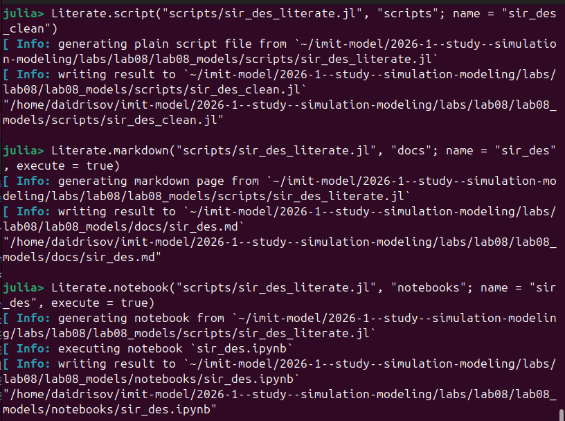
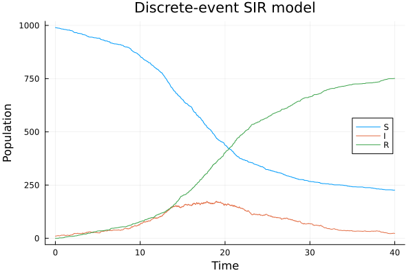
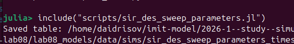
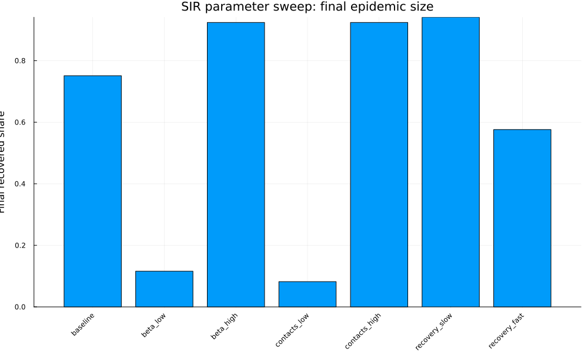

---
author:
  name: Идрисов Джафер Арсенович
  degrees: student
  email: 1132232876@rudn.ru
  affiliation:
    - name: Российский университет дружбы народов
      country: Российская Федерация
      postal-code: 117198
      city: Москва
      address: ул. Миклухо-Маклая, д. 6
title: "Имитационное моделирование"
subtitle: "Лабораторная работа №8. Реализация основных моделей в дискретно-событийном подходе"
license: CC BY
date: today
date-format: "YYYY-MM-DD"
---

# Информация

## Докладчик

:::::::::::::: {.columns align=center}
::: {.column width="70%"}

- Идрисов Джафер Арсенович
- Студент
- Российский университет дружбы народов
- [1132232876@rudn.ru](mailto:1132232876@rudn.ru)

:::
::: {.column width="30%"}
:::
::::::::::::::

# Цель и задачи

## Цель работы

- Реализовать стохастическую дискретно-событийную SIR-модель
- Выполнить базовый запуск модели
- Провести параметрическое исследование
- Сохранить результаты в `CSV` и `PNG`
- Получить `clean`, `md`, `ipynb` из literate-кода

## Задание

1. Создать проект `DrWatson`
2. Реализовать `src/sir_model.jl`
3. Выполнить `scripts/sir_des.jl`
4. Сгенерировать производные форматы из `sir_des_literate.jl`
5. Выполнить `scripts/sir_des_sweep_parameters.jl`
6. Сгенерировать производные форматы параметрического исследования

# Подготовка проекта

## Запуск Julia

{width=75%}

- Работа началась с Julia REPL
- Все команды установки выполнялись в окружении Julia

## Подключение DrWatson

{width=40%}

- Подключён пакет `DrWatson`
- Он используется для воспроизводимой структуры проекта

## Создание проекта

{width=80%}

- Проект создан как `lab08_models`
- Использованы каталоги `src`, `scripts`, `data/sims`, `plots`, `notebooks`, `docs`

## Подключение пакетного менеджера

{width=45%}

- Активировано окружение проекта
- Подготовлена установка зависимостей

## Установка пакетов

{width=55%}

- Установлены `ConcurrentSim`, `Distributions`, `DataFrames`
- Добавлены `CSV`, `StatsPlots`, `Literate`, `IJulia`

## Завершение установки

{width=80%}

- Пакеты установлены и подготовлены к работе
- Проект готов к запуску сценариев

# Структура решения

## Основные файлы

- `src/sir_model.jl` - ядро SIR-модели
- `scripts/sir_des.jl` - базовый запуск
- `scripts/sir_des_literate.jl` - literate-версия базового запуска
- `scripts/sir_des_sweep_parameters.jl` - параметрическое исследование
- `scripts/sir_des_sweep_parameters_literate.jl` - literate-версия исследования

## Модель SIR

- `S` - восприимчивые
- `I` - инфицированные
- `R` - переболевшие
- События: заражение и выздоровление
- Параметры: `beta`, `c`, `gamma`

# Базовый запуск

## Выполнение `sir_des.jl`

{width=55%}

- Выполнен базовый сценарий
- Начальное состояние: `u0 = [990, 10, 0]`
- Параметры: `p = [0.05, 10.0, 0.25]`

## Производные форматы

{width=50%}

- Получен `scripts/sir_des_clean.jl`
- Получен `docs/sir_des.md`
- Получен выполненный `notebooks/sir_des.ipynb`

## График базового запуска

{width=50%}

- `S` убывает по мере заражения
- `I` сначала растёт, затем снижается
- `R` монотонно возрастает
- К концу моделирования: `S = 226`, `I = 23`, `R = 751`

# Параметрическое исследование

## Запуск `sir_des_sweep_parameters.jl`

{width=75%}

- Выполнены сценарии `baseline`, `beta_low`, `beta_high`
- Также исследованы `contacts_low`, `contacts_high`, `recovery_slow`, `recovery_fast`

## Производные форматы исследования

{width=50%}

- Получен `scripts/sir_des_sweep_parameters_clean.jl`
- Получен `docs/sir_des_sweep_parameters.md`
- Получен выполненный `notebooks/sir_des_sweep_parameters.ipynb`

## Сравнение инфицированных

{width=50%}

- Самый высокий пик: `recovery_slow`, `peak_I = 376`
- `contacts_high`: `peak_I = 293`
- `beta_high`: `peak_I = 264`
- Низкие `beta` и `c` резко ослабляют эпидемию

## Итоговая доля переболевших

{width=50%}

- `recovery_slow`: `final_R_share = 0.941`
- `beta_high` и `contacts_high`: `0.924`
- `contacts_low`: `0.082`

# Результаты

## Таблицы

- `sir_990_10_0.05_10.0_0.25.csv`
  - колонки `t`, `S`, `I`, `R`
  - 1516 строк данных
- `sir_des_sweep_parameters_timeseries.csv`
  - временные ряды по всем сценариям
- `sir_des_sweep_parameters_metrics.csv`
  - сводные метрики по сценариям

## Метрики сценариев

| Сценарий | Пик `I` | Время пика | Доля `R` |
|---|---:|---:|---:|
| `baseline` | 174 | 17.87 | 0.751 |
| `beta_low` | 24 | 37.87 | 0.116 |
| `beta_high` | 264 | 12.25 | 0.924 |
| `contacts_low` | 21 | 7.16 | 0.082 |
| `contacts_high` | 293 | 8.24 | 0.924 |
| `recovery_slow` | 376 | 14.60 | 0.941 |
| `recovery_fast` | 109 | 20.55 | 0.576 |

# Выводы

## Основные выводы

- Дискретно-событийная модель воспроизводит стохастическую SIR-динамику
- Рост `beta` повышает пик и итоговую долю переболевших
- Рост `c` ускоряет распространение инфекции
- Уменьшение `gamma` увеличивает длительность заразности и пик `I`
- Literate-подход позволил получить код, документацию и notebook из одного источника
