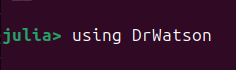
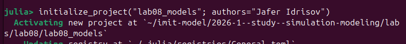
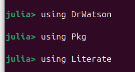
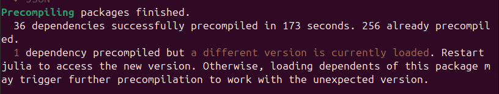
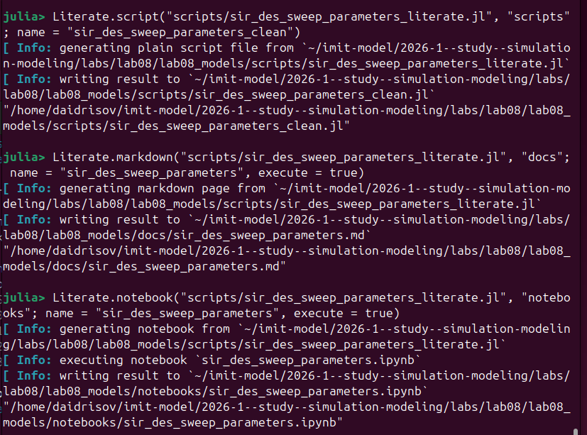
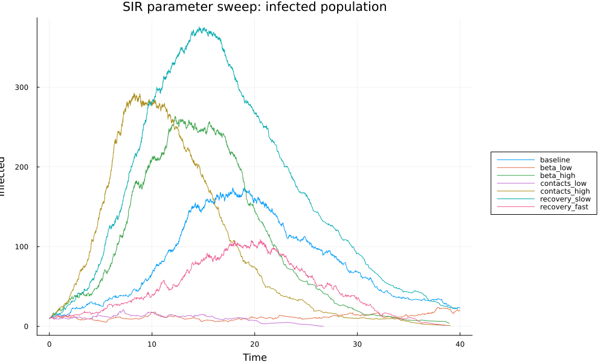

---
## Author
author:
  name: Идрисов Джафер Арсенович
  degrees: student
  email: 1132232876@rudn.ru
  affiliation:
    - name: Российский университет дружбы народов
      country: Российская Федерация
      postal-code: 117198
      city: Москва
      address: ул. Миклухо-Маклая, д. 6

## Title
title: "Имитационное моделирование"
subtitle: "Лабораторная работа №8. Реализация основных моделей в дискретно-событийном подходе"
license: "CC BY"
code-overflow: wrap
code-line-numbers: false
lot: true
---

# Цель работы

Изучить дискретно-событийный подход к имитационному моделированию на примере стохастической модели распространения инфекции SIR. Реализовать модель на языке Julia, выполнить базовый прогон, провести исследование чувствительности к параметрам, сохранить результаты в таблицы и графики, а также получить производные форматы из literate-кода.

# Задание

1. Создать рабочий проект в структуре `DrWatson`.
2. Установить пакеты для дискретно-событийного моделирования, обработки таблиц, визуализации и литературного программирования.
3. Реализовать ядро SIR-модели в `src/sir_model.jl`.
4. Подготовить базовый скрипт `scripts/sir_des.jl`.
5. Подготовить literate-версию `scripts/sir_des_literate.jl`.
6. Сгенерировать из literate-файла чистый код, Markdown-документацию и выполненный notebook.
7. Подготовить скрипт параметрического исследования `scripts/sir_des_sweep_parameters.jl`.
8. Подготовить literate-версию параметрического исследования.
9. Сгенерировать производные форматы для параметрического исследования.
10. Проанализировать полученные графики и таблицы.

# Теоретическое введение

## Модель SIR

SIR-модель делит популяцию на три группы: восприимчивые `S`, инфицированные `I` и переболевшие `R`. Классическая постановка восходит к работе Кермака и Маккендрика [@kermack1927epidemics]. В лабораторной работе использовалась стохастическая дискретно-событийная версия модели: каждый индивид представлен отдельным агентом, а изменения состояния происходят только в моменты событий заражения и выздоровления.

Состояния агента:

| Обозначение | Смысл |
|---|---|
| `S` | восприимчивый индивид |
| `I` | инфицированный индивид |
| `R` | переболевший индивид |

: Состояния SIR-модели {#tbl-sir-states}

Параметры модели:

| Параметр | Смысл |
|---|---|
| `beta` | вероятность заражения при контакте |
| `c` | средняя частота контактов индивида |
| `gamma` | интенсивность выздоровления |
| `tmax` | время окончания моделирования |

: Параметры SIR-модели {#tbl-sir-params}

## Дискретно-событийная реализация

Дискретно-событийный подход удобен для систем, в которых состояние изменяется не на регулярной временной сетке, а в моменты наступления событий. В данной работе событиями являются заражение и выздоровление. Для планирования событий использовался пакет `ConcurrentSim.jl`, в котором процессы реализуются через возобновляемые функции и события `timeout` [@concurrentsim_docs].

Восприимчивый агент ожидает случайное время до следующего контакта, выбирает случайного собеседника и при контакте с инфицированным заражается с вероятностью `beta`. Инфицированный агент ожидает случайное время до выздоровления, распределённое экспоненциально со средним `1 / gamma`, после чего переходит в состояние `R`.

## Инструменты

Расчёты выполнены на языке Julia, предназначенном для научных и численных вычислений [@bezanson2017julia]. Структура проекта организована с помощью `DrWatson`, который поддерживает воспроизводимые вычислительные проекты и стандартные каталоги для исходного кода, данных и графиков [@datseris2020drwatson; @drwatson_project_docs].

## Литературное программирование

Литературное программирование объединяет исполняемый код и поясняющий текст в одном исходном документе. Такой подход удобен для лабораторной работы: один файл одновременно служит сценарием вычислений, заготовкой документации и источником для notebook. Это снижает риск расхождения между кодом, описанием и результатами.

В работе использовался пакет `Literate.jl`. Его исходный формат представляет собой обычный Julia-скрипт: строки с `#` преобразуются в Markdown, а остальные строки остаются исполняемым Julia-кодом [@literate_docs]. Для базового запуска и параметрического исследования были подготовлены literate-версии скриптов. Из них через `Literate.script`, `Literate.markdown` и `Literate.notebook` получались чистые Julia-файлы, Markdown-документация и Jupyter notebook.

Важная особенность использованного подхода состоит в том, что notebook и Markdown-документация генерировались с флагом `execute = true`. Поэтому при генерации производных форматов код выполнялся, а в выходные файлы попадали актуальные результаты вычислений.

# Выполнение лабораторной работы

## Подготовка проекта

Работа началась с запуска Julia REPL.

{#fig-julia width=80%}

Далее был подключён пакет `DrWatson`.

{#fig-drwatson width=45%}

Проект был создан командой `initialize_project`. Для лабораторной использовался каталог `lab08_models`.

{#fig-init-project width=80%}

После создания проекта были подключены функции пакетного менеджера и установлены зависимости.

{#fig-using-pkg width=45%}

Основной набор пакетов был добавлен в окружение проекта. В него вошли `ResumableFunctions`, `ConcurrentSim`, `Distributions`, `DataFrames`, `StatsPlots`, `BenchmarkTools`, `CSV`, `Dates`, `Literate` и `IJulia`.

{#fig-pkg-add width=55%}

После установки и предварительной компиляции окружение было готово к запуску моделей.

{#fig-pkg-finished width=80%}

## Структура проекта

В проекте были подготовлены следующие основные файлы:

| Файл | Назначение |
|---|---|
| `src/sir_model.jl` | ядро дискретно-событийной SIR-модели |
| `scripts/sir_des.jl` | базовый запуск модели |
| `scripts/sir_des_literate.jl` | literate-версия базового запуска |
| `scripts/sir_des_sweep_parameters.jl` | параметрическое исследование |
| `scripts/sir_des_sweep_parameters_literate.jl` | literate-версия параметрического исследования |
| `data/*.csv` | таблицы результатов |
| `plots/*.png` | графики |

: Основные файлы проекта {#tbl-project-files}

## Реализация ядра модели

В файле `src/sir_model.jl` реализованы структуры `SIRPerson` и `SIRModel`, функции обновления статистики, процесс жизни агента `live`, функции создания, активации и запуска модели.

Ключевой фрагмент логики агента:

```julia
while individual.status == :S
    @yield timeout(env, rand(Exponential(1 / m.c)))
    alter = individual
    while alter === individual
        index = rand(DiscreteUniform(1, length(m.allIndividuals)))
        alter = m.allIndividuals[index]
    end
    if alter.status == :I && rand() < m.beta
        individual.status = :I
        infection_update!(env, m)
    end
end
```

При заражении уменьшается `S`, увеличивается `I`, а при выздоровлении уменьшается `I` и увеличивается `R`. В каждый момент события в таблицу добавляется текущее модельное время.

## Базовый запуск

Базовый сценарий был выполнен скриптом `scripts/sir_des.jl`.

{#fig-run-sir-des width=55%}

Параметры базового запуска:

| Параметр | Значение |
|---|---:|
| `tmax` | `40.0` |
| `S0` | `990` |
| `I0` | `10` |
| `R0` | `0` |
| `beta` | `0.05` |
| `c` | `10.0` |
| `gamma` | `0.25` |

: Параметры базового запуска {#tbl-base-params}

После запуска были получены:

```text
plots/sir_des.png
data/sims/sir_990_10_0.05_10.0_0.25.csv
```

Таблица базового запуска содержит 1516 строк данных и колонки `t`, `S`, `I`, `R`. Последнее состояние траектории: `t = 39.9933`, `S = 226`, `I = 23`, `R = 751`.

## Производные форматы базового запуска

Из `scripts/sir_des_literate.jl` были сгенерированы чистый скрипт, Markdown-документация и выполненный Jupyter notebook.

{#fig-sir-des-derivatives width=80%}

Полученные файлы:

```text
scripts/sir_des_clean.jl
docs/sir_des.md
notebooks/sir_des.ipynb
```

## График базового запуска

На графике базового запуска показана динамика `S`, `I`, `R`.

{#fig-sir-des-plot width=75%}

Кривая `S` убывает по мере заражения восприимчивых индивидов. Кривая `I` сначала растёт, достигает максимума, затем снижается из-за выздоровления. Кривая `R` монотонно возрастает. К концу моделирования переболело `751` индивидов, что соответствует `75.1%` популяции.

## Параметрическое исследование

Параметрическое исследование выполнено скриптом `scripts/sir_des_sweep_parameters.jl`.

{#fig-run-sweep width=75%}

Исследовались следующие сценарии:

| Сценарий | `beta` | `c` | `gamma` |
|---|---:|---:|---:|
| `baseline` | `0.05` | `10.0` | `0.25` |
| `beta_low` | `0.03` | `10.0` | `0.25` |
| `beta_high` | `0.07` | `10.0` | `0.25` |
| `contacts_low` | `0.05` | `5.0` | `0.25` |
| `contacts_high` | `0.05` | `15.0` | `0.25` |
| `recovery_slow` | `0.05` | `10.0` | `0.15` |
| `recovery_fast` | `0.05` | `10.0` | `0.35` |

: Сценарии параметрического исследования {#tbl-sweep-scenarios}

После запуска были получены:

```text
data/sims/sir_des_sweep_parameters_timeseries.csv
data/sims/sir_des_sweep_parameters_metrics.csv
plots/sir_des_sweep_parameters_infected.png
plots/sir_des_sweep_parameters_final_size.png
```

## Производные форматы параметрического исследования

Из `scripts/sir_des_sweep_parameters_literate.jl` были сгенерированы производные форматы.

{#fig-sweep-derivatives width=80%}

Полученные файлы:

```text
scripts/sir_des_sweep_parameters_clean.jl
docs/sir_des_sweep_parameters.md
notebooks/sir_des_sweep_parameters.ipynb
```

## Сравнение кривых заражения

Файл `sir_des_sweep_parameters_infected.png` показывает кривые `I(t)` для всех сценариев.

{#fig-sweep-infected width=90%}

Наибольший пик инфицированных получен в сценарии `recovery_slow`: `peak_I = 376`. При медленном выздоровлении инфицированные дольше остаются в состоянии `I`, поэтому одновременно больных становится больше. Высокая частота контактов (`contacts_high`) даёт пик `293`, а высокая вероятность заражения (`beta_high`) даёт пик `264`. Наименьшие пики получены при `contacts_low` и `beta_low`.

## Итоговая доля переболевших

Файл `sir_des_sweep_parameters_final_size.png` сравнивает итоговую долю переболевших.

{#fig-sweep-final-size width=90%}

Самая большая итоговая доля переболевших наблюдается в сценарии `recovery_slow`: `0.941`. Сценарии `beta_high` и `contacts_high` дают по `0.924`. Самая малая итоговая доля получена при низкой частоте контактов: `contacts_low = 0.082`.

## Сводная таблица метрик

Таблица `sir_des_sweep_parameters_metrics.csv` содержит основные показатели по каждому сценарию.

| Сценарий | `beta` | `c` | `gamma` | Пик `I` | Время пика | Итоговое `R` | Доля `R` |
|---|---:|---:|---:|---:|---:|---:|---:|
| `baseline` | 0.05 | 10.0 | 0.25 | 174 | 17.8722 | 751 | 0.751 |
| `beta_low` | 0.03 | 10.0 | 0.25 | 24 | 37.8662 | 116 | 0.116 |
| `beta_high` | 0.07 | 10.0 | 0.25 | 264 | 12.2485 | 924 | 0.924 |
| `contacts_low` | 0.05 | 5.0 | 0.25 | 21 | 7.1631 | 82 | 0.082 |
| `contacts_high` | 0.05 | 15.0 | 0.25 | 293 | 8.2436 | 924 | 0.924 |
| `recovery_slow` | 0.05 | 10.0 | 0.15 | 376 | 14.5966 | 941 | 0.941 |
| `recovery_fast` | 0.05 | 10.0 | 0.35 | 109 | 20.5455 | 576 | 0.576 |

: Метрики параметрического исследования {#tbl-sweep-metrics}

## Интерпретация результатов

Увеличение `beta` повышает вероятность передачи инфекции при контакте. Поэтому сценарий `beta_high` приводит к более раннему и высокому пику, а итоговая доля переболевших возрастает до `0.924`. Уменьшение `beta` замедляет распространение: в сценарии `beta_low` пик составляет только `24`, а итоговая доля переболевших равна `0.116`.

Увеличение `c` означает больше контактов на единицу времени. При `contacts_high` пик достигает `293`, а итоговая доля переболевших равна `0.924`. При `contacts_low` эпидемия почти затухает: пик равен `21`, итоговая доля переболевших равна `0.082`.

Параметр `gamma` отвечает за скорость выздоровления. При `recovery_slow` инфицированные дольше остаются заразными, поэтому пик самый высокий: `376`, а итоговая доля переболевших равна `0.941`. При `recovery_fast` пик меньше (`109`), а итоговая доля переболевших равна `0.576`.

# Выводы

В ходе лабораторной работы была реализована стохастическая дискретно-событийная SIR-модель на Julia. Проект организован в структуре `DrWatson`, ядро модели вынесено в `src/sir_model.jl`, а сценарии запуска размещены в `scripts`.

Базовый запуск показал типичную SIR-динамику: число восприимчивых убывает, число инфицированных сначала растёт и затем снижается, число переболевших монотонно растёт. В базовом сценарии к концу моделирования переболело `751` из `1000` индивидов.

Параметрическое исследование показало, что увеличение вероятности заражения `beta` и частоты контактов `c` усиливает эпидемию. Уменьшение интенсивности выздоровления `gamma` также повышает пик инфицированных и итоговую долю переболевших. Все результаты сохранены в `CSV`, графики сохранены в `PNG`, а из literate-скриптов получены чистые Julia-скрипты, Markdown-документация и Jupyter notebook.

# Список литературы{.unnumbered}

::: {#refs}
:::
