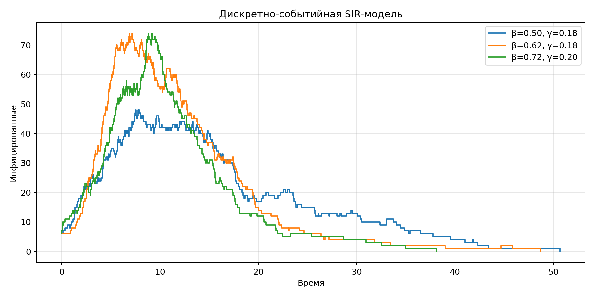

**Студент:** Гашимов Кенан Мухтар оглы  
**Группа:** НКНбд-01-23  
**Студенческий билет:** 1032235820  
**Направление:** Математика и компьютерные науки  
**Email:** kenan24gguka@gmail.com

        # Цель работы

        Построить событийную SIR-модель, сравнить несколько сценариев параметров и оформить финальный комплект артефактов курса.

        # Формулировка задания

        - Реализовать событийную SIR-модель.
- Провести серию сценариев по параметрам β и γ.
- Сохранить траектории, график и сводную таблицу.
- Подготовить финальный отчёт и презентацию.

        # Теоретическая часть

        В событийной SIR-модели моменты заражения и выздоровления генерируются как случайные события, что даёт естественную стохастическую траекторию эпидемии.

        # Ход работы

        ## Событийная постановка

События заражения и выздоровления порождаются согласно интенсивностям, зависящим от текущего состояния системы.
## Сценарный анализ

Вычислены три сценария с разными параметрами `β` и `γ`, что позволяет сравнить темп распространения инфекции.
## Итоговая интерпретация

По каждому сценарию выделены пик инфекции, время пика и конечное число переболевших.

        # Эксперименты

        1. Смоделированы три сценария событийной SIR-модели.
1. Для каждого сценария собраны траектории по событийному времени.
1. Сравнены пики инфицированных, время пика и число выздоровевших к концу моделирования.

        # Полученные артефакты

        - project/data/event-sir-1.csv
- project/data/event-sir-2.csv
- project/data/event-sir-3.csv
- project/plots/event-sir.png
- project/src/Lab08.jl
- project/notebook/lab08.ipynb
- report/simulation-modeling--lab08--report.qmd
- presentation/simulation-modeling--lab08--presentation.qmd

        # Основные результаты

        

        | β | γ | peak I | time of peak | recovered at end |
| --- | --- | ---: | ---: | ---: |
| 0.50 | 0.18 | 48 | 7.48 | 153 |
| 0.62 | 0.18 | 74 | 6.87 | 162 |
| 0.72 | 0.20 | 74 | 8.82 | 172 |

        # Выводы

        - Событийная SIR-модель отражает стохастический характер вспышки и затухания эпидемии.
- Увеличение β при фиксированном γ заметно ускоряет достижение пика.
- Финальная лабораторная замыкает курс связкой между непрерывными, агентными, петри-сетевыми и DES-подходами.

        # Материалы проекта

        - Три CSV-сценария событийной SIR.
- Сводный PNG-график по числу инфицированных.
- Локальный release-документ и отчётные материалы.

        # Воспроизводимость

        - Исходный Julia-проект находится в `../project/`.
        - Literate-документация находится в `../project/markdown/`.
        - Notebook находится в `../project/notebook/`.
        - Для повторной сборки используйте команды `make generate`, `make render`, `make verify`.
